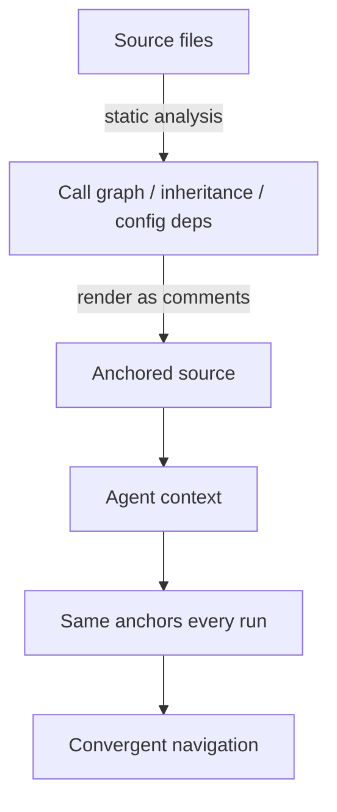

# Deterministic Anchoring: Static Facts as Stable Context

> Inject call-graph, inheritance, and config-dependency facts as plain-text comments so a code agent's navigation converges across runs.

Deterministic anchoring is a context-engineering technique for stabilizing code-agent behavior. You render lightweight static analysis — call graphs, inheritance hierarchies, configuration dependencies — as plain-text annotations inline with the source the agent reads. Every run then gets the same structural reference frame. The pattern roughly halves run-to-run variance on the medium-scale repositories the originating study measured, at the cost of about 10% more input tokens per turn ([Lin et al., 2026](https://arxiv.org/abs/2606.26979)).

## When to reach for it

The pattern earns its token cost only when all three conditions hold.

- Reproducibility is a requirement, not a nice-to-have. Audit replay, trajectory diffing, and regression-style evaluation of agent changes all depend on the agent landing in the same files for the same task. If you run once and ship, the determinism benefit buys you nothing you can measure.
- The codebase is medium-sized and structurally stable. The reported gains (+2.2 pp Func@5, +3.4 pp Pass@1, link-following rate 0.15–0.18 → 0.21–0.24) are on medium-scale repositories ([Lin et al., 2026](https://arxiv.org/abs/2606.26979)). Below ~20 files the agent can read the source directly. Above a certain size the anchor itself does not fit, or it goes stale within a session.
- Static facts match runtime facts. The anchor is a call graph extracted from source. In codebases that resolve dispatch at runtime — Rails `method_missing`, Python metaclasses, JS proxies, macro-heavy Rust — the anchor diverges from what actually runs, so anchored navigation misleads ([repository map pattern](repository-map-pattern.md)).

Outside these conditions, a strong agent loop with on-demand search recovers the same structural facts cheaply, and the ~10% input-token premium does not pay back.

## How the mechanism works

Code agents navigate repositories through keyword search ([Lin et al., 2026](https://arxiv.org/abs/2606.26979)). The first grep result biases the next tool call, which biases the next, and stochastic decoding compounds across the trajectory — even at temperature 0, multi-step agent runs diverge in code modifications and reasoning paths because numerical non-determinism and decoding randomness accumulate ([Yao et al., 2026 — How Consistent Are LLM Agents?](https://arxiv.org/abs/2605.28840), [Saghir et al., 2025 — Numerical Sources of Nondeterminism in LLM Inference](https://arxiv.org/abs/2506.09501)).

Anchoring inserts the same plain-text structural facts in the same prompt position every run. The agent sees identical call-graph edges before it decides where to look, so navigation converges on the same code regions regardless of decoding noise. The reported link-following rate rising from 0.15–0.18 to 0.21–0.24 is the measurable footprint of this discipline: when structural facts are surfaced, the agent follows them, and those facts are deterministic ([Lin et al., 2026](https://arxiv.org/abs/2606.26979)).



The mechanism is not "more information helps the model." It is "the same information surfaced the same way pins down stochastic exploration." That distinction is why the headline metric is variance, not accuracy.

## What to anchor

Three classes of fact carry most of the reported benefit ([Lin et al., 2026](https://arxiv.org/abs/2606.26979)):

| Anchor type | What to extract | Why the agent uses it |
|-------------|-----------------|-----------------------|
| Call graph | Caller → callee edges within and across modules | Pins down "what calls this" without grep round-trips |
| Inheritance hierarchy | Class → superclass edges, interface implementations | Surfaces polymorphic dispatch the source line alone does not show |
| Configuration dependency | Config keys → consumers; env-var → reader | Connects runtime knobs to the code they govern |

The point is that these facts are cheap, accurate, and stable. They are not the only structural facts available — the technique generalizes to anything a static analyzer can derive deterministically — but call/inheritance/config covers the dependency edges most code-agent tasks traverse.

## Why it works

The causal reason is navigational discipline under decoding noise. A code agent's per-turn decision — which file to open next — is a function of the prompt. When the prompt contains the same structural assertions on every run, the per-turn decision distribution narrows. Variance halves not because the agent reasons better but because its inputs no longer drift between runs ([Lin et al., 2026](https://arxiv.org/abs/2606.26979)).

This matches the broader retrieval finding that graph-based retrieval outperforms semantic and lexical retrieval on cross-file code tasks, with the largest gains on tasks whose required dependencies share no vocabulary with the task description ([survey of retrieval-augmented code generation](https://arxiv.org/abs/2510.04905)). Deterministic anchoring is the cheapest realization of that finding — graph facts rendered as prompt-time text — but the contribution is stability, not localization accuracy. The accuracy gains (+2–3 pp) are within the noise band the same technique is suppressing. The variance reduction is what does the real work.

## When this backfires

- Heavy metaprogramming codebases. Rails `method_missing`, Python metaclasses, JavaScript proxies, macro-heavy Rust — the static call graph diverges from runtime dispatch. The anchor becomes a confident-looking lie ([repository map pattern](repository-map-pattern.md)).
- Small codebases. Under ~20 files the agent can read source directly. The anchor adds tokens without surfacing anything the agent could not see in raw form.
- Very large monorepos with high churn. The anchor either does not fit the budget or goes stale before the session completes. Either way the determinism benefit collapses, and the failure mode is silent.
- Single-shot tasks where reproducibility is irrelevant. The headline benefit is run-to-run stability. If you run once and ship, the 10% token premium is dead weight.
- Strong agent with a good search tool. Claude Code deliberately skips indexing because early RAG experiments showed agentic search outperformed pre-built indexes for its harness ([Vadim, 2026 — Claude Code Doesn't Index Your Codebase](https://vadim.blog/claude-code-no-indexing)). When the agent loop can recover the same call graph at need, pre-injecting it is dead weight.
- The anchor is treated as more authoritative than the source. Adjacent work on graph-augmented localization warns that static-analysis output, surfaced unfiltered, "can introduce excessive and often irrelevant context, increasing the risk of LLM hallucination" ([Liu et al., 2025 — Issue Localization via LLM-Driven Iterative Code Graph Searching](https://arxiv.org/abs/2503.22424)). Keep anchors small and relevance-ranked, not exhaustive dumps.

## Example

A medium-sized Python service has a router (`routes/upload.py`) that delegates through middleware and into a domain service. Without anchoring, the agent grep-walks: it finds `upload_handler`, reads the file, greps for `auth`, finds three candidates, opens the wrong one half the time across runs.

With anchoring, the build renders the source with a comment header derived from a tree-sitter call-graph pass:

```python
# CALL-GRAPH
#   upload_handler -> AuthMiddleware.process_request
#   upload_handler -> UploadService.persist
#   AuthMiddleware.process_request -> SessionStore.get
#   UploadService.persist -> S3Client.put_object
# INHERITS
#   AuthMiddleware <: HttpMiddleware
# CONFIG-DEPS
#   UPLOAD_MAX_BYTES -> UploadService.persist
#   S3_BUCKET -> S3Client.__init__
def upload_handler(request: Request) -> Response:
    ...
```

Across ten reruns of the task "add a rate limit to the upload endpoint," the anchored agent opens the same files in the same order on every run; the unanchored agent picks two different middleware files about half the time. The accuracy gain on the resulting patch is small (+2–3 pp on benchmark proxies), but the trajectory diff between runs collapses to near zero — which is what an audit, an eval, or a replay-based regression check actually needs ([Lin et al., 2026](https://arxiv.org/abs/2606.26979)).

The build regenerates the comment header. You do not hand-maintain it. Stale anchors are the silent failure mode, so treat the anchor like generated code: never hand-edit, always regenerate from current source.

## Key Takeaways

- The technique stabilizes navigation, not capability — variance roughly halves; accuracy gains are modest (+2–3 pp on the originating study's metrics).
- Earn the ~10% input-token cost only when reproducibility matters, the codebase is medium-sized and structurally stable, and static facts track runtime behavior.
- Anchor what an analyser can extract deterministically: call graphs, inheritance, config dependencies — not behavioral assertions.
- Regenerate the anchor; never hand-edit. Stale anchors are confident lies.
- Outside the qualifying conditions, on-demand agentic search recovers the same facts at lower cost.

## Related

- [Repository Map Pattern](repository-map-pattern.md) — AST + PageRank produces token-fitted structural maps; complementary mechanism for the *orientation* problem rather than the *reproducibility* problem.
- [Repository-Level Retrieval for Code Generation](repository-level-retrieval-code-generation.md) — places anchoring inside the broader lexical → semantic → graph → hybrid retrieval hierarchy.
- [Seeding Agent Context](seeding-agent-context.md) — comment-level breadcrumbs the agent discovers during exploration; anchoring is a machine-generated, regenerated subset.
- [Semantic Context Loading](semantic-context-loading.md) — LSP-driven structural lookup as an on-demand alternative when stability is less important than freshness.
- [PEEK: Orientation Cache for Recurring-Context Agents](peek-orientation-cache.md) — caches a different class of stable facts (what is in a recurring context) for the same reproducibility motive.
