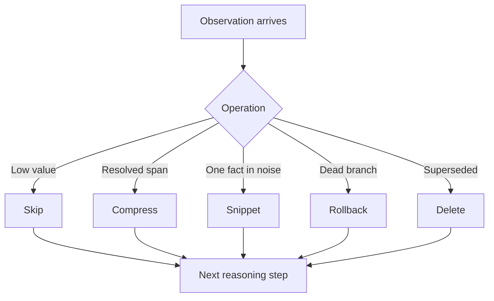

# Elastic Context Orchestration

> A long-horizon search agent picks a context-management operation per turn — Skip, Compress, Rollback, Snippet, or Delete — instead of accumulating raw trajectory or running a single periodic compaction. Different parts of the trajectory are kept at different fidelity based on current task relevance.

## Why Uniform Retention Fails on Long-Horizon Search

Long-horizon search visits many irrelevant pages before finding the answer. A ReAct agent that logs every observation accumulates noisy raw history; quality degrades as context fills, attention spreads thin, and signal competes with resolved sub-tasks. AgentFold's authors describe this as "context saturation" and frame it as the dominant failure mode for ReAct on web-search tasks ([AgentFold, Feng et al., 2025](https://arxiv.org/abs/2510.24699)). Anthropic frames the same effect as a [context performance gradient](https://www.anthropic.com/engineering/effective-context-engineering-for-ai-agents) across all models — a steady decline as context grows, not a cliff.

A single periodic summariser is not enough either: summarising the full history at fixed intervals risks irreversible loss of fine-grained evidence the agent needed for the current step ([AgentFold §1](https://arxiv.org/abs/2510.24699)).

Elastic context orchestration responds by giving the agent's policy a vocabulary of context operations and letting it pick one per step. LongSeeker formalises this as **Context-ReAct** — a ReAct extension where each turn emits a thought, an action, and a context operation drawn from five atomic primitives ([Lu et al., 2026](https://arxiv.org/abs/2605.05191)).

## The Five-Operation Vocabulary

| Operation | What it does | When to pick it |
|-----------|--------------|-----------------|
| **Skip** | Do not add the current observation to working context | Low-value page, captcha, navigational filler |
| **Compress** | Summarise a span of prior turns into a shorter form | Resolved sub-task; evidence already extracted |
| **Snippet** | Keep a small extracted span verbatim; drop the surrounding observation | A page contained one critical fact among long boilerplate |
| **Rollback** | Discard a recent reasoning branch | Dead end identified; resume from the last productive state |
| **Delete** | Remove a specific entry from working context | Superseded result, contradicted claim |

LongSeeker's authors note that **Compress alone is expressively complete** — any retention strategy can be built from repeated compression. The other four operations exist for efficiency and fidelity guarantees: they reduce generation cost (no LLM call to "summarise" a span you can just Skip) and reduce hallucination risk (Snippet preserves verbatim evidence; Compress can paraphrase it away) ([Lu et al., 2026](https://arxiv.org/abs/2605.05191)).



## Evidence the Mechanism Works

Two reported signals support adaptive multi-fidelity retention over uniform accumulation:

- **Sub-linear context growth.** AgentFold-30B reports context length growing from ~3.5k to ~7k tokens across 100 turns — less than doubling — against a 128k window, while raw ReAct accumulates linearly ([AgentFold, Feng et al., 2025](https://arxiv.org/abs/2510.24699)).
- **BrowseComp deltas at fixed parameter class.** LongSeeker (Qwen3-30B-A3B base, 10,000 synthesised trajectories) reports 61.5% on BrowseComp and 62.5% on BrowseComp-ZH, against AgentFold's 36.2 / 47.3 and Tongyi DeepResearch's 43.2 / 46.7 at comparable scale ([Lu et al., 2026](https://arxiv.org/abs/2605.05191)). All numbers come from the proposing labs; no third-party replication exists yet.

Adjacent results in the same literature cluster point in the same direction: ReSum's external summariser yields +4.5% over ReAct training-free and +8.2% with GRPO on BrowseComp ([ReSum, Wu et al., 2025](https://arxiv.org/abs/2509.13313)).

## Where the Pattern Does Not Apply

Elastic orchestration is search-agent territory, not a default for short coding sessions.

- **Short-horizon tasks (≲ 20 turns).** The five-op vocabulary adds policy complexity and SFT cost without payoff; raw ReAct or [tiered compression](context-compression-strategies.md) is cheaper.
- **Code agents with persistent file state.** Evidence lives in files, not trajectory. Aggressive Skip or Delete on tool observations breaks debug loops where the agent needs to re-read prior outputs.
- **Off-the-shelf models with no SFT on the vocabulary.** Skip, Snippet, and Rollback are not natural ReAct actions. Models invoke them inconsistently and can regress below the ReAct baseline. LongSeeker reports 10,000-trajectory SFT specifically to teach the operation policy ([Lu et al., 2026](https://arxiv.org/abs/2605.05191)).
- **Side-effecting tools.** Rollback removes context but cannot undo bookings, payments, or writes. See [Rollback-First Design](../agent-design/rollback-first-design.md) for the orthogonal mechanism that handles world state.

## Relation to Adjacent Patterns

- [Context Compression Strategies](context-compression-strategies.md) — periodic tiered compaction. Elastic orchestration is per-step with multiple operations.
- [Turn-Level Context Decisions](turn-level-context-decisions.md) — five-option decision framework for human-driven coding sessions (continue, rewind, clear, compact, delegate). Elastic orchestration is the autonomous-agent analogue.
- [Observation Masking](observation-masking.md) — one operation (mask processed observations) generalised by Skip / Delete here.
- [Lost in the Middle](lost-in-the-middle.md) — the attention-distribution result that motivates concentrating retention on currently-relevant tokens.

## Example

A LongSeeker-style trajectory on a multi-hop biographical search ([Lu et al., 2026](https://arxiv.org/abs/2605.05191)):

```text
Turn 12: search("subject's PhD advisor")
  Observation: long Wikipedia page, 18k tokens, advisor name in one sentence
  Operation: Snippet — keep the advisor sentence; drop the rest

Turn 13: search("advisor's lab affiliations 1987-1992")
  Observation: list of 40 papers, none from 1987-1992
  Operation: Skip — observation does not advance the task

Turn 14: branched into wrong sub-question (advisor's spouse)
  Operation: Rollback — return to turn 12 state

Turn 15-22: resolved branch — found the lab affiliation
  Operation (after turn 22): Compress turns 15-22 into one summary line
```

The agent ends with a working context of a few hundred tokens covering 22 search turns, instead of tens of thousands.

## Key Takeaways

- Elastic context orchestration treats context management as a per-turn action drawn from a fixed vocabulary, not a periodic background process.
- The Skip / Compress / Snippet / Rollback / Delete vocabulary lets the policy tier retention by current relevance — Compress is expressively complete; the others exist for efficiency and fidelity.
- Reported gains come from search-agent benchmarks (BrowseComp, BrowseComp-ZH) on SFT-trained models; numbers are first-party and unreplicated.
- Short coding sessions, file-state-heavy agents, and off-the-shelf models without operation-vocabulary SFT will not benefit and can regress.
- Rollback removes context but does not undo side-effects; pair with [Rollback-First Design](../agent-design/rollback-first-design.md) for world-state recovery.

## Related

- [Context Compression Strategies](context-compression-strategies.md)
- [Turn-Level Context Decisions](turn-level-context-decisions.md)
- [Observation Masking](observation-masking.md)
- [Long-Running Agents](../agent-design/long-running-agents.md)
- [Lost in the Middle](lost-in-the-middle.md)
- [Rollback-First Design](../agent-design/rollback-first-design.md)
