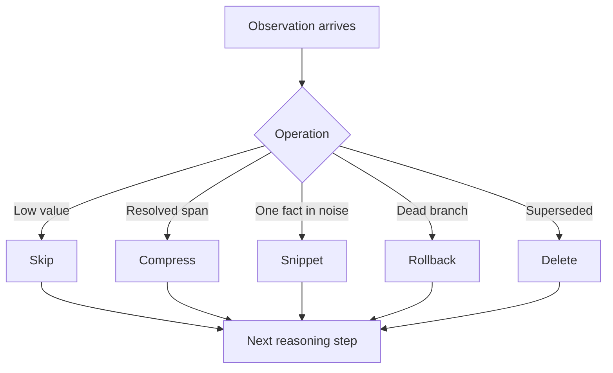

# Elastic Context Orchestration

> Elastic context orchestration picks one of five retention operations per turn instead of accumulating raw trajectory or compacting on a fixed schedule.

## Why uniform retention fails on long-horizon search

Long-horizon search visits many irrelevant pages before it finds the answer. A ReAct agent that logs every observation builds up noisy raw history. Quality drops as context fills: attention spreads thin, and signal competes with resolved sub-tasks. AgentFold's authors call this "context saturation" and treat it as the main failure mode for ReAct on web-search tasks ([AgentFold, Ye et al., 2025](https://arxiv.org/abs/2510.24699)). Anthropic describes the same effect as a [context performance gradient](https://www.anthropic.com/engineering/effective-context-engineering-for-ai-agents) across all models: a steady decline as context grows, not a cliff.

A single periodic summarizer is not enough either. Summarizing the full history at fixed intervals risks losing fine-grained evidence the agent still needs for the current step ([AgentFold §1](https://arxiv.org/abs/2510.24699)).

Elastic context orchestration responds by giving the agent's policy a vocabulary of context operations, then letting it pick one per step. LongSeeker formalizes this as Context-ReAct, a ReAct extension where each turn emits a thought, an action, and a context operation drawn from five atomic primitives ([Lu et al., 2026](https://arxiv.org/abs/2605.05191)).

## The five-operation vocabulary

| Operation | What it does | When to pick it |
|-----------|--------------|-----------------|
| `Skip` | Do not add the current observation to working context | Low-value page, captcha, navigational filler |
| `Compress` | Summarize a span of prior turns into a shorter form | Resolved sub-task; evidence already extracted |
| `Snippet` | Keep a small extracted span verbatim; drop the surrounding observation | A page contained one critical fact among long boilerplate |
| `Rollback` | Discard a recent reasoning branch | Dead end identified; resume from the last productive state |
| `Delete` | Remove a specific entry from working context | Superseded result, contradicted claim |

LongSeeker's authors note that Compress alone is expressively complete: you can build any retention strategy from repeated compression. The other four operations exist for efficiency and fidelity. They cut generation cost (Skip drops a span with no LLM call, unlike Compress) and cut hallucination risk (Snippet keeps verbatim evidence; Compress can paraphrase it away) ([Lu et al., 2026](https://arxiv.org/abs/2605.05191)).


```mermaid
graph TD
    O[Observation arrives] --> Q{Operation}
    Q -->|Low value| S[Skip]
    Q -->|Resolved span| C[Compress]
    Q -->|One fact in noise| N[Snippet]
    Q -->|Dead branch| R[Rollback]
    Q -->|Superseded| D[Delete]
    S --> A[Next reasoning step]
    C --> A
    N --> A
    R --> A
    D --> A
```

## Evidence the mechanism works

Two reported signals support adaptive multi-fidelity retention over uniform accumulation:

- Sub-linear context growth. AgentFold-30B reports context length growing from about 3.5k to 7k tokens across 100 turns, less than doubling, against a 128k window, while raw ReAct grows linearly ([AgentFold, Ye et al., 2025](https://arxiv.org/abs/2510.24699)).
- BrowseComp results at a fixed parameter class. LongSeeker (Qwen3-30B-A3B base, 10,000 synthesized trajectories) reports 61.5% on BrowseComp and 62.5% on BrowseComp-ZH, against AgentFold's 36.2 / 47.3 and Tongyi DeepResearch's 43.2 / 46.7 at comparable scale ([Lu et al., 2026](https://arxiv.org/abs/2605.05191)). All numbers come from the proposing labs; no third-party replication exists yet.

Adjacent results in the same literature point the same way: ReSum's external summarizer yields +4.5% over ReAct training-free and +8.2% with GRPO on BrowseComp ([ReSum, Wu et al., 2025](https://arxiv.org/abs/2509.13313)).

## Where the pattern does not apply

Elastic orchestration suits search agents. Four situations fall outside it:

- Short-horizon tasks (about 20 turns or fewer). The five-operation vocabulary adds policy complexity and SFT cost without payoff. Raw ReAct or [tiered compression](context-compression-strategies.md) is cheaper.
- Code agents with persistent file state. Evidence lives in the files, and aggressive Skip or Delete on tool observations breaks debug loops where the agent needs to [re-read prior outputs](observation-masking.md).
- Off-the-shelf models with no SFT on the vocabulary. Skip, Snippet, and Rollback are not natural ReAct actions. Models invoke them inconsistently and can regress below the ReAct baseline. LongSeeker reports 10,000-trajectory SFT specifically to teach the operation policy ([Lu et al., 2026](https://arxiv.org/abs/2605.05191)).
- Side-effecting tools. Rollback removes context but cannot undo bookings, payments, or writes. See [Rollback-First Design](../patterns/agent-design/rollback-first-design.md) for the separate mechanism that handles world state.

## Relation to adjacent patterns

- [Context Compression Strategies](context-compression-strategies.md) — periodic tiered compaction. Elastic orchestration is per-step with multiple operations.
- [Turn-Level Context Decisions](turn-level-context-decisions.md) — five-option decision framework for human-driven coding sessions (continue, rewind, clear, compact, delegate). Elastic orchestration is the autonomous-agent analogue.
- [Observation Masking](observation-masking.md) — one operation (mask processed observations) generalized by Skip / Delete here.
- [Lost in the Middle](lost-in-the-middle.md) — the attention-distribution result that motivates concentrating retention on currently-relevant tokens.

## Example

A LongSeeker-style trajectory on a multi-hop biographical search ([Lu et al., 2026](https://arxiv.org/abs/2605.05191)):

```text
Turn 12: search("subject's PhD advisor")
  Observation: long Wikipedia page, 18k tokens, advisor name in one sentence
  Operation: Snippet — keep the advisor sentence; drop the rest

Turn 13: search("advisor's lab affiliations 1987-1992")
  Observation: list of 40 papers, none from 1987-1992
  Operation: Skip — observation does not advance the task

Turn 14: branched into wrong sub-question (advisor's spouse)
  Operation: Rollback — return to turn 12 state

Turn 15-22: resolved branch — found the lab affiliation
  Operation (after turn 22): Compress turns 15-22 into one summary line
```

The agent ends with a working context of a few hundred tokens covering 22 search turns, instead of tens of thousands.

## Key Takeaways

- Reach for elastic orchestration over [periodic compaction](context-compression-strategies.md) when the agent needs to judge each turn's value on its own — a fixed schedule cannot distinguish a resolved sub-task from evidence still in play.
- Compress alone can implement the whole vocabulary, so a minimal build can start there and add Skip, Snippet, Rollback, and Delete only once generation cost or hallucination risk demands them.
- The reported BrowseComp gains are first-party and unreplicated — pilot on your own workload before sizing an SFT budget around the LongSeeker or AgentFold numbers.
- Before adopting the vocabulary, check turn count, where evidence lives, and whether the base model has operation-vocabulary SFT; if any of those work against you, default to raw ReAct or tiered compression instead.
- Rollback removes context but does not undo side-effects; pair with [Rollback-First Design](../patterns/agent-design/rollback-first-design.md) for world-state recovery.

## Related

- [Context Compression Strategies](context-compression-strategies.md)
- [Turn-Level Context Decisions](turn-level-context-decisions.md)
- [Observation Masking](observation-masking.md)
- [Long-Running Agents](../patterns/agent-design/long-running-agents.md)
- [Lost in the Middle](lost-in-the-middle.md)
- [Rollback-First Design](../patterns/agent-design/rollback-first-design.md)
