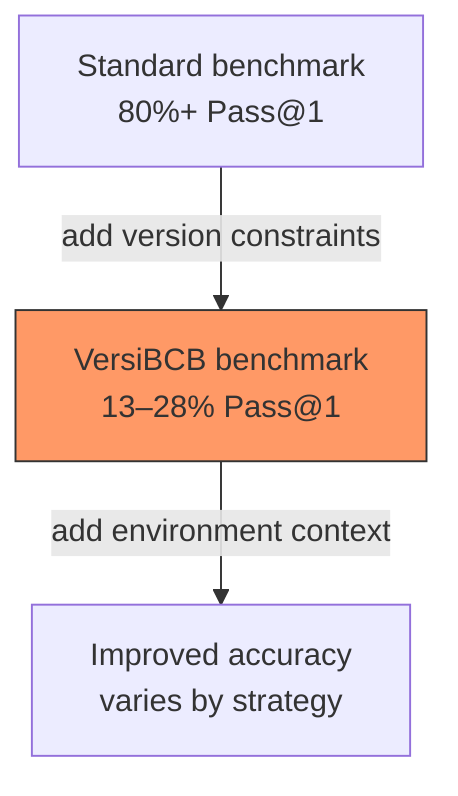

# Environment Specification as Context

> Specify your software environment — dependency versions, runtime constraints, OS — as explicit agent context to prevent generated code from targeting the wrong API surface.

## The Version Gap

Standard code-generation benchmarks (HumanEval+, MBPP) test isolated functions with no version constraints. Models score 80%+ on these tasks. When the same models must generate code that runs under specific library versions, accuracy drops to 13–28% Pass@1 ([Liu et al., "Environment-Aware Code Generation," ICSE 2026](https://arxiv.org/abs/2601.12262)).

The gap is a context problem. Models default to the most common API patterns in training data, which skew toward popular (often outdated) versions. Without environment context, the model has no signal to deviate.



## Why Models Default to Deprecated APIs

Models trained on web-scale code corpora see more examples of older API surfaces than current ones. The result: a systematic preference for deprecated patterns, with 3–30% gaps between strict and lenient evaluation ([Liu et al., 2026](https://arxiv.org/abs/2601.12262)).

This compounds in fast-evolving domains. ML libraries — `torch`, `transformers`, `datasets` — show the steepest accuracy drops because their API surfaces change across minor versions ([Liu et al., 2026](https://arxiv.org/abs/2601.12262)). An independent benchmark (GitChameleon) confirms: enterprise models achieve only 48–51% on version-conditioned Python tasks across 26 libraries ([Vidal et al., "GitChameleon 2.0," 2025](https://arxiv.org/abs/2507.12367)).

31.7% of AI-generated code fails at runtime due to environment mismatches in reproducibility studies ([Siddiq et al., "AI-Generated Code Is Not Reproducible (Yet)," 2024](https://arxiv.org/pdf/2512.22387)).

## Techniques

### Feed Lock Files as Context

Include `requirements.txt`, `pyproject.toml`, `package-lock.json`, or equivalent lock files in the agent's context. This gives the model an explicit version manifest to target. Tools that index workspace files (Claude Code, Cursor, Copilot Workspace) can surface these automatically [unverified — no controlled study confirms the specific accuracy improvement, though the mechanism is consistent with the research].

### State Versions in Instructions

When requesting code that depends on specific libraries, name the version:

> "Write a data loader using PyTorch 2.1 DataPipes" not "Write a data loader using PyTorch"

This shifts the model toward the correct API surface — strongest for libraries with breaking changes between versions.

### Prefer Migration over Generation

The three adaptation strategies tested — RAG, LoRA MoE, and prefix-KV caching — show models are 2–3x better at adapting existing code to a target environment than generating version-correct code from scratch. MoE improves partial correctness; memory-based approaches (prefix-KV) excel at migration tasks; RAG tends to overfit retrieved examples ([Liu et al., 2026](https://arxiv.org/abs/2601.12262)).

When possible, give the agent working code to migrate rather than generating from scratch.

### Use Execution Feedback Loops

Error traces from failed execution contain version-specific signals (e.g., `AttributeError: module 'torch' has no attribute 'compile'`). Feeding these back into context acts as a corrective signal. This is a specific application of [error preservation in context](error-preservation-in-context.md) tuned for version mismatches.

### Scope Caution to High-Churn Libraries

ML frameworks (`torch`, `transformers`, `tensorflow`) and web frameworks with rapid release cycles show the steepest accuracy drops. Stable standard-library modules rarely trigger version mismatches. Focus verification effort where churn is highest.

## Example

A developer asks an agent to write a training script using HuggingFace Transformers:

**Without environment context** — the agent generates code using `TrainingArguments` with parameters available in an older version:

```python
from transformers import TrainingArguments

args = TrainingArguments(
    output_dir="./results",
    evaluation_strategy="epoch",  # deprecated in v4.46+
    per_device_train_batch_size=8,
)
```

**With environment context** — the developer includes `pyproject.toml` showing `transformers==4.47.0` and states the version in the prompt:

```python
from transformers import TrainingArguments

args = TrainingArguments(
    output_dir="./results",
    eval_strategy="epoch",  # correct parameter name for v4.46+
    per_device_train_batch_size=8,
)
```

One renamed parameter — a `FutureWarning` or outright failure depending on version. Trivial to fix, expensive to debug without context.

## Key Takeaways

- Models drop from 80%+ to 13–28% accuracy when code must target specific library versions — the gap is a context problem, not a capability problem.
- Deprecated API preference is systematic: models default to the most-represented patterns in training data, which skew older.
- Feed lock files and version manifests into agent context to shift generation toward the correct API surface.
- Prefer migration tasks (adapt existing code) over from-scratch generation — adaptation accuracy is 2–3x higher.
- Focus verification on fast-evolving libraries (ML frameworks, web frameworks) where version churn causes the steepest accuracy drops.

## Unverified Claims

- Including workspace lock files (requirements.txt, pyproject.toml) in agent context tools like Claude Code and Cursor produces measurable accuracy improvements on version-specific tasks [unverified — mechanism is consistent with research but no controlled study confirms the specific claim]
- The 2–3x migration advantage may shift with newer model architectures trained on more recent code corpora [unverified]

## Sources

- [Liu et al., "Environment-Aware Code Generation: How far are We?" ICSE 2026](https://arxiv.org/abs/2601.12262) — EACG framework, VersiBCB benchmark, three adaptation strategies
- [Vidal et al., "GitChameleon 2.0," 2025](https://arxiv.org/abs/2507.12367) — version-conditioned coding benchmark, 328 problems across 26 Python libraries
- [Siddiq et al., "AI-Generated Code Is Not Reproducible (Yet)," 2024](https://arxiv.org/pdf/2512.22387) — 31.7% runtime failure rate from environment mismatches

## Related

- [Context Engineering](context-engineering.md)
- [Seeding Agent Context](seeding-agent-context.md)
- [Error Preservation in Context](error-preservation-in-context.md)
- [Context Hub](context-hub.md)
- [Retrieval-Augmented Agent Workflows](retrieval-augmented-agent-workflows.md)
- [Repository-Level Retrieval for Code Generation](repository-level-retrieval-code-generation.md)
