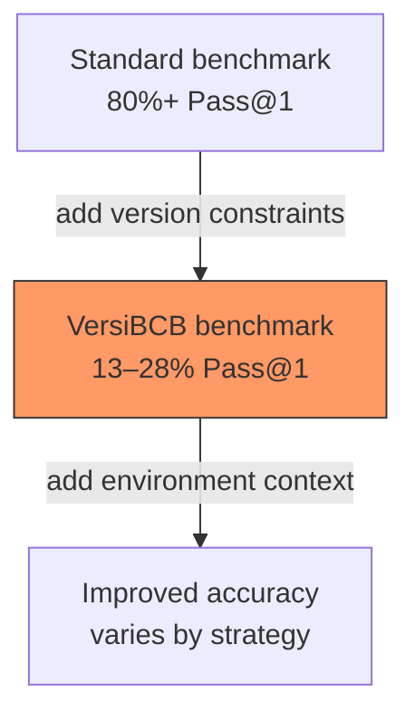

# Environment Specification as Context

> Specify your software environment — dependency versions, runtime constraints, OS — as explicit agent context to prevent generated code from targeting the wrong API surface.

Learn it hands-on with [the Mind the Version Gap lesson](https://learn.agentpatterns.ai/context-engineering/mind-the-version-gap/), a guided walkthrough with quizzes.

## The version gap

Standard code-generation benchmarks (HumanEval+, MBPP) test isolated functions with no version constraints. Models score 80%+ on these tasks. When the same models must generate code that runs under specific library versions, accuracy drops to 13–28% Pass@1 ([Liu et al., "Environment-Aware Code Generation," ICSE 2026](https://arxiv.org/abs/2601.12262v1)).

The gap is a context problem. Models default to the most common API patterns in training data, which skew toward popular (often outdated) versions. Without environment context, the model has no signal to deviate.


```mermaid
graph TD
    A["Standard benchmark<br>80%+ Pass@1"] -->|add version constraints| B["VersiBCB benchmark<br>13–28% Pass@1"]
    B -->|add environment context| C["Improved accuracy<br>varies by strategy"]
    style B fill:#f96,stroke:#333
```

## Why models default to deprecated APIs

Models trained on web-scale code corpora see more examples of older API surfaces than current ones. The result: a systematic preference for deprecated patterns, with 3–30% gaps between strict and lenient evaluation ([Liu et al., 2026](https://arxiv.org/abs/2601.12262v1)).

This compounds in fast-evolving domains. ML libraries — `torch`, `transformers`, `datasets` — show the steepest accuracy drops because their API surfaces change across minor versions ([Liu et al., 2026](https://arxiv.org/abs/2601.12262v1)). An independent benchmark (GitChameleon) confirms: enterprise models achieve only 48–51% on version-conditioned Python tasks across 26 libraries ([Vidal et al., "GitChameleon 2.0," 2025](https://arxiv.org/abs/2507.12367)).

31.7% of AI-generated code fails at runtime due to environment mismatches in reproducibility studies ([Vangala et al., "AI-Generated Code Is Not Reproducible (Yet)," 2025](https://arxiv.org/pdf/2512.22387)).

## Techniques

### Feed lock files as context

Include `requirements.txt`, `pyproject.toml`, `package-lock.json`, or equivalent lock files in the agent's context. This gives the model an explicit version manifest to target. Tools that index workspace files (Claude Code, Cursor, Copilot Workspace) can surface these automatically. For tools that cannot, paste the relevant lock file contents directly into the prompt or system message.

### State versions in instructions

When requesting code that depends on specific libraries, name the version:

> "Write a data loader using PyTorch 2.1 DataPipes" not "Write a data loader using PyTorch"

This shifts the model toward the correct API surface — strongest for libraries with breaking changes between versions.

### Prefer migration over generation

The three adaptation strategies tested — RAG, LoRA MoE, and prefix-KV caching — show models are 2–3x better at adapting existing code to a target environment than generating version-correct code from scratch. MoE improves partial correctness; memory-based approaches (prefix-KV) excel at migration tasks; RAG tends to overfit retrieved examples ([Liu et al., 2026](https://arxiv.org/abs/2601.12262v1)).

When possible, give the agent working code to migrate rather than generating from scratch.

### Use execution feedback loops

Error traces from failed execution contain version-specific signals (for example `AttributeError: module 'torch' has no attribute 'compile'`). Feeding these back into context lets the model correct its next attempt. This is a specific application of [error preservation in context](error-preservation-in-context.md) tuned for version mismatches.

### Scope caution to high-churn libraries

ML frameworks (`torch`, `transformers`, `tensorflow`) and web frameworks with rapid release cycles show the steepest accuracy drops. Stable standard-library modules rarely trigger version mismatches. Focus verification effort where churn is highest.

## When this backfires

Environment specification has real costs. Three conditions make the overhead exceed the benefit:

- Stable, low-churn deps: standard library modules, mature packages with frozen APIs (for example `os`, `json`, `requests` ≥2.x), or projects pinned to an LTS release rarely produce version mismatches. Adding lock file context for these fills the prompt with noise.
- Token-budget pressure: a full `package-lock.json` or `poetry.lock` can run to thousands of tokens. In agents with long task context, feeding the entire lock file may crowd out instructions, retrieved code, or error history that matters more. Excerpt only the relevant dep declarations (`[tool.poetry.dependencies]` or filtered `requirements.txt` lines) rather than the full resolved tree.
- Version not in training data: for very new library releases (after the model's training cutoff), the model has no examples of the correct API surface. Specifying the version signals the correct target but cannot conjure knowledge of it. Here, supplement with retrieved docs or changelogs rather than relying on version-conditioned generation alone.

## Example

A developer asks an agent to write a training script using HuggingFace Transformers:

Without environment context, the agent generates code using `TrainingArguments` with parameters available in an older version:

```python
from transformers import TrainingArguments

args = TrainingArguments(
    output_dir="./results",
    evaluation_strategy="epoch",  # deprecated in v4.46+
    per_device_train_batch_size=8,
)
```

With environment context, the developer includes `pyproject.toml` showing `transformers==4.47.0` and states the version in the prompt:

```python
from transformers import TrainingArguments

args = TrainingArguments(
    output_dir="./results",
    eval_strategy="epoch",  # correct parameter name for v4.46+
    per_device_train_batch_size=8,
)
```

The renamed parameter triggers a `FutureWarning` or an outright failure depending on version. It is trivial to fix once found, but costly to debug without version context.

## Key Takeaways

- The 80%+ to 13–28% accuracy drop is a context gap, not a capability gap — close it by feeding the model version signals, not by switching to a larger model.
- When generated code calls a library incorrectly, suspect a deprecated-API default first: models systematically favor older, more common patterns over the current API.
- Feed lock files and version manifests into agent context to shift generation toward the correct API surface.
- Prefer migration tasks (adapt existing code) over from-scratch generation — adaptation accuracy is 2–3x higher.
- Focus verification on fast-evolving libraries (ML frameworks, web frameworks) where version churn causes the steepest accuracy drops.

## Sources

- [Liu et al., "Environment-Aware Code Generation: How far are We?" ICSE 2026](https://arxiv.org/abs/2601.12262) — EACG framework, VersiBCB benchmark, three adaptation strategies
- [Vidal et al., "GitChameleon 2.0," 2025](https://arxiv.org/abs/2507.12367) — version-conditioned coding benchmark, 328 problems across 26 Python libraries
- [Vangala et al., "AI-Generated Code Is Not Reproducible (Yet)," 2025](https://arxiv.org/pdf/2512.22387) — 31.7% runtime failure rate from environment mismatches

## Related

- [Context Engineering](context-engineering.md)
- [Seeding Agent Context](seeding-agent-context.md)
- [Error Preservation in Context](error-preservation-in-context.md)
- [Context Hub](context-hub.md)
- [Retrieval-Augmented Agent Workflows](retrieval-augmented-agent-workflows.md)
- [Repository-Level Retrieval for Code Generation](repository-level-retrieval-code-generation.md)
