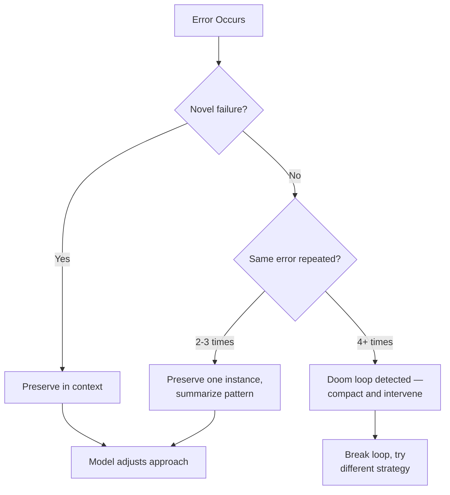

# Error Preservation in Context

> Keep failed actions and error traces visible in the agent's context window. Error history acts as negative examples that shift model behavior — removing failures removes the signal the model needs to avoid repeating them.

## The Counter-Intuitive Tradeoff

The natural instinct is to clean up after errors: remove stack traces, clear failed tool results, compact the context. This instinct is wrong in most cases.

Manus describes the mechanism directly: "leave the wrong turns in the context. When the model sees a failed action — and the resulting observation or stack trace — it implicitly updates its internal beliefs" ([Manus](https://manus.im/blog/Context-Engineering-for-AI-Agents-Lessons-from-Building-Manus)). Removing the failure removes the information the model needs to adjust its next decision.

Cursor quantified the impact: removing reasoning traces from Codex caused a **30% performance drop** — lost subgoals, degraded planning, and repeated re-derivation of earlier steps ([Cursor](https://cursor.com/blog/codex-model-harness)).

## What Error Traces Provide

Error traces are not noise — they are structured negative examples:

| Signal | What the Model Learns |
|--------|----------------------|
| Stack trace from failed approach | Which code path does not work and why |
| Tool call that returned an error | Which tool invocation to avoid repeating |
| Type error from a previous fix | Which type assumptions are incorrect |
| Test failure after a change | Which behavioral expectation was violated |
| Permission denied on an operation | Which access paths are unavailable |

Each retained failure narrows the solution space. The model does not need to rediscover constraints already encountered.

## The Token-Preservation Trap

Instructing agents to conserve tokens can backfire. Cursor found that telling the model to "preserve tokens and not be wasteful" caused it to refuse ambitious tasks entirely, declaring "I'm not supposed to waste tokens, and I don't think it's worth continuing with this task!" ([Cursor](https://cursor.com/blog/codex-model-harness)). The model interprets "be efficient" as "avoid doing things that might fail" — the opposite of the exploratory behavior needed for recovery.

## When to Preserve vs. When to Compact

Not all errors deserve permanent context residency. The decision depends on whether the error still carries signal:



**Preserve** when the failure is novel, contains architectural information, or recovery is still in progress.

**Compact** when the same error has repeated three or more times (doom loop), or early errors are no longer relevant to the current task.

OpenDev implements five-stage progressive compaction: error traces are preserved in full during active recovery, then progressively summarized as the session continues ([Bui, 2025](https://arxiv.org/abs/2603.05344)).

## Error Messages as Teaching Mechanisms

Well-designed error messages do double duty: they inform the developer and teach the agent. Alex Lavaee describes embedding architectural guidance directly in error output — for example, "Error: Service layer cannot import from UI layer. Move this logic to a Provider" ([Lavaee](https://alexlavaee.me/blog/openai-agent-first-codebase-learnings)). The agent learns the architectural constraint through the failure itself.

When choosing tools for agent workflows, prefer those with descriptive error output over terse codes.

## Two Schools of Thought

| Approach | Advocate | Strategy | Risk |
|----------|----------|----------|------|
| **Preserve everything** | Manus | Keep all failed actions visible; let the model learn from the full history | Context bloat in long sessions |
| **Prevent and compact** | Anthropic | Design tools to prevent errors; clear tool results as lightweight compaction | Losing error signal the model needs for recovery |

Anthropic frames tool misuse as [context pollution](../anti-patterns/session-partitioning.md) and recommends tool result clearing as compaction ([Anthropic](https://www.anthropic.com/engineering/effective-context-engineering-for-ai-agents)). Manus takes the opposite position — those "dead-ends" are the signal. Practical rule: preserve during active recovery, compact once recovery succeeds.

## Anchoring Recovery in Deterministic Signals

Preserved errors are most valuable when the agent verifies recovery against deterministic signals rather than its own judgment. The nibzard agentic handbook warns that "self-critique without objective checks is also brittle — models can rationalize" ([nibzard](https://www.nibzard.com/agentic-handbook)).

Anchor error recovery to tests, linters, type checkers, and build systems — not to the model's reasoning about whether the error is fixed.

## Git as Error Recovery Infrastructure

For long-running agents, git provides structured recovery points. A commit before each risky change means the error trace captures both what failed and a clean recovery state ([Anthropic](https://www.anthropic.com/engineering/effective-harnesses-for-long-running-agents)).

## Example

An agent attempts to write a file and receives a permission error. The context window retains the failure:

```
Tool call: write_file(path="/etc/config.yaml", content="...")
Result: PermissionError: [Errno 13] Permission denied: '/etc/config.yaml'
```

On the next turn, the agent does not retry the same path. It infers from the error that `/etc/` requires elevated access and reroutes to a writable location:

```
Tool call: write_file(path="/tmp/config.yaml", content="...")
Result: ok
Tool call: move_file(src="/tmp/config.yaml", dest="/etc/config.yaml", sudo=True)
Result: ok
```

Removing the first failed tool call would cause the model to retry `/etc/config.yaml` directly, re-encountering the same error — a doom loop. Preserving the error is what enables the reroute.

## Related

- [Context-Injected Error Recovery](context-injected-error-recovery.md)
- [Loop Detection](../observability/loop-detection.md)
- [Circuit Breakers for Agent Loops](../observability/circuit-breakers.md)
- [Failure-Driven Iteration](../workflows/failure-driven-iteration.md)
- [Context Compression Strategies](context-compression-strategies.md)
- [Context Budget Allocation](context-budget-allocation.md)
- [Context Window Dumb Zone](context-window-dumb-zone.md)
- [Goal Recitation](goal-recitation.md)
- [Phase-Specific Context Assembly](phase-specific-context-assembly.md)
- [Manual Compaction and Dumb-Zone Mitigation](manual-compaction-dumb-zone-mitigation.md)
- [Observation Masking](observation-masking.md)
- [Token Preservation Backfire](../anti-patterns/token-preservation-backfire.md)
- [Agent-First Software Design](../agent-design/agent-first-software-design.md)
- [Lost in the Middle](lost-in-the-middle.md)
- [Attention Sinks](attention-sinks.md)
