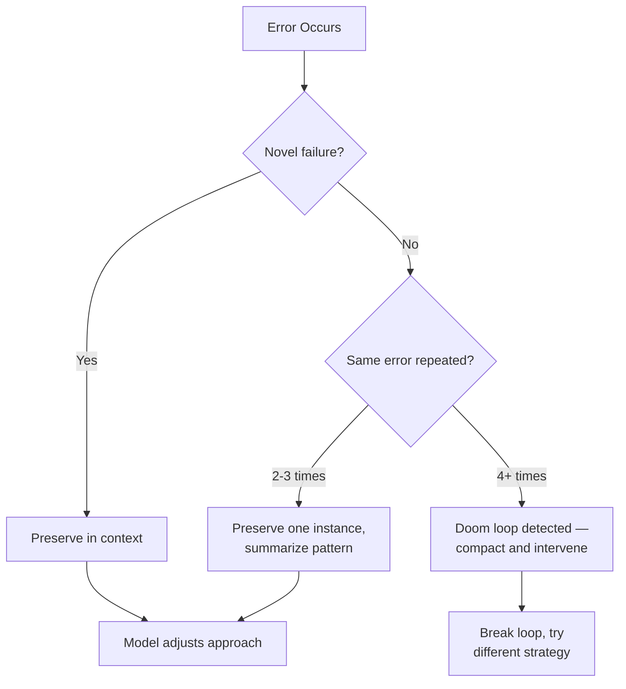

# Error Preservation in Context

> Preserve failed actions and error traces in context. Retained failures act as negative examples that steer the model away from approaches it has already tried.

Related lesson: [Staying on Target](https://learn.agentpatterns.ai/context-engineering/staying-on-target/) covers this concept in a hands-on lesson with quizzes.

## The counter-intuitive tradeoff

The natural instinct is to clean up after errors: remove stack traces, clear failed tool results, compact the context. In most cases this instinct is wrong.

Manus describes the mechanism directly: "leave the wrong turns in the context. When the model sees a failed action — and the resulting observation or stack trace — it implicitly updates its internal beliefs" ([Manus](https://manus.im/blog/Context-Engineering-for-AI-Agents-Lessons-from-Building-Manus)). Remove the failure and you remove the information the model needs to adjust its next decision.

Cursor measured the effect: removing reasoning traces from Codex caused a 30% performance drop, with lost subgoals, worse planning, and repeated re-derivation of earlier steps ([Cursor](https://cursor.com/blog/codex-model-harness)).

## What error traces provide

Error traces are structured negative examples:

| Signal | What the model learns |
|--------|----------------------|
| Stack trace from failed approach | Which code path does not work and why |
| Tool call that returned an error | Which tool invocation to avoid repeating |
| Type error from a previous fix | Which type assumptions are incorrect |
| Test failure after a change | Which behavioral expectation was violated |
| Permission denied on an operation | Which access paths are unavailable |

Each retained failure narrows the solution space. The model does not need to rediscover constraints it has already hit.

## The token-preservation trap

Telling agents to conserve tokens can backfire. Cursor found that telling the model to "preserve tokens and not be wasteful" made it refuse ambitious tasks entirely, declaring "I'm not supposed to waste tokens, and I don't think it's worth continuing with this task!" ([Cursor](https://cursor.com/blog/codex-model-harness)). The model reads "be efficient" as "avoid doing things that might fail". That is the opposite of the exploratory behavior recovery needs.

## When to preserve and when to compact

Not all errors deserve a permanent place in context. The decision depends on whether the error still carries signal:


```mermaid
graph TD
    A[Error Occurs] --> B{Novel failure?}
    B -->|Yes| C[Preserve in context]
    B -->|No| D{Same error repeated?}
    D -->|2-3 times| E[Preserve one instance,<br/>summarize pattern]
    D -->|4+ times| F[Doom loop detected —<br/>compact and intervene]
    C --> G[Model adjusts approach]
    E --> G
    F --> H[Break loop, try<br/>different strategy]
```

Preserve an error when the failure is novel, holds architectural information, or recovery is still in progress.

Compact when the same error has repeated four or more times (a doom loop), or when early errors no longer matter to the current task.

OpenDev uses five-stage progressive compaction: it keeps error traces in full during active recovery, then summarizes them step by step as the session continues ([Bui, 2026](https://arxiv.org/abs/2603.05344)).

## Error messages as teaching mechanisms

Well-designed error messages do two jobs: they inform the developer and they teach the agent. Alex Lavaee describes putting architectural guidance directly in error output, for example "Error: Service layer cannot import from UI layer. Move this logic to a Provider" ([Lavaee](https://alexlavaee.me/blog/openai-agent-first-codebase-learnings)). The agent learns the architectural constraint through the failure itself.

When you choose tools for agent workflows, prefer those with descriptive error output over terse codes.

## Two schools of thought

| Approach | Advocate | Strategy | Risk |
|----------|----------|----------|------|
| Preserve everything | Manus | Keep all failed actions visible; let the model learn from the full history | Context bloat in long sessions |
| Prevent and compact | Anthropic | Design tools to prevent errors; clear tool results as lightweight compaction | Losing error signal the model needs for recovery |

Anthropic frames tool misuse as [context pollution](../patterns/anti-patterns/session-partitioning.md) and recommends clearing tool results as compaction ([Anthropic](https://www.anthropic.com/engineering/effective-context-engineering-for-ai-agents)). Manus takes the opposite position: those dead-ends are the signal. The practical rule: preserve during active recovery, compact once recovery succeeds.

## Anchoring recovery in deterministic signals

Preserved errors help most when the agent verifies recovery against deterministic signals rather than its own judgment. The nibzard agentic handbook warns that "self-critique without objective checks is also brittle — models can rationalize" ([nibzard](https://www.nibzard.com/agentic-handbook)).

Anchor error recovery to tests, linters, type checkers, and build systems, rather than to the model's own reasoning about whether the error is fixed.

## Git as error recovery infrastructure

For long-running agents, git provides structured recovery points. A commit before each risky change means the error trace captures both what failed and a clean recovery state ([Anthropic](https://www.anthropic.com/engineering/effective-harnesses-for-long-running-agents)).

## Example

An agent attempts to write a file and receives a permission error. The context window retains the failure:

```
Tool call: write_file(path="/etc/config.yaml", content="...")
Result: PermissionError: [Errno 13] Permission denied: '/etc/config.yaml'
```

On the next turn, the agent does not retry the same path. It infers from the error that `/etc/` requires elevated access and reroutes to a writable location:

```
Tool call: write_file(path="/tmp/config.yaml", content="...")
Result: ok
Tool call: move_file(src="/tmp/config.yaml", dest="/etc/config.yaml", sudo=True)
Result: ok
```

Removing the first failed tool call would cause the model to retry `/etc/config.yaml` directly and re-encounter the same error (a doom loop). Preserving the error is what enables the reroute.

## Related

- [Context-Injected Error Recovery](context-injected-error-recovery.md)
- [Loop Detection](../observability/loop-detection.md)
- [Circuit Breakers for Agent Loops](../observability/circuit-breakers.md)
- [Failure-Driven Iteration](../workflows/failure-driven-iteration.md)
- [Context Compression Strategies](context-compression-strategies.md)
- [Context Budget Allocation](context-budget-allocation.md)
- [Context Window Dumb Zone](context-window-dumb-zone.md)
- [Goal Recitation](goal-recitation.md)
- [Phase-Specific Context Assembly](phase-specific-context-assembly.md)
- [Manual Compaction and Dumb-Zone Mitigation](manual-compaction-dumb-zone-mitigation.md)
- [Observation Masking](observation-masking.md)
- [Token Preservation Backfire](../patterns/anti-patterns/token-preservation-backfire.md)
- [Agent-First Software Design](../patterns/agent-design/agent-first-software-design.md)
- [Lost in the Middle](lost-in-the-middle.md)
- [Attention Sinks](attention-sinks.md)
- [Context Window Diagnostic Tooling](context-window-diagnostic-tooling.md)
- [Environment Specification as Context](environment-specification-as-context.md)
