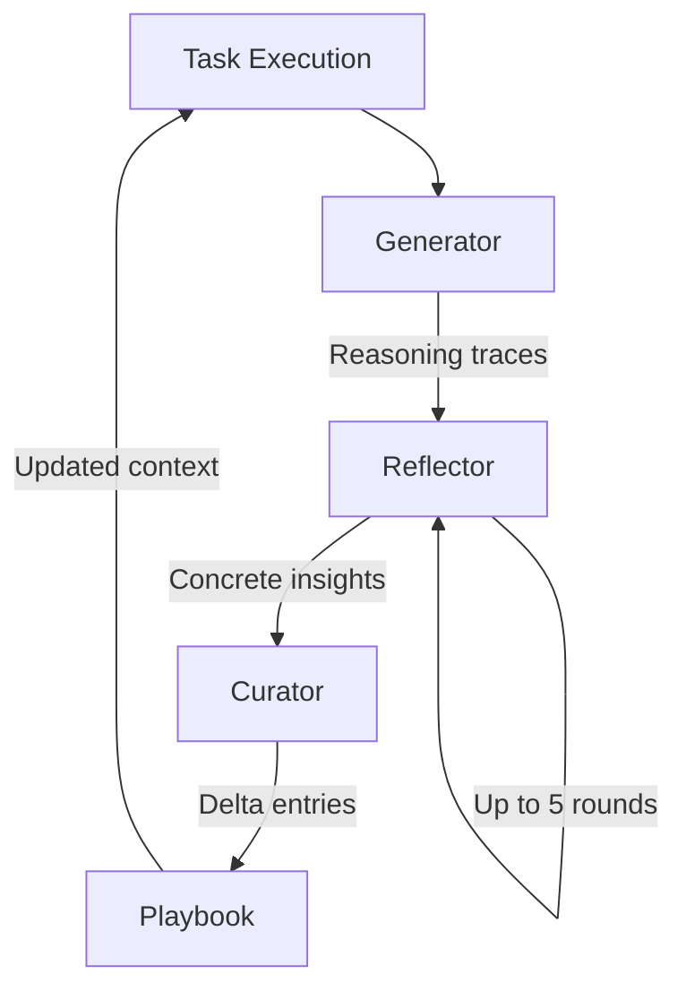

# Evolving Playbooks: Incremental Context That Preserves Knowledge

> Replace monolithic prompt rewrites with structured delta entries that accumulate, refine, and organize agent strategies -- preventing the brevity bias and context collapse that erode knowledge during iterative rewriting.

## When This Pattern Applies

Evolving playbooks solve a specific problem: agents that improve over time by learning from execution feedback. The pattern is most valuable when:

- The domain generates **reusable strategies** (coding patterns, tool usage sequences, error recovery approaches)
- **Reliable feedback signals** exist (test pass/fail, task completion, validation outcomes)
- The system runs enough iterations to **accumulate meaningful entries**

For well-understood tasks with a single optimal strategy, or environments without clear success/failure signals, a carefully written static prompt remains simpler and sufficient.

## Two Failure Modes of Iterative Rewriting

Developers iterating on system prompts and agent memory hit two named failure modes that motivate the shift from static to evolving contexts.

### Brevity Bias

When an LLM summarizes or rewrites a context, it systematically drops domain-specific knowledge in favor of conciseness. The model optimizes for shorter output, not for preserving the insights that make the context effective. Strategies that took multiple iterations to discover -- specific error recovery sequences, tool ordering preferences, edge case handling -- are the first to be cut because they appear verbose relative to high-level guidance ([Zhang et al., 2026](https://arxiv.org/abs/2510.04618)).

### Context Collapse

Repeated full rewrites compound brevity bias into progressive knowledge loss. Each rewrite cycle uses the previous output as input, and each cycle drops more nuance. Quantitatively: monolithic rewrites reduced a working context from 18,282 tokens to 122 tokens over multiple cycles, with a 9.6-point accuracy drop -- not because the model was asked to compress, but because rewriting inherently loses information that the model considers redundant ([Zhang et al., 2026](https://arxiv.org/abs/2510.04618)).

## The Generation-Reflection-Curation Loop

The ACE framework (Agentic Context Engineering) replaces monolithic rewrites with a three-phase loop where each phase has a distinct role ([Zhang et al., 2026](https://arxiv.org/abs/2510.04618)):

**Generator**: Executes tasks and produces reasoning trajectories that capture both successful strategies and failure modes. The traces include tool calls, intermediate outputs, and decision points.

**Reflector**: Examines execution traces and extracts concrete, reusable insights. Iterates up to 5 rounds of refinement to distill lessons from successes and errors. Uses execution feedback signals (task outcomes, validation results) rather than requiring labeled training data.

**Curator**: Synthesizes reflections into compact **delta entries** -- small, itemized units representing a single strategy, domain concept, or failure mode. Each entry carries metadata: a unique ID and helpful/harmful counters that track how often the strategy led to good or bad outcomes.

The critical design choice: the Curator merges deltas through **deterministic, non-LLM logic** (semantic embedding comparison for deduplication, ID-based updates). This prevents the rewriting bottleneck where an LLM must compress an entire context into a shorter form.

## Delta Entries vs. Monolithic Rewrites

The structural difference between evolving playbooks and traditional prompt iteration:

| Approach | Update mechanism | Knowledge preservation | Scaling behavior |
|----------|-----------------|----------------------|-----------------|
| Monolithic rewrite | LLM regenerates full context | Lossy -- each cycle drops nuance | Degrades as context grows |
| Delta entries | Add/update/remove individual items | Structural -- entries persist independently | Grows with domain complexity |

Each delta entry is independently addressable. Updating one strategy does not require regenerating the entire context. The helpful/harmful counters provide lightweight reinforcement: strategies that consistently help surface more prominently, while harmful ones are deprioritized or removed -- without requiring explicit labels ([Zhang et al., 2026](https://arxiv.org/abs/2510.04618)).

## Offline and Online Optimization

The same loop applies to two distinct optimization targets:

**Offline (system prompts)**: Run the generation-reflection-curation loop over a batch of tasks, then update the system prompt with the accumulated playbook. The agent starts every new session with strategies learned from prior batches. This is analogous to updating a `CLAUDE.md` or `.github/copilot-instructions.md` file based on observed failure patterns.

**Online (agent memory)**: Run the loop within a single session, accumulating strategies as the agent works. The playbook grows during execution and persists for future sessions. This maps to how tools like Claude Code's [memory system](https://www.anthropic.com/engineering/effective-context-engineering-for-ai-agents) store learned patterns across sessions.

## Results in Practice

On agent benchmarks, evolving playbooks outperform both static prompts and monolithic rewriting approaches:

- **AppWorld**: +10.6% task completion, matching the top-ranked production agent (IBM CUGA at 60.3%) while using smaller open-source models (DeepSeek-V3.1) ([Zhang et al., 2026](https://arxiv.org/abs/2510.04618))
- **Finance domain**: +8.6% average accuracy across financial NER and formula tasks ([Zhang et al., 2026](https://arxiv.org/abs/2510.04618))
- **Adaptation latency**: 82.3% reduction compared to GEPA (a monolithic prompt evolution baseline), because delta merges are cheaper than full regenerations ([Zhang et al., 2026](https://arxiv.org/abs/2510.04618))

The predecessor framework, Dynamic Cheatsheet, demonstrated the core mechanism: GPT-4o went from 10% to 99% accuracy on Game of 24 by retaining and reusing discovered solution strategies across problems ([Suzgun et al., 2025](https://arxiv.org/abs/2504.07952)).

## When This Backfires

- **Low-feedback environments**: Without clear success/failure signals (creative tasks, open-ended research), the Reflector cannot distinguish useful strategies from noise. The playbook accumulates entries of unknown quality.
- **Rapidly shifting domains**: If the task domain changes faster than the playbook adapts, stale strategies persist and mislead. The helpful/harmful counters need sufficient samples to decay outdated entries.
- **Reflector quality dependency**: The framework is only as good as the Reflector's ability to extract causal insights rather than surface correlations. Poor reflection produces noisy contexts that degrade performance ([Zhang et al., 2026](https://arxiv.org/abs/2510.04618)).
- **Compliance-critical systems**: Automated curation may introduce subtle strategy changes. In regulated environments where every prompt change requires review, the overhead of auditing individual deltas may exceed the cost of manual prompt iteration.

## Key Takeaways

- Brevity bias and context collapse are named failure modes of iterative prompt rewriting -- monolithic rewrites progressively lose domain knowledge.
- Evolving playbooks replace full rewrites with structured delta entries that carry metadata and merge deterministically.
- The generation-reflection-curation loop separates task execution, insight extraction, and knowledge organization into distinct phases.
- The pattern requires reliable feedback signals and sufficient domain complexity to justify the infrastructure overhead.
- Static prompts remain the better choice for well-understood, fixed-strategy tasks.

## Related

- [Context Compression Strategies](context-compression-strategies.md) -- tiered compression for managing context growth, complementary to playbook accumulation
- [Memory Synthesis from Execution Logs](../agent-design/memory-synthesis-execution-logs.md) -- extracting lessons from agent traces, a prerequisite for the reflection phase
- [Memory Reinforcement Learning](../agent-design/memory-reinforcement-learning.md) -- utility-scored episodic memory, a related approach to tracking strategy effectiveness
- [Goal Recitation](goal-recitation.md) -- countering drift in long sessions through periodic objective restatement
- [Dynamic System Prompt Composition](dynamic-system-prompt-composition.md) -- building prompts from modular sections, the delivery mechanism for playbook content
- [Objective Drift](../anti-patterns/objective-drift.md) -- the failure mode that evolving playbooks can cause if curation quality is poor
- [Context Engineering](context-engineering.md) -- the broader discipline that evolving playbooks operate within
- [Prompt Compression](prompt-compression.md) -- reducing token cost through denser instructions, a complementary technique when playbooks grow large
