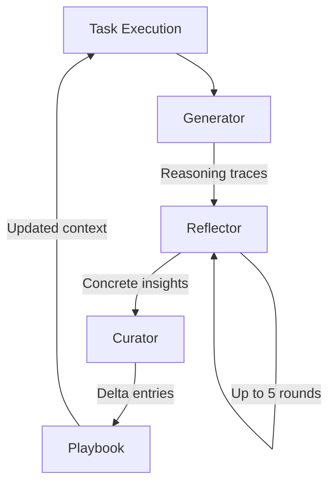

# Evolving Playbooks: Incremental Context That Preserves Knowledge

> Structured delta entries that accumulate and refine agent strategies prevent the brevity bias and context collapse that erode knowledge during monolithic prompt rewrites.

Related lesson: [Assembling the Prompt](https://learn.agentpatterns.ai/context-engineering/assembling-the-prompt/) — this concept features in a hands-on lesson with quizzes.

## When this pattern applies

Evolving playbooks suit agents that improve by learning from execution feedback. The pattern fits when:

- The domain generates reusable strategies: coding patterns, tool usage sequences, error recovery
- Reliable feedback signals exist: test pass/fail, task completion, validation outcomes
- Iterations are frequent enough to accumulate meaningful entries

A static prompt stays simpler and is enough when a task has one optimal strategy, or when the environment gives no clear success signals.

## Two failure modes of iterative rewriting

### Brevity bias

When an LLM rewrites a context, it drops domain-specific knowledge to stay concise. Strategies that took several iterations to find -- specific error recovery sequences, tool ordering preferences, edge case handling -- are cut first, because they look verbose next to high-level guidance ([Zhang et al., 2026](https://arxiv.org/abs/2510.04618)).

### Context collapse

Repeated full rewrites turn brevity bias into steady knowledge loss. Each cycle takes the previous output as input and drops more nuance. In measured runs, monolithic rewrites shrank a working context from 18,282 tokens to 122 tokens over several cycles, with a 9.6-point accuracy drop -- because rewriting loses information the model treats as redundant ([Zhang et al., 2026](https://arxiv.org/abs/2510.04618)).

## The generation-reflection-curation loop

The ACE framework (Agentic Context Engineering) replaces monolithic rewrites with a three-phase loop where each phase has a distinct role ([Zhang et al., 2026](https://arxiv.org/abs/2510.04618)):

```mermaid
graph TD
    A[Task Execution] --> B[Generator]
    B -->|Reasoning traces| C[Reflector]
    C -->|Concrete insights| D[Curator]
    D -->|Delta entries| E[Playbook]
    E -->|Updated context| A
    C -->|Up to 5 rounds| C
```

Generator: executes tasks and produces reasoning trajectories -- tool calls, intermediate outputs, decision points -- capturing both successful strategies and failure modes.

Reflector: extracts concrete, reusable insights from traces. It runs up to 5 rounds to distill lessons from successes and errors, using execution feedback signals rather than labeled training data.

Curator: turns reflections into compact delta entries -- itemized units that each represent a single strategy, domain concept, or failure mode. Each entry carries a unique ID and helpful/harmful counters that track outcome frequency.

The critical design choice: the Curator merges deltas through deterministic, non-LLM logic -- semantic embedding comparison for deduplication, plus ID-based updates. This avoids the rewriting bottleneck that forces an LLM to compress the full context.

## Delta entries versus monolithic rewrites

| Approach | Update mechanism | Knowledge preservation | Scaling |
|----------|-----------------|----------------------|---------|
| Monolithic rewrite | LLM regenerates full context | Lossy -- each cycle drops nuance | Degrades as context grows |
| Delta entries | Add/update/remove items | Structural -- entries persist independently | Grows with domain complexity |

Each delta entry is independently addressable, so updating one strategy does not regenerate the whole context. Helpful/harmful counters give lightweight reinforcement: consistently useful strategies surface more prominently, while harmful ones are deprioritized or removed -- without explicit labels ([Zhang et al., 2026](https://arxiv.org/abs/2510.04618)).

## Offline and online optimization

Offline (system prompts): run the loop over a task batch, then update the system prompt with the accumulated playbook -- like updating `CLAUDE.md` or `.github/copilot-instructions.md` based on observed failures.

Online (agent memory): run the loop within a session, accumulating strategies as the agent works. The playbook persists for future sessions, as in Claude Code's [memory system](https://www.anthropic.com/engineering/effective-context-engineering-for-ai-agents).

## Results in practice

On agent benchmarks, evolving playbooks outperform both static prompts and monolithic rewriting:

- AppWorld: +10.6% task completion, matching IBM CUGA (60.3%) on smaller open-source models (DeepSeek-V3.1) ([Zhang et al., 2026](https://arxiv.org/abs/2510.04618))
- Finance: +8.6% average accuracy across financial NER and formula tasks ([Zhang et al., 2026](https://arxiv.org/abs/2510.04618))
- Adaptation latency: 82.3% reduction versus GEPA, because delta merges are cheaper than full regenerations ([Zhang et al., 2026](https://arxiv.org/abs/2510.04618))

The predecessor framework, Dynamic Cheatsheet, showed the core mechanism: GPT-4o went from 10% to 99% on Game of 24 by reusing discovered solution strategies ([Suzgun et al., 2025](https://arxiv.org/abs/2504.07952)).

## When this backfires

- Low-feedback environments: without clear success/failure signals, the Reflector cannot tell useful strategies from noise, and the playbook fills with entries of unknown quality.
- Rapidly shifting domains: if the domain changes faster than the playbook adapts, stale strategies persist. Helpful/harmful counters need enough samples to decay outdated entries.
- Reflector quality dependency: the framework is only as good as the Reflector's ability to extract causal insights rather than surface correlations. Poor reflection produces noisy contexts that degrade performance ([Zhang et al., 2026](https://arxiv.org/abs/2510.04618)).
- Compliance-critical systems: in regulated environments, auditing individual deltas may cost more than manual prompt iteration.

## Key Takeaways

- Brevity bias and context collapse are named failure modes of iterative prompt rewriting -- monolithic rewrites progressively lose domain knowledge.
- Evolving playbooks replace full rewrites with structured delta entries that carry metadata and merge deterministically.
- The generation-reflection-curation loop separates task execution, [insight extraction](../patterns/agent-design/memory-synthesis-execution-logs.md), and knowledge organization into distinct phases.
- The pattern requires reliable feedback signals and sufficient domain complexity to justify the infrastructure overhead.
- Static prompts remain the better choice for well-understood, fixed-strategy tasks.

## Related

- [Context Compression Strategies](context-compression-strategies.md) -- tiered compression for managing context growth, complementary to playbook accumulation
- [Memory Synthesis from Execution Logs](../patterns/agent-design/memory-synthesis-execution-logs.md) -- extracting lessons from agent traces, a prerequisite for the reflection phase
- [Memory Retrieval as a Control Decision](../patterns/agent-design/memory-retrieval-as-control.md) -- utility-scored episodic memory, a related approach to tracking strategy effectiveness
- [Goal Recitation](goal-recitation.md) -- countering drift in long sessions through periodic objective restatement
- [Dynamic System Prompt Composition](dynamic-system-prompt-composition.md) -- building prompts from modular sections, the delivery mechanism for playbook content
- [Objective Drift](../patterns/anti-patterns/objective-drift.md) -- the failure mode that evolving playbooks can cause if curation quality is poor
- [Context Engineering](context-engineering.md) -- the broader discipline that evolving playbooks operate within
- [Prompt Compression](prompt-compression.md) -- reducing token cost through denser instructions, a complementary technique when playbooks grow large
