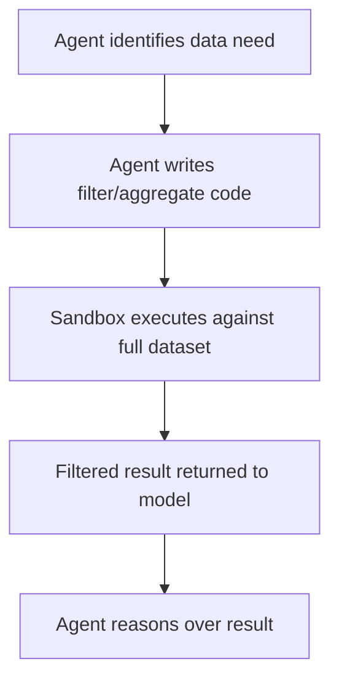

# Filter and Aggregate in the Execution Environment

> Run data processing logic inside the code execution sandbox before surfacing results to the model, so only the relevant subset of data enters context.

## The Problem

When an agent fetches a dataset to find a subset of matching records, the naive approach passes the full dataset through the model's context. A 10,000-row dataset fetched to find three matching records wastes 9,997 rows of context. This limits the size of datasets agents can reason about and increases cost proportionally.

[Anthropic's MCP code execution research](https://www.anthropic.com/engineering/code-execution-with-mcp) describes the pattern of running filtering and aggregation inside a sandboxed execution environment as the primary mechanism for keeping datasets of arbitrary size manageable.

## The Pattern

Instead of returning raw data to the model, the agent writes and executes code in a sandbox that filters, aggregates, or joins data before the result surfaces:



The model sees only the output — not the intermediate data. The sandbox acts as a compute boundary that keeps large datasets out of context entirely.

## What Can Be Processed in the Sandbox

The same pattern applies to any large intermediate representation:

- **Tabular data**: SQL queries, pandas DataFrames, CSV files — filter rows, aggregate columns, join tables before returning
- **Log files**: grep-equivalent filtering to return only relevant log lines, not the full file
- **API payloads**: extract specific fields from large JSON responses before the agent sees them
- **Images and binary data**: thumbnails, metadata extraction, format conversion — return the derived representation, not the raw bytes
- **Code analysis results**: AST traversal, dependency graphs — return the answer to the query, not the full graph

## Why Code Over Tool Chains

An agent that achieves filtering through a sequence of tool calls — fetch all, filter, paginate, aggregate — incurs overhead at each step: the intermediate results enter context at each stage, and the agent must reason about each result before issuing the next call.

Code in a sandbox replaces the chain with a single execution: fetch, filter, aggregate, return. [Anthropic's MCP code execution research](https://www.anthropic.com/engineering/code-execution-with-mcp) notes that familiar programming constructs (loops, conditionals) enable this consolidation, reducing both "time to first token" latency and total token consumption [unverified].

## Sandbox Requirements

This pattern requires a secure execution environment with:

- **Resource limits**: CPU time, memory ceiling, and network restrictions to prevent runaway execution
- **Isolation**: code executed in the sandbox must not be able to affect the host environment
- **Monitored output**: sandbox execution logs should be observable for debugging and auditing
- **Deterministic behavior**: the same input and code must produce the same output, with no side effects that persist between executions

Without adequate isolation, the pattern introduces a code execution vulnerability: malicious or erroneous agent-generated code could cause harm beyond data filtering.

## Scope of Applicability

This pattern is most valuable when:

- Datasets exceed what fits comfortably in the context window
- The agent's task requires a derived result (count, aggregate, filtered slice) rather than raw data
- Intermediate processing would otherwise produce context-heavy tool chains

It is not applicable when the agent needs to reason about the full dataset — for example, when the task is to identify structural patterns across all rows rather than filter to a subset.

## Key Takeaways

- Pass filtered results to the model, not raw datasets — the sandbox is the compute boundary.
- Replace multi-step tool chains with single sandbox executions to reduce latency and token cost.
- Apply to any large intermediate representation: tables, logs, API payloads, binary data.
- The sandbox must have resource limits, isolation, and monitoring — code execution without these is a security risk.

## Unverified Claims

- Code in a sandbox reduces "time to first token" latency and total token consumption compared to tool chains [unverified]

## Example

An agent task: "Find all orders over $500 placed in Q4 2024 from the orders table."

Without the pattern, the agent receives all rows and filters them itself:

```python
# naive — full dataset enters context
result = execute_tool("read_csv", {"path": "orders.csv"})
# result: 50,000 rows, ~2M tokens
```

With filter-aggregate in the sandbox, the agent writes code the sandbox executes:

```python
# agent-generated code, executed in sandbox
import pandas as pd

df = pd.read_csv("orders.csv")
filtered = df[
    (df["amount"] > 500) &
    (df["order_date"] >= "2024-10-01") &
    (df["order_date"] <= "2024-12-31")
]
result = filtered[["order_id", "customer_id", "amount", "order_date"]].to_dict("records")
```

The sandbox returns only the matching rows — perhaps 43 records instead of 50,000. The model reasons over 43 rows rather than the full dataset.

The same approach works for log filtering:

```python
# agent-generated code, executed in sandbox
import re

with open("/var/log/app.log") as f:
    lines = f.readlines()

errors = [l.strip() for l in lines if re.search(r"ERROR|CRITICAL", l) and "2024-12-15" in l]
```

The model sees only the error lines for the target date, not the full log file.

## Related

- [Filesystem-Based Tool Discovery](../tool-engineering/filesystem-tool-discovery.md)
- [Semantic Tool Output: Designing for Agent Readability](../tool-engineering/semantic-tool-output.md)
- [Context Compression Strategies](context-compression-strategies.md)
- [Token-Efficient Tool Design](../tool-engineering/token-efficient-tool-design.md)
- [Observation Masking](observation-masking.md)
- [Prompt Compression](prompt-compression.md)
- [Retrieval-Augmented Agent Workflows](retrieval-augmented-agent-workflows.md)
- [Semantic Context Loading](semantic-context-loading.md)
- [Observation Masking](observation-masking.md)
- [Prompt Compression](prompt-compression.md)
- [Retrieval-Augmented Agent Workflows](retrieval-augmented-agent-workflows.md)
- [Semantic Context Loading](semantic-context-loading.md)