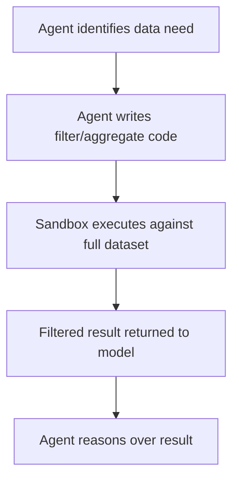

# Filter and Aggregate Data in the Execution Environment

> Run data processing logic inside the code execution sandbox before surfacing results to the model, so only the relevant subset of data enters context.

Related lesson: [Code Mode](https://learn.agentpatterns.ai/mcp-server-design/code-mode/) covers this concept in a hands-on lesson with quizzes.

## The problem

When an agent fetches a dataset to find a few matching records, the naive approach passes the whole dataset through the model's context. A 10,000-row dataset fetched to find three matching records wastes 9,997 rows of context. This caps the size of datasets an agent can reason about, and it raises cost in proportion.

[Anthropic's MCP code execution research](https://www.anthropic.com/engineering/code-execution-with-mcp) describes running filtering and aggregation inside a sandboxed execution environment as the primary mechanism for keeping arbitrarily large datasets manageable.

## The pattern

Instead of returning raw data to the model, the agent writes and runs code in a sandbox. That code filters, aggregates, or joins the data before the result surfaces:


```mermaid
graph TD
    A[Agent identifies data need] --> B[Agent writes filter/aggregate code]
    B --> C[Sandbox executes against full dataset]
    C --> D[Filtered result returned to model]
    D --> E[Agent reasons over result]
```

The model sees only the output, not the intermediate data. The sandbox acts as a compute boundary that keeps large datasets out of context.

## What can be processed in the sandbox

The same pattern applies to any large intermediate representation:

- Tabular data: SQL queries, pandas DataFrames, CSV files — filter rows, aggregate columns, and join tables before returning
- Log files: grep-style filtering that returns only the relevant log lines, not the full file
- API payloads: extract specific fields from large JSON responses before the agent sees them
- Images and binary data: thumbnails, metadata extraction, format conversion — return the derived representation, not the raw bytes
- Code analysis results: AST traversal, dependency graphs — return the answer to the query, not the full graph

## Why code beats tool chains

An agent that filters through a sequence of tool calls — fetch all, filter, paginate, aggregate — pays overhead at each step. The intermediate results enter context at each stage, and the agent must reason about each result before it issues the next call.

Code in a sandbox replaces the chain with a single run: fetch, filter, aggregate, return. [Anthropic's MCP code execution research](https://www.anthropic.com/engineering/code-execution-with-mcp) notes that familiar programming constructs such as loops and conditionals make this consolidation possible, which cuts both time-to-first-token latency and total token use. Anthropic's [programmatic tool calling](https://www.anthropic.com/engineering/advanced-tool-use) extends the same idea: an agent-written script processes the tool results instead of the model consuming them. It reports a roughly 37% drop in token use on complex research tasks, because the intermediate results never enter context.

## Sandbox requirements

This pattern needs a secure execution environment with:

- Resource limits: CPU time, a memory ceiling, and network restrictions that prevent runaway execution
- Isolation: code run in the sandbox must not be able to affect the host environment
- Monitored output: you should be able to observe the execution logs for debugging and auditing
- Deterministic behavior: the same input and code must produce the same output, with no side effects that persist between runs

Without enough isolation, the pattern opens a code execution vulnerability: malicious or buggy agent-generated code could cause harm beyond data filtering.

## When to apply it

This pattern is most valuable when:

- Datasets exceed what fits comfortably in the context window
- The task needs a derived result, such as a count, an aggregate, or a filtered slice, rather than raw data
- Intermediate processing would otherwise produce context-heavy tool chains

It does not apply when the agent needs to reason about the full dataset. For example, the task may be to find structural patterns across all rows rather than filter to a subset.

## When this backfires

- The agent writes non-deterministic code: if the generated code has side effects — writing to shared state, making external calls, consuming random seeds — the determinism guarantees break. The same filter run twice may return different results or corrupt shared resources.
- Sandbox start-up costs more than it saves: cold-starting a new sandbox container can add hundreds of milliseconds per call. For small datasets or infrequent queries, the sandbox overhead outweighs the [token savings](context-budget-allocation.md) from filtering.
- Sandbox isolation is too loose: an under-isolated sandbox — shared filesystem, unrestricted network, or weak memory limits — turns agent-generated code into a privilege-escalation vector. The pattern assumes a well-hardened environment; without one it adds more risk than [raw context overhead](context-compression-strategies.md).
- Filtering silently drops relevant data: if the filter logic has an off-by-one error or a wrong predicate, the model receives a clean but wrong subset and reasons confidently over incomplete data. Errors in tool chains are often visible; errors in sandbox code may be silent.

## Key Takeaways

- Pass filtered results to the model, not raw datasets — the sandbox is the compute boundary.
- Replace multi-step tool chains with single sandbox executions to reduce latency and [token cost](../token-engineering/token-efficient-tool-design.md).
- Apply to any large intermediate representation: tables, logs, API payloads, binary data.
- The sandbox must have resource limits, isolation, and monitoring — code execution without these is a security risk.

## Example

An agent task: "Find all orders over $500 placed in Q4 2024 from the orders table."

Without the pattern, the agent receives all rows and filters them itself:

```python
# naive — full dataset enters context
result = execute_tool("read_csv", {"path": "orders.csv"})
# result: 50,000 rows, ~2M tokens
```

With filter-aggregate in the sandbox, the agent writes code the sandbox executes:

```python
# agent-generated code, executed in sandbox
import pandas as pd

df = pd.read_csv("orders.csv")
filtered = df[
    (df["amount"] > 500) &
    (df["order_date"] >= "2024-10-01") &
    (df["order_date"] <= "2024-12-31")
]
result = filtered[["order_id", "customer_id", "amount", "order_date"]].to_dict("records")
```

The sandbox returns only the matching rows — perhaps 43 records instead of 50,000. The model reasons over 43 rows rather than the full dataset.

The same approach works for log filtering:

```python
# agent-generated code, executed in sandbox
import re

with open("/var/log/app.log") as f:
    lines = f.readlines()

errors = [l.strip() for l in lines if re.search(r"ERROR|CRITICAL", l) and "2024-12-15" in l]
```

The model sees only the error lines for the target date, not the full log file.

## Related

- [Dynamic Tool Fetching Breaks KV Cache](../anti-patterns/dynamic-tool-fetching-cache-break.md) — tool-by-tool fetching patterns and their cache cost implications
- [Semantic Tool Output: Designing for Agent Readability](../tool-engineering/semantic-tool-output.md)
- [Context Compression Strategies](context-compression-strategies.md)
- [Token-Efficient Tool Design](../token-engineering/token-efficient-tool-design.md)
- [Observation Masking](observation-masking.md)
- [Retrieval-Augmented Agent Workflows](retrieval-augmented-agent-workflows.md)
- [Semantic Context Loading](semantic-context-loading.md)
- [Context Budget Allocation](context-budget-allocation.md)
