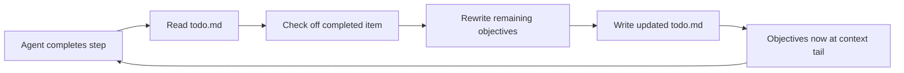

# Goal Recitation: Countering Drift in Long Sessions

> Periodically rewrite objectives, to-do lists, and status summaries at the tail of context to exploit recency bias and prevent goal drift in long-running agent sessions.

## The Problem

Agent sessions exceeding ~50 tool calls routinely drift from their original objective. Earlier instructions fall into the low-attention middle zone of the context window ([Liu et al., "Lost in the Middle," TACL 2023](https://arxiv.org/abs/2307.03172)). Arike et al. (2025) confirmed this across multiple models on 100k+ token sequences: all exhibited goal drift, predominantly through **inaction** ([Arike et al., 2025](https://arxiv.org/abs/2505.02709)).

## The Technique

The agent maintains a running objectives file (e.g., `todo.md`) and rewrites it after each completed step — checking off finished items, restating remaining goals, and noting status. This pushes global objectives into the high-attention recency zone.



Manus uses this pattern for tasks averaging ~50 tool calls: a `todo.md` maintained step-by-step, where rewriting recites objectives into the model's recent attention span ([Manus, "Context Engineering for AI Agents"](https://manus.im/blog/Context-Engineering-for-AI-Agents-Lessons-from-Building-Manus)).

## How It Differs from Related Techniques

| Technique | Who initiates | When it fires | Mechanism |
|-----------|--------------|---------------|-----------|
| **Goal recitation** | Agent | Every step (continuous) | Rewrites objectives into context tail |
| [Critical instruction repetition](../instructions/critical-instruction-repetition.md) | Author | Prompt design time (static) | Duplicates rules at start and end of prompt |
| [Event-driven system reminders](../instructions/event-driven-system-reminders.md) | Harness | Detected conditions (reactive) | Injects user-role messages |
| [Trajectory logging / progress files](../observability/trajectory-logging-progress-files.md) | Agent | Session boundaries | Filesystem state for cross-session recovery |

## Implementation

### Via CLAUDE.md / AGENTS.md

```markdown
## Task Management

- Create a `todo.md` file at the start of every multi-step task
- After completing each step, rewrite `todo.md`: check off the completed item,
  restate all remaining objectives, note any blockers
- Before starting each new step, read `todo.md` to confirm current priorities
- When compacting context, always preserve the full contents of `todo.md`
```

### Via Harness / Orchestrator

```python
def post_step_recitation(agent_state: AgentState) -> str:
    """Generate an objective recitation message after each tool call."""
    completed = [t for t in agent_state.tasks if t.done]
    remaining = [t for t in agent_state.tasks if not t.done]

    recitation = "## Current Status\n"
    recitation += "".join(f"- [x] {t.name}\n" for t in completed)
    recitation += "".join(f"- [ ] {t.name}\n" for t in remaining)
    recitation += f"\nPrimary objective: {agent_state.original_goal}\n"

    # Inject as a user message so it lands in the attention window
    return {"role": "user", "content": recitation}
```

## Amplifying Recitation with Strong Goal Elicitation

Arike et al. (2025) found that **strong goal elicitation** — restating the core objective in imperative language — significantly reduced drift across all tested models.

Weak (task list only):

```
- [ ] Implement refresh endpoint
- [ ] Write integration tests
```

Strong (objective + task list):

```
Remember: your primary goal is to refactor UserService for dependency injection
WITHOUT changing any public method signatures.

- [ ] Implement refresh endpoint
- [ ] Write integration tests
```

Strong elicitation reduces drift but does not eliminate it.

## When Recitation Is Not Enough

Goal recitation addresses within-session attention decay but not:

- **Post-compaction drift** — if the todo file is lost during context compression, recitation cannot help. Instruct compaction to preserve it verbatim ([LangChain](https://blog.langchain.com/context-management-for-deepagents/)).
- **Instruction fade-out** — after ~15 tool calls, agents violate foundational instructions regardless of recitation. Event-driven system reminders are the complementary defense ([Bui, 2025 §2.3.4](https://arxiv.org/abs/2603.05344)).
- **Cross-session continuity** — recitation is ephemeral. For persistence, use [trajectory logging via progress files](../observability/trajectory-logging-progress-files.md).

## Unverified Claims

- Manus reports improved goal adherence from todo.md rewriting but has not published metrics or A/B results. [unverified]
- The ~15 tool-call threshold for instruction fade-out may vary across models and context configurations. [unverified]

## Related

- [Lost in the Middle: The U-Shaped Attention Curve](lost-in-the-middle.md) — the underlying attention problem
- [Attention Sinks: Why First Tokens Always Win](attention-sinks.md) — why the tail gets attention but the middle loses it
- [Context Window Dumb Zone](context-window-dumb-zone.md) — the degradation gradient that makes goal recitation necessary
- [Manual Compaction Strategy for Dumb Zone Mitigation](manual-compaction-dumb-zone-mitigation.md) — managing context compression to prevent post-compaction drift
- [Context Compression Strategies: Offloading and Summarisation](context-compression-strategies.md) — tiered offloading for long-running agents
- [Objective Drift: When Agents Lose the Thread](../anti-patterns/objective-drift.md) — the failure mode this technique mitigates
- [Critical Instruction Repetition](../instructions/critical-instruction-repetition.md) — static, author-placed counterpart
- [Event-Driven System Reminders](../instructions/event-driven-system-reminders.md) — harness-injected, reactive counterpart
- [Trajectory Logging via Progress Files](../observability/trajectory-logging-progress-files.md) — cross-session audit trail
- [Post-Compaction Re-read Protocol](../instructions/post-compaction-reread-protocol.md) — addresses post-compaction drift that recitation alone cannot prevent
- [Phase-Specific Context Assembly](phase-specific-context-assembly.md) — structuring context bundles per phase, including objective framing
- [Context Engineering: The Discipline of Designing Agent Context](context-engineering.md) — the broader discipline
