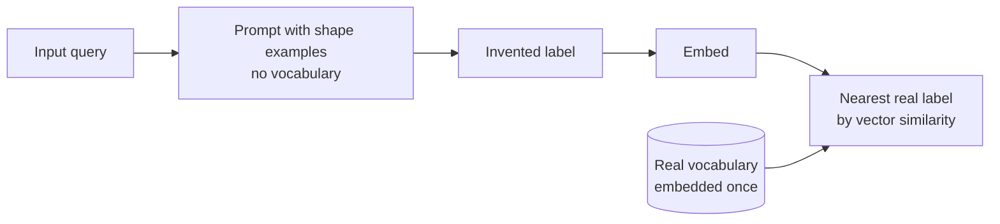

# Hypothetical Classification for Large Label Vocabularies

> Ask the model to invent a plausible label, then resolve that invention to the nearest real entry by embedding similarity.

Hypothetical classification splits a large-vocabulary classification problem into two cheap steps. A small model invents a label that does not exist in your taxonomy, and an embedding lookup snaps that invention onto the closest entry that does. The vocabulary never enters the prompt, so its size stops constraining the model. Doug Turnbull demonstrated the technique on the Wayfair WANDS taxonomy, sorting a query such as `brown coffee table` into one of hundreds of category paths ([Turnbull, 2026](https://softwaredoug.com/blog/2026/08/10/hypothetical-classifications)).

## When to reach for it

Check all four conditions before adopting the technique:

- The vocabulary genuinely does not fit. Simon Willison's motivating case is 1,856 blog tags, "likely too many to feed to an LLM in one go" ([Willison, 2026](https://simonwillison.net/2026/Aug/14/dont-classify-hallucinate/)). The academic framing matches: "the label set is too large to be given to the LLMs in their prompt" ([Zhu and Zamani, 2024](https://arxiv.org/abs/2311.09649v2)).
- Inputs are phrased unlike the labels. A short search query and a slash-delimited taxonomy path share few surface tokens, and the invented label bridges that gap.
- You can validate the mapping, because the resolution step returns a match whether or not one deserves to exist.
- You have measured the baseline. Embedding the input directly against the label vocabulary is a few lines of code, and it is the number this technique has to beat.

## How the two steps work



The prompt carries no candidate answers, only a handful of example paths that establish the depth, register, and delimiter of the real taxonomy ([Turnbull, 2026](https://softwaredoug.com/blog/2026/08/10/hypothetical-classifications)). Those examples do shape-setting work rather than enumeration work, so prompt size stays constant as the vocabulary grows. Turnbull embeds every real classification once with MiniLM, embeds the invented label, then takes the dot product.

## Why it works

The invented label is a query vector rather than an answer. Writing something that reads like a category moves the input into label space, so its embedding lands near real categories instead of near other queries. Grounding then happens in the encoder rather than the model. The authors of HyDE, the retrieval-side ancestor of this shape, state the causal step directly: "This second step ground the generated document to the actual corpus, with the encoder's dense bottleneck filtering out the incorrect details" ([Gao et al., 2022](https://arxiv.org/abs/2212.10496v1)). That bottleneck is lossy, and the loss is the point: fabricated specifics survive generation but not encoding, while the relevance pattern survives both.

Turnbull's post never names HyDE or claims the lineage. The resemblance is structural.

## When this backfires

- The unguided form loses to plain retrieval. In the closest measured analogue, candidates from no-demonstration generation scored P@1 0.160 on a 131K-label benchmark against 0.190 for dense retrieval over the same label space, and 0.250 against 0.270 at 320K labels ([Zhu and Zamani, 2024](https://arxiv.org/abs/2311.09649v2)). Structured guidance in the prompt separated the winning configuration from the losing one.
- Accuracy erodes as the vocabulary grows. The same work reports that at 320K labels the generation route "does not measure up to the performance levels achieved by soft matching," attributing the gap to scale ([Zhu and Zamani, 2024](https://arxiv.org/abs/2311.09649v2)).
- The mapping step cannot abstain: "Nearest neighbor assignment guarantees every extracted risk maps to some taxonomy category, even when no appropriate category exists" ([Dolphin et al., 2026](https://arxiv.org/abs/2601.15247v1)). That team added an LLM judge as a third stage to filter what the embedding step wrongly accepted.
- Inputs already written in the vocabulary's own terms get paraphrased away. Retrieval degradations "co-occur with reduced lexical alignment between rewritten queries and relevant documents, as rewriting replaces domain-specific terms in already well-matched queries" ([Kotte, 2026](https://arxiv.org/abs/2603.13301v1)). SKUs, error codes, and internal jargon are most at risk.
- Reported gains for the retrieval ancestor may be partly a benchmark artifact. Improvements "consistently occurred for claims whose generated documents included sentences entailed by gold evidence," which suggests leakage inflates the measured benefit ([Yoon et al., 2025](https://arxiv.org/abs/2504.14175v2)).

Turnbull reports no accuracy or cost figures. His claims are qualitative: the work runs on "dumb / cheap LLMs" and "you don't need to ship the schema over to the LLM every time" ([Turnbull, 2026](https://softwaredoug.com/blog/2026/08/10/hypothetical-classifications)). Treat the prompt-size saving as demonstrated and the accuracy as unmeasured.

## Alternatives worth pricing first

Iterative label space reduction ranks and prunes candidate classes across passes instead of inventing one, improving macro-F1 by 7.0% on average with Llama-3.1-70B and 3.3% with Claude-3.5-Sonnet across seven benchmarks ([Vandemoortele et al., 2025](https://arxiv.org/abs/2502.08436v2)). It costs repeated model calls per item, traded against a single cheap generation.

## Example

Turnbull's prompt names no legal values. It supplies six example paths, then the input to classify ([Turnbull, 2026](https://softwaredoug.com/blog/2026/08/10/hypothetical-classifications)):

```text
Your task is to create novel, never seen before, furniture, home goods,
or hardware classification that best fit a search query.

Product classifications might look like:

Furniture / Living Room Furniture / Coffee Tables & End Tables / Coffee Tables
Décor & Pillows / Decorative Pillows & Blankets / Throw Pillows
Furniture / Bedroom Furniture / Dressers & Chests
Kitchen & Tabletop / Kitchen Organization / Food Storage & Canisters
School Furniture and Supplies / School Furniture / School Chairs & Seating / Stackable Chairs
Baby & Kids / Toddler & Kids Bedroom Furniture / Kids Beds

Here's the query to generate classifications for:

brown coffee table
```

For that query the model produces something like `Furniture / Living Room / Tables / Coffee`, a path absent from the real taxonomy. Its MiniLM embedding is closest to `Furniture / Living Room Furniture / Coffee Tables & End Tables / Coffee Tables`, which is the answer the system needed and never asked for.

## Key Takeaways

- Moving the vocabulary out of the prompt and into an embedding index trades a prompt-budget constraint for an embedding-quality one, so the accuracy question moves to the encoder.
- Example labels in the prompt set taxonomy shape rather than candidate answers, and removing that guidance is what made the technique lose its benchmark.
- Run the one-step baseline before the two-step technique; where the invented label does not beat it on your data, the generation call is pure cost.
- The resolution step always returns something, so a validation stage belongs in any pipeline where a wrong label is expensive.

## Related

- [Structured Domain Retrieval](structured-domain-retrieval.md) — retrieving domain context through knowledge graphs where flat vector search falls short
- [Schema-Guided Graph Retrieval](schema-guided-graph-retrieval.md) — one shared schema across graph construction, query decomposition, and typed retrieval
- [LLM-Driven Logical Retrieval](llm-driven-logical-retrieval.md) — letting the model emit Boolean queries against an inverted index
- [Component-Wise RAG Prioritization](rag-component-prioritization-software-engineering.md) — empirical evidence that retriever choice dominates generator choice, which is why the retrieval baseline comes first
