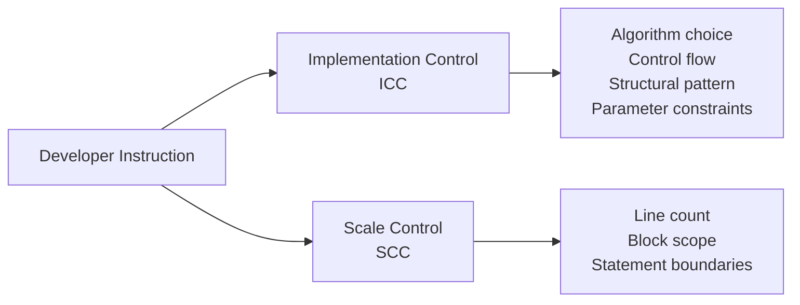

# Instruction-Guided Code Completion

> Functional correctness and instruction adherence are independent capabilities — a model that completes code correctly may still ignore your structural, algorithmic, and scope constraints.

## The Problem

Standard code completion benchmarks (HumanEval, CrossCodeEval) measure whether generated code passes tests. They do not measure whether the model followed the developer's instructions about *how* to implement it. In practice, developers specify implementation constraints: use a specific algorithm, follow a structural pattern, limit completion to a particular scope. [unverified] Most models treat these instructions as suggestions rather than requirements.

C3-Bench (arxiv [2601.15879](https://arxiv.org/abs/2601.15879)) is the first benchmark to measure this gap directly, testing 2,195 Python tasks across two instruction categories.

## Two Types of Completion Instructions



**Implementation-Control (ICC)** instructions specify *how* to implement: use recursion instead of iteration, follow a specific design pattern, constrain parameter types. Models handle these reasonably well — proprietary models reach 50-60% instruction-following rates.

**Scale-Control (SCC)** instructions specify *how much* to generate: complete only the next three lines, fill in just the if-block, stop at the function boundary. Models handle these poorly. Even advanced models like Gemini-2.0-Flash (7.0% SCC) and GPT-4o (24.1% SCC) fail to respect scope boundaries in most cases.

## Benchmark Rankings Mislead

Open-source models that top standard leaderboards underperform on instruction adherence. Qwen2.5-Coder-32B scores 49.2% on CrossCodeEval but only 38.7% on ICC instruction-following. Claude 3.5 Sonnet reaches 60.9% ICC — a gap invisible in standard rankings.

The practical implication: if your workflow involves guided completions (Cursor Composer, Copilot Chat, agent-driven code generation), benchmark scores are not a reliable proxy for how well the model will follow your instructions.

## What Works

### Be Explicit About Implementation Constraints

Ablation studies show that removing instructions from prompts causes instruction-following scores to drop while functional correctness stays roughly the same. The instructions are not redundant — models do respond to fine-grained guidance. Specify:

- **Algorithmic approach**: "Use iterative depth-first search, not recursion"
- **Structural patterns**: "Implement as a generator that yields results"
- **Control flow**: "Handle the error case first with an early return"
- **Parameter constraints**: "Accept only keyword arguments"

### Do Not Rely on Scale Instructions

Asking a model to "complete only the next 3 lines" or "just fill in the if-block" is unreliable across most models. Instead:

- Use explicit stop markers or delimiters in context
- Post-process completions to trim to the desired scope
- Structure prompts so the completion boundary is syntactically unambiguous

### Select Models for Instruction Adherence

For workflows with heavy instruction guidance — which is the norm for agent-assisted coding — instruction-following capability matters more than raw completion accuracy. At the time of the C3-Bench evaluation, the top performers on instruction-following were proprietary models (Claude 3.5 Sonnet, o1-series), with a meaningful gap over open-source alternatives [unverified — model capabilities change rapidly with new releases].

### Training Improves Instruction-Following

IFCoder (a fine-tuned Qwen2.5-Coder variant) improved ICC instruction-following from 38.7% to 52.5% and SCC from 5.2% to 80.7% using 200K synthetic instruction-completion pairs — while also improving functional correctness. This suggests instruction-following is a trainable capability, not an inherent limitation. Teams running local models can invest in instruction-tuning data to close the gap.

## Key Takeaways

- **Instruction adherence and functional correctness are orthogonal.** A model that writes correct code may still ignore your structural and scope constraints.
- **Implementation instructions work; scale instructions do not.** Tell models *how* to implement (algorithm, pattern, flow) but do not rely on telling them *how much* to generate.
- **Benchmark rankings do not predict instruction-following.** Evaluate models on the specific capability your workflow requires.
- **Fine-tuning on instruction-completion pairs closes the gap.** If you run local models, synthetic instruction data is an effective lever.

## Example

A developer needs a function to flatten a nested dictionary. Without instruction guidance, the model chooses its own approach:

```python
# Prompt (no instruction guidance):
# Write a function to flatten a nested dictionary

def flatten_dict(d, parent_key='', sep='.'):
    items = []
    for k, v in d.items():
        new_key = f"{parent_key}{sep}{k}" if parent_key else k
        if isinstance(v, dict):
            items.extend(flatten_dict(v, new_key, sep).items())
        else:
            items.append((new_key, v))
    return dict(items)
```

The model produces correct code but uses recursion, builds intermediate lists, and returns a new dictionary. With explicit implementation constraints:

```python
# Prompt with instruction guidance:
# Write a function to flatten a nested dictionary.
# - Use an iterative approach with an explicit stack (no recursion)
# - Yield key-value pairs as a generator
# - Use '/' as the separator
# - Handle only dict nesting (skip lists)

def flatten_dict(nested, sep='/'):
    stack = [('', nested)]
    while stack:
        prefix, current = stack.pop()
        for key, value in current.items():
            full_key = f"{prefix}{sep}{key}" if prefix else key
            if isinstance(value, dict):
                stack.append((full_key, value))
            else:
                yield full_key, value
```

The second prompt specifies algorithm (iterative with stack), output structure (generator), separator choice, and scope boundary. C3-Bench results show that models follow these implementation-control instructions roughly 50-60% of the time — better than scale instructions but still unreliable enough to require verification.

## Unverified Claims

- The claim that most models treat instructions as suggestions is based on C3-Bench results for a specific set of Python tasks; generalization to other languages and task types is assumed but not tested.
- Model rankings for instruction-following change with each release; the specific numbers cited reflect models available at the time of the C3-Bench paper (early 2025).

## Related

- [Context Priming](context-priming.md) — Loading relevant context before completion shapes output quality; instruction-guided completion is a specific form of this discipline
- [Prompt Layering](prompt-layering.md) — Instructions arrive from multiple sources simultaneously; understanding precedence affects whether completion instructions are followed
- [Pass@k Metrics](../verification/pass-at-k-metrics.md) — Standard evaluation metric that measures functional correctness but not instruction adherence
- [Token-Efficient Code Generation](token-efficient-code-generation.md) — Structural patterns that reduce generated code tokens; a complementary lens on controlling model output quality
