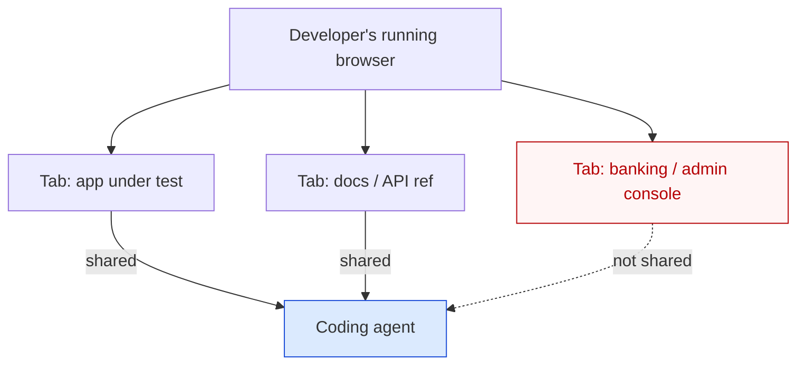

# Live Browser as Agent Context Channel

> Wire an agent to read the developer's running browser tabs — DOM, console, network — as live context. The channel is cheap to provision and removes copy-paste friction, but pulls the developer's logged-in session into the indirect-injection attack surface.

## The Channel

The agent observes the human's actual browsing session — the tabs the developer already has open — rather than spawning its own headless instance. Page state is already rendered and post-auth; the agent reads it instead of reconstructing it.

Three implementations have shipped:

| Surface | What the agent reads | Boundary |
|---------|---------------------|----------|
| **VS Code 1.119 share-tab** | DOM, console, network of an attached tab via `readPage` and `screenshotPage` | Per-tab opt-in; agent can request a share, user approves or denies |
| **Claude Code + chrome-devtools-mcp** | "All open windows for the selected profile" via Chrome's remote debugging port — DOM accessibility tree, console, network | Remote debugging port enabled on the developer's running Chrome |
| **Cursor embedded browser** | Agent-owned browser pane — its own session, not the developer's primary browser ([Cursor browser tool docs](https://cursor.com/docs/agent/tools/browser)) | Sandboxed; the contrasting headless model |

VS Code 1.119 frames the value: "When agents can access a live browser, they validate changes in real time and iterate faster" ([VS Code 1.119 release notes](https://code.visualstudio.com/updates/v1_119)). Shared pages "use your existing browser session, including cookies and login state," while agent-opened pages run "in private, in-memory sessions that don't share cookies or storage with your other browser tabs" ([VS Code browser-agent testing guide](https://code.visualstudio.com/docs/copilot/guides/browser-agent-testing-guide)).

## Why It Differs From Headless Browsing

A headless browser owned by the agent starts from a clean session. If a malicious page injects instructions, the blast radius is whatever the agent could do with an empty session.

Live tab sharing is structurally different on two axes:

- **Session continuity** — the shared tab is post-auth. The agent reads the DOM as it appears after the developer's logins and cookies have already loaded. This is the channel's value: no auth automation, no copy-paste.
- **Adjacent-tab proximity** — the developer's other tabs (banking, admin console, internal HR) sit one approval click away. VS Code makes agents "aware of how many browser tabs you have open and are not shared" so they can request a share ([VS Code 1.119 release notes](https://code.visualstudio.com/updates/v1_119)). The friction to widen scope is one prompt.

## The Lethal-Trifecta Consequence

Indirect prompt injection through web content is in-the-wild against browser-using agents. Palo Alto Unit 42 documents active attacks ([Help Net Security summary](https://www.helpnetsecurity.com/2026/04/24/indirect-prompt-injection-in-the-wild/)); Brave demonstrated injection against Perplexity Comet via DOM content ([Brave: agentic browser security](https://brave.com/blog/comet-prompt-injection/)); Anthropic states "no browser agent is immune to prompt injection" ([Anthropic: prompt injection defenses](https://www.anthropic.com/research/prompt-injection-defenses)).

When the channel reads the developer's authenticated browser, every shared page is untrusted input on a principal holding the developer's session cookies. If that agent also has egress, the [lethal trifecta](../security/lethal-trifecta-threat-model.md) is closed within a single tool call. BrowseSafe frames the threat exactly: injections that "influence real-world actions rather than mere text outputs" ([BrowseSafe (arxiv 2511.20597)](https://arxiv.org/abs/2511.20597)) — agent-driven actions in a logged-in session are that class.

The chrome-devtools-mcp README states the boundary: "enabling the remote debugging port opens up a debugging port on the running browser instance. Any application on your machine can connect to this port and control the browser" ([chrome-devtools-mcp README](https://github.com/ChromeDevTools/chrome-devtools-mcp)).

## Conditions Where the Pattern Pays

Use the channel when:

- The task explicitly involves the page the developer is already looking at — debugging a UI bug, summarising a doc, validating a deployment.
- The page requires logged-in state the agent could not cleanly reconstruct in a headless session.
- The agent's other tools are read-only or sandboxed, so injected DOM content cannot reach a write surface.

Avoid the channel when:

- The agent has shell, write APIs, or other consequential tools that injected DOM could coerce. Prefer headless browsing with a clean session.
- The page is reachable by an unauthenticated fetch — use [URL-fetch index gating](../security/url-fetch-public-index-gate.md) instead.
- Sensitive tabs (banking, admin consoles, customer data) are open in the same profile. Move the work to a separate profile first.

## Failure Modes

- **Stale DOM** — the agent caches DOM across turns; the page submits, navigates, or re-renders, and the next agent action targets state that no longer exists.
- **Silent context bloat** — every shared tab's DOM enters the prompt. Many shared tabs spend tokens on incidental content and trigger [lost-in-the-middle](lost-in-the-middle.md) effects on the task-relevant material.
- **URL-in-transcript leakage** — the URL itself can encode a session token or user ID. Telemetry and agent logs persist that URL beyond the share lifetime; revoking the share does not redact the transcript.
- **Hidden DOM injection** — malicious pages hide instructions in zero-opacity text, off-screen elements, or CDATA inside SVG. The developer never sees the payload; the agent's DOM extractor reads it ([Brave: unseeable prompt injections](https://brave.com/blog/unseeable-prompt-injections/)).
- **Reflexive approval of agent-initiated shares** — VS Code's prompt for an agent-initiated share is one click. After a few hours of routine approvals, the developer is one unconsidered approval away from sharing a sensitive tab.

## Example

VS Code 1.119 ships the consent gate as part of the channel itself. A developer has the in-progress app open in one tab and an internal admin console open in another:

**Setting up the share** — the developer drags the app tab into the chat input or selects it from the context picker. The browser tab "enters a sharing state where the agent can read and interact with the page" ([VS Code 1.119 release notes](https://code.visualstudio.com/updates/v1_119)). The agent now has DOM, console, and network for that tab.

**Agent-initiated request** — mid-task, the agent has information about the unshared tabs and decides it needs the API documentation tab to answer a question. It surfaces a prompt: approve or deny. The developer approves the docs tab, leaves the admin console unshared.

**Revocation** — when the task completes, the developer clicks the sharing button in the browser to stop sharing. Subsequent agent turns can no longer read the tab. The transcript still contains the DOM excerpts the agent already ingested.

The pattern only holds while the consent gate is taken seriously. A reflexive approval of the admin-console share request closes the lethal trifecta on that agent.

## Key Takeaways

- The channel reads the developer's running browser instead of spawning a headless one — value is information continuity, not new capability.
- VS Code 1.119 ships the per-tab share-and-revoke model; Claude Code reaches the same surface via chrome-devtools-mcp; Cursor's embedded browser is the contrasting agent-owned model.
- The cost is structural: shared tabs are post-auth and untrusted DOM enters context on a principal that holds the developer's session cookies.
- Use the channel for tasks tied to the page the developer is already looking at; prefer headless browsing when the agent has consequential tools or the page is reachable unauthenticated.
- Treat the share approval as a security gate, not a UI prompt — reflexive approval defeats the only mitigation the channel provides.

## Related

- [Lethal Trifecta Threat Model](../security/lethal-trifecta-threat-model.md)
- [Use a Public-Web Index to Gate Automatic URL Fetching](../security/url-fetch-public-index-gate.md)
- [Browser Automation as a Research Tool](../tool-engineering/browser-automation-for-research.md)
- [Lost in the Middle](lost-in-the-middle.md)
- [Retrieval-Augmented Agent Workflows](retrieval-augmented-agent-workflows.md)
- [Prompt Injection: A First-Class Threat to Agentic Systems](../security/prompt-injection-threat-model.md)
