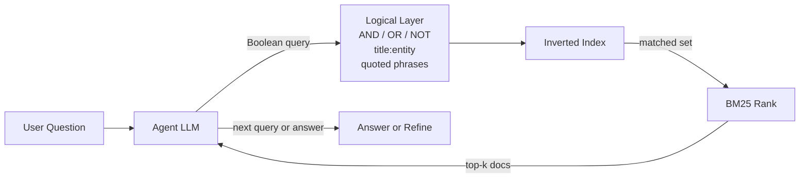

# LLM-Driven Logical Retrieval: Boolean Queries over an Inverted Index

> A frontier LLM emits AND/OR/NOT logical queries against an inverted index — matching hybrid retrieval at scale and 41× lower indexing cost.

## When this pattern applies

LogicalRAG only pays off under all four conditions:

- Frontier-capable agent LLM, able to plan multi-hop questions and author well-formed Boolean expressions. Weaker generators collapse: Search-R1 paired with untuned BM25 reaches 3.86% on BrowseComp-Plus, versus 55.9% for GPT-5 on that same baseline ([Chen et al., 2025](https://arxiv.org/abs/2508.06600v1)). A separately tuned BM25 configuration lifts a frontier agent to 83.1% in a different paper — that gain includes a retriever change ([Hsu, Yang, Lin, 2026](https://arxiv.org/abs/2605.10848v1)).
- Lexical-overlap-rich corpus — multi-hop QA over Wikipedia-style text, code, docs, or logs, where queries and documents share surface forms. It weakens when many surface forms share no tokens.
- Construction cost matters — the index rebuilds often, or indexing budget is tight. A one-time index amortizes hybrid's build cost to zero, erasing the 41× indexing-cost advantage.
- Hallucination on unanswerable queries matters — a Boolean "no match" gives a sharper signal than a low cosine score.

Outside these conditions, hybrid retrieval keeps a small edge and stays the safer default.

Parsing method is an earlier decision: see [Towards Data Science on choosing a parsing method first](https://towardsdatascience.com/before-full-agentic-rag-know-how-you-decide-and-the-parsing-methods-you-pick-from/).

## The architecture

LogicalRAG ([Zeng et al., 2026](https://arxiv.org/abs/2605.27123)) hands retrieval intent to the LLM and shrinks the backend to a faithful executor:



Retrieval runs in two phases: Boolean logic picks the eligible document set, then BM25 ranks within it. The interface exposes `AND`, `OR`, `NOT`, quoted phrases, and field-targeting like `title:entity_name` ([Zeng et al., 2026](https://arxiv.org/abs/2605.27123)). The agent iterates: it reads results, refines the query, and re-issues. The backend executes only what the LLM authors, with no semantic-similarity notion.

## Reported results

| Metric | LogicalRAG | Agentic Hybrid | Source |
|--------|------------|----------------|--------|
| Medium-scale accuracy (HotpotQA / 2WikiMultiHopQA / MuSiQue avg.) | 0.784 | 0.807 | [Zeng et al., 2026](https://arxiv.org/abs/2605.27123v1) |
| KILT Wikipedia accuracy | 0.717 | 0.716 | [Zeng et al., 2026](https://arxiv.org/abs/2605.27123v1) |
| KILT throughput (16 concurrent) | 152.5 QPS | 66.6 QPS | [Zeng et al., 2026](https://arxiv.org/abs/2605.27123v1) |
| KILT mean latency | 74.9 ms | 230.5 ms | [Zeng et al., 2026](https://arxiv.org/abs/2605.27123v1) |
| Index construction time | 1.27 h | 52.02 h | [Zeng et al., 2026](https://arxiv.org/abs/2605.27123v1) |
| Hallucination rate (answer-unavailable) | 0.083 | 0.128 | [Zeng et al., 2026](https://arxiv.org/abs/2605.27123v1) |

The headline "matches hybrid" holds at KILT scale and on cost, but trails hybrid by 2.3 accuracy points on medium-scale multi-hop QA. The trade is honest only when index-rebuild cost and hallucination on unanswerable queries matter as much as raw accuracy.

## Why it works

LogicalRAG moves retrieval precision from the index to the query author. Hybrid retrieval pays for precision twice — at indexing time (dense embeddings, HNSW graphs) and at query time (vector similarity fused with BM25). LogicalRAG removes both costs. The frontier LLM that already plans multi-hop questions breaks them into Boolean predicates over fielded terms, and the inverted index looks up rather than guesses ([Zeng et al., 2026](https://arxiv.org/abs/2605.27123)).

Hallucination reduction follows the same mechanism. A Boolean empty set is a sharp not-found signal. A low cosine score is ambiguous — "no relevant document" versus "relevant document was paraphrased."

This fits a broader retrieval-side-dominance trend: retriever choice matters more than generator choice for SE-task RAG with high identifier-query overlap ([Ke et al., 2026](https://arxiv.org/abs/2605.14503)), and tuned BM25 plus a frontier agent matches dense retrieval on deep-research benchmarks ([Hsu, Yang, Lin, 2026](https://arxiv.org/abs/2605.10848)).

## When this backfires

- Sub-frontier generator — weaker LLMs cannot plan Boolean decompositions. On BrowseComp-Plus, Search-R1 paired with BM25 reaches only 3.86% versus 55.9% for GPT-5 on the same untuned baseline ([Chen et al., 2025](https://arxiv.org/abs/2508.06600v1)). LogicalRAG is a precision-cost migration, not a free optimization.
- Semantic-gap queries — natural-language paraphrases against identifier-heavy documents ("deduplicate while preserving order" → `unique_ordered`) have near-zero lexical overlap. Logical operators cannot bridge that gap without an expansion step.
- Synonym-heavy corpora — medical, legal, multilingual, or consumer-product domains where one concept has many surface forms. BM25's insensitivity to synonymy is well documented, so agents author speculative `OR` chains to compensate.
- Static-index, query-rate-dominated workloads — an index built once, serving billions of queries, amortizes the 41× build-time win to zero; the medium-scale 2.3-point gap then dominates.
- Latency-sensitive workloads — every logical query is an inference call, so single round-trip dense retrieval can beat multi-turn Boolean refinement on tail latency.

## Example

A team running an agentic RAG system over 10M technical-documentation pages, frontier LLM in the loop, index rebuilt nightly to track product churn.

Before — agentic hybrid with dense plus BM25 fusion:

```yaml
retrieval:
  type: agentic-hybrid
  dense:
    embedder: text-embedding-3-large
    vector_db: managed-hnsw
  sparse:
    backend: bm25
  fusion: reciprocal-rank
  rerank: bge-reranker-v2-m3
indexing:
  nightly_build_hours: 38
  monthly_infra_usd: 18000
agent:
  query_pattern: free-text
```

After — LLM-authored Boolean queries over inverted index:

```yaml
retrieval:
  type: logical
  backend: inverted-index
  operators: [AND, OR, NOT, "quoted phrases", "field:value"]
  rank: bm25
indexing:
  nightly_build_hours: 0.9
  monthly_infra_usd: 1100
agent:
  query_pattern: boolean-logical
  examples:
    - 'title:"rate limit" AND (429 OR "too many requests") NOT deprecated'
    - '"event_loop" AND asyncio NOT "twisted"'
```

The "after" configuration trades about 2 accuracy points for 42× faster nightly builds and roughly 3× lower query latency. That accuracy cost applies only at medium scale — it matches hybrid at large scale. You keep frontier LLM authoring; the migration is the retrieval interface, not the agent. Re-evaluate hallucination rate on a held-out unanswerable-query set before committing: the 0.083 versus 0.128 hallucination delta is the second load-bearing benefit beyond raw cost ([Zeng et al., 2026](https://arxiv.org/abs/2605.27123v1)).

## Key Takeaways

- LogicalRAG moves retrieval precision from the index to the query author: a frontier LLM emits AND/OR/NOT and field-scoped queries against a plain inverted index ([Zeng et al., 2026](https://arxiv.org/abs/2605.27123)).
- The pattern matches an agentic hybrid baseline at KILT-scale Wikipedia (0.717 vs. 0.716) and trails it on medium-scale multi-hop QA (0.784 vs. 0.807). The win is cost (41× faster indexing) and hallucination rate (0.083 vs. 0.128), not raw accuracy ([Zeng et al., 2026](https://arxiv.org/abs/2605.27123v1)).
- Evaluate this pattern by checking hallucination rate on answer-unavailable queries specifically — that is where its gap over hybrid concentrates ([Zeng et al., 2026](https://arxiv.org/abs/2605.27123)).
- Benchmark your specific agent model on Boolean decomposition before switching: Search-R1 + BM25 reaches only 3.86% on BrowseComp-Plus, while GPT-5 on that same BM25 baseline reaches 55.9% ([Chen et al., 2025](https://arxiv.org/abs/2508.06600v1)). A separately tuned BM25 configuration lifts a frontier agent to 83.1% in a different paper — tuning, not generator capability, drives most of that gap ([Hsu, Yang, Lin, 2026](https://arxiv.org/abs/2605.10848v1)).
- When corpora have high lexical overlap, weight retriever choice over generator upgrades — the broader SE-task RAG evidence shows retriever choice dominates outcomes there ([Ke et al., 2026](https://arxiv.org/abs/2605.14503)).

## Related

- [Component-Wise RAG Prioritization for Software Engineering Tasks](rag-component-prioritization-software-engineering.md) — retriever-dominance mechanism with BM25 as the SE-task default
- [Lexical-First Retrieval for Agentic Search](../tool-engineering/lexical-first-retrieval-for-agentic-search.md) — independent evidence that BM25 + frontier agent matches dense retrieval in deep-research loops
- [Schema-Guided Graph Retrieval](schema-guided-graph-retrieval.md) — alternative structured-retrieval interface that pushes precision onto a typed schema rather than logical operators
- [Structured Domain Retrieval](structured-domain-retrieval.md) — knowledge-graph + case-based retrieval that captures hierarchical relationships flat vector search misses
- [Retrieval-Augmented Agent Workflows](retrieval-augmented-agent-workflows.md) — the JIT-context pattern this retrieval interface plugs into
- [Codebase-Derived Pattern Libraries as Agent Context](codebase-pattern-library-context.md) — tunes *what* is in the retrieval corpus (vetted in-house code) rather than *how* queries are authored
- [Exhaustive Retrieval for Listing Questions](exhaustive-retrieval-for-listing-questions.md) — the Boolean empty set as a completeness signal when the answer is a set rather than a best match
- [Hypothetical Classification for Large Label Vocabularies](hypothetical-classification.md) — the inverse move: the model authors a fake target and the corpus supplies the real one, instead of authoring a query the index executes
