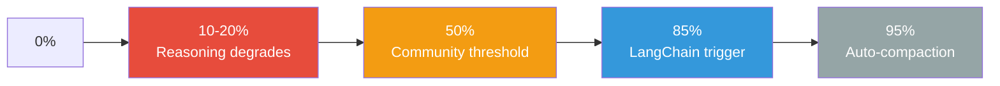

# Manual Compaction as Dumb Zone Mitigation

> Auto-compaction fires at ~95% context fill — long after reasoning quality has degraded. Manual compaction reframes context management from memory cleanup to reasoning quality preservation.

## The Gap

Claude Code's auto-compaction triggers at [approximately 95% of the context window](https://code.claude.com/docs/en/sub-agents). Reasoning tasks degrade at [10-20% of context usage](https://arxiv.org/abs/2406.10149), and code bug fixing collapses from 29% accuracy at 32K to 3% at 256K per [LongCodeBench](https://arxiv.org/abs/2505.07897). By the time auto-compaction fires, the agent has been in the [dumb zone](context-window-dumb-zone.md) for most of the session.



The gap between degradation onset and auto-compaction is where quality silently erodes.

## When to Compact Manually

Manual `/compact` is a reasoning quality tool, not a memory management chore. Use it at these transition points:

| Trigger | Example |
|---------|---------|
| Before reasoning-intensive work | Architectural decisions, multi-step debugging |
| After large file reads no longer needed | Read a 500-line file, extracted the three relevant functions |
| At task-type transitions | Finished searching codebase, now planning refactor |
| When you notice quality degradation | Agent starts repeating itself, missing obvious patterns |
| After completing a subtask | Finished implementing feature A, moving to feature B |

## When Not to Compact

Compaction is lossy. [Anthropic acknowledges](https://www.anthropic.com/engineering/effective-context-engineering-for-ai-agents) that "overly aggressive compaction can result in the loss of subtle but critical context whose importance only becomes apparent later."

Avoid compacting when:

- The agent is mid-reasoning and needs accumulated context to complete a chain of thought
- Reference material (schemas, specs, API contracts) will be needed repeatedly
- You are iterating on a single file where the full edit history informs the next change

In these cases, prefer `/clear` between unrelated tasks or use [observation masking](observation-masking.md) for selective cleanup.

## Directing Compaction

Generic compaction discards indiscriminately. Claude Code supports focused compaction:

**Inline focus:**

```
/compact Focus on the API changes and the test failures
```

**Persistent focus via CLAUDE.md:**

```markdown
# Compact instructions

When compacting, always preserve:
- Current task objective and acceptance criteria
- File paths modified in this session
- Unresolved test failures and error messages
- Architectural decisions and their rationale
```

Custom compaction instructions are a [first-class feature](https://code.claude.com/docs/en/best-practices) — shifting compaction from lossy summarization to targeted preservation.

## Lowering the Auto-Compaction Threshold

For reasoning-heavy sessions, 95% is too late. The `CLAUDE_AUTOCOMPACT_PCT_OVERRIDE` environment variable accepts values 1-100 and [overrides the default trigger point](https://code.claude.com/docs/en/settings):

```bash
# Set auto-compaction to 60% for a reasoning-heavy session
CLAUDE_AUTOCOMPACT_PCT_OVERRIDE=60 claude
```

| Session type | Suggested threshold | Rationale |
|-------------|-------------------|-----------|
| Reasoning-heavy (architecture, debugging) | 50-60% | Preserves quality before significant degradation |
| Mixed retrieval and reasoning | 70-80% | Balances context availability with quality |
| Retrieval-heavy (search, lookup) | 95% (default) | Retrieval tolerates larger context loads |

## Monitoring Context Usage

Claude Code exposes `context_window.used_percentage` as a [status line field](https://code.claude.com/docs/en/statusline):

```json
{
  "statusline": "context: {context_window.used_percentage}%"
}
```

This makes compaction timing data-driven.

## Partial Summarization

Claude Code (v2.1.30+) supports "Summarize from here" via the message selector [unverified]. This preserves recent context at full fidelity while compressing older turns — useful when exploration history can be discarded but recent implementation work cannot.

## How Other Systems Handle This

| System | Trigger | Approach |
|--------|---------|----------|
| Claude Code (default) | 95% | Single binary compaction |
| Claude Code (override) | Configurable 1-100% | Same mechanism, earlier trigger |
| LangChain Deep Agents | 85% | Compression + 20K-token tool offloading |
| OPENDEV (ACC) | 70/80/85/90/99% | [Five graduated stages](context-compression-strategies.md) |
| Manus | N/A | File system as external memory; avoids aggressive compaction entirely [unverified] |

Production systems compact earlier and more selectively.

## Example

A developer is debugging a failing integration test in Claude Code. The session so far: reading 4 test files, grepping through 12 source modules, and reviewing CI logs. Context is at ~55%.

```
> /compact Focus on the three failing test assertions in test_payment_flow.py
>   and the PaymentService.process() method. Discard CI log output and
>   unrelated source files.
```

After compaction, context drops to ~15%. The developer then asks Claude to reason about the root cause — with a clean context window, the agent identifies a race condition it had previously overlooked.

For the next session, the developer sets an earlier auto-compaction trigger:

```bash
CLAUDE_AUTOCOMPACT_PCT_OVERRIDE=55 claude
```

## Key Takeaways

- Manual compaction preserves reasoning quality — auto-compaction at 95% fires long after degradation begins.
- Compact at task-type transitions, after bulk reads, or when output quality declines.
- Use a focus directive or CLAUDE.md to control what survives summarization.
- Set `CLAUDE_AUTOCOMPACT_PCT_OVERRIDE` to 50-70% for reasoning-heavy sessions.

## Unverified Claims

- `CLAUDE_AUTOCOMPACT_PCT_OVERRIDE` at lower values has not been empirically tested for reasoning quality improvements vs. the default 95% [unverified]
- The community recommendation to compact at 50% comes from [claude-code-best-practice](https://github.com/shanraisshan/claude-code-best-practice) and is not officially endorsed by Anthropic [unverified]
- Manus using file system as external memory to avoid aggressive compaction [unverified]

## Related

- [Context Engineering](context-engineering.md)
- [Context Hub: On-Demand Versioned API Docs](context-hub.md)
- [Retrieval-Augmented Agent Workflows: On-Demand Context](retrieval-augmented-agent-workflows.md)
- [Context Window Dumb Zone](context-window-dumb-zone.md)
- [Context Compression Strategies](context-compression-strategies.md)
- [Observation Masking](observation-masking.md)
- [Goal Recitation: Countering Drift in Long Sessions](goal-recitation.md)
- [Reasoning Budget Allocation](../agent-design/reasoning-budget-allocation.md)
- [Attention Sinks](attention-sinks.md)
- [Context Budget Allocation](context-budget-allocation.md)
- [Context Priming](context-priming.md)
- [Lost in the Middle](lost-in-the-middle.md)
- [Prompt Compression](prompt-compression.md)
- [Prompt Caching as Architectural Discipline](prompt-caching-architectural-discipline.md)
