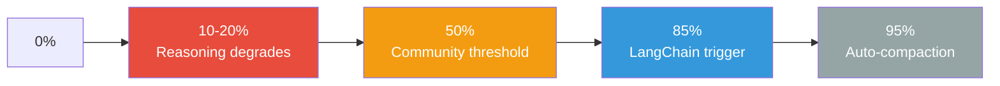

# Manual Compaction as Dumb Zone Mitigation

> Manual compaction reframes context management from memory cleanup to reasoning quality preservation, ahead of auto-compaction's ~95% trigger.

Learn it hands-on in [Compaction](https://learn.agentpatterns.ai/harness-engineering/compaction/), a guided lesson with quizzes.

## The gap

Claude Code's auto-compaction triggers at [approximately 95% of the context window](https://code.claude.com/docs/en/sub-agents). Benchmark research shows [LLMs effectively use only 10-20% of a long context window](https://arxiv.org/abs/2406.10149) for multi-step reasoning tasks. Code bug fixing collapses from 29% accuracy at 32K to 3% at 256K per [LongCodeBench](https://arxiv.org/abs/2505.07897). By the time auto-compaction fires, the agent has been in the [dumb zone](context-window-dumb-zone.md) for most of the session.


```mermaid
graph LR
    A["0%"] --> B["10-20%<br/>Reasoning degrades"]
    B --> C["50%<br/>Community threshold"]
    C --> D["85%<br/>LangChain trigger"]
    D --> E["95%<br/>Auto-compaction"]
    style B fill:#e74c3c,color:#fff
    style C fill:#f39c12,color:#fff
    style D fill:#3498db,color:#fff
    style E fill:#95a5a6,color:#fff
```

The gap between degradation onset and auto-compaction is where quality erodes without warning.

## When to compact manually

Use `/compact` at these transition points:

| Trigger | Example |
|---------|---------|
| Before reasoning-intensive work | Architectural decisions, multi-step debugging |
| After large file reads no longer needed | Read a 500-line file, extracted the three relevant functions |
| At task-type transitions | Finished searching codebase, now planning refactor |
| When you notice quality degradation | Agent starts repeating itself, missing obvious patterns |
| After completing a subtask | Finished implementing feature A, moving to feature B |

## When not to compact

Compaction is lossy. [Anthropic acknowledges](https://www.anthropic.com/engineering/effective-context-engineering-for-ai-agents) that "overly aggressive compaction can result in the loss of subtle but critical context whose importance only becomes apparent later."

Avoid compacting when:

- The agent is mid-reasoning and needs accumulated context to complete a chain of thought
- Reference material (schemas, specs, API contracts) will be needed repeatedly
- You are iterating on a single file where the full edit history informs the next change

In these cases, prefer `/clear` between unrelated tasks or use [observation masking](observation-masking.md) for selective cleanup.

## Directing compaction

Claude Code supports focused compaction.

Inline focus:

```
/compact Focus on the API changes and the test failures
```

Persistent focus via CLAUDE.md:

```markdown
# Compact instructions

When compacting, always preserve:
- Current task objective and acceptance criteria
- File paths modified in this session
- Unresolved test failures and error messages
- Architectural decisions and their rationale
```

Custom compaction instructions are a [first-class feature](https://code.claude.com/docs/en/best-practices).

## Why it works

Transformer attention spans all tokens in the context window. That creates n² pairwise relationships for n tokens. As the context grows, [the attention budget spreads thin](https://www.anthropic.com/engineering/effective-context-engineering-for-ai-agents). The model attends less to any specific piece of information, while irrelevant tokens compete for the same fixed capacity. Compaction replaces the accumulated token mass with a dense summary. That gives the model a focused context, where relevant information receives proportionally more attention. Compacting early, before the window saturates, stops useful signal from being crowded out by accumulated noise.

## Lowering the auto-compaction threshold

The `CLAUDE_AUTOCOMPACT_PCT_OVERRIDE` environment variable accepts values 1-100 and [overrides the default trigger point](https://code.claude.com/docs/en/settings):

```bash
# Set auto-compaction to 60% for a reasoning-heavy session
CLAUDE_AUTOCOMPACT_PCT_OVERRIDE=60 claude
```

| Session type | Suggested threshold | Rationale |
|-------------|-------------------|-----------|
| Reasoning-heavy (architecture, debugging) | 50-60% | Preserves quality before significant degradation |
| Mixed retrieval and reasoning | 70-80% | Balances context availability with quality |
| Retrieval-heavy (search, lookup) | 95% (default) | Retrieval tolerates larger context loads |

## Monitoring context usage

Claude Code exposes `context_window.used_percentage` as a [status line field](https://code.claude.com/docs/en/statusline):

```json
{
  "statusline": "context: {context_window.used_percentage}%"
}
```

## Partial summarization

Claude Code supports partial summarization through the message selector ("Summarize from here"). This preserves recent context at full fidelity while compressing older turns. It helps when you can discard exploration history but must keep recent implementation work.

## How other systems handle this

| System | Trigger | Approach |
|--------|---------|----------|
| Claude Code (default) | 95% | Single binary compaction |
| Claude Code (override) | Configurable 1-100% | Same mechanism, earlier trigger |
| LangChain Deep Agents | 85% | Compression + 20K-token tool offloading |
| OPENDEV (ACC) | 70/80/85/90/99% | [Five graduated stages](context-compression-strategies.md) |
| Manus | N/A | File system as external memory; avoids aggressive compaction entirely |

## Example

A developer is debugging a failing integration test in Claude Code. The session so far: reading 4 test files, grepping through 12 source modules, and reviewing CI logs. Context is at ~55%.

```
> /compact Focus on the three failing test assertions in test_payment_flow.py
>   and the PaymentService.process() method. Discard CI log output and
>   unrelated source files.
```

After compaction, context drops to ~15%. The developer then asks Claude to reason about the root cause. With a clean context window, the agent identifies a race condition it had previously overlooked.

For the next session, the developer sets an earlier auto-compaction trigger:

```bash
CLAUDE_AUTOCOMPACT_PCT_OVERRIDE=55 claude
```

## Key Takeaways

- Do not wait for auto-compaction's 95% trigger. Treat it as a ceiling, not a cue, and compact manually before quality degrades.
- Compact at task-type transitions, after bulk reads, or when output quality declines.
- Use a focus directive or CLAUDE.md to control what survives summarization.
- Set `CLAUDE_AUTOCOMPACT_PCT_OVERRIDE` to 50-70% for reasoning-heavy sessions.

## Related

- [Context Engineering](context-engineering.md)
- [Context Hub: On-Demand Versioned API Docs](context-hub.md)
- [Retrieval-Augmented Agent Workflows: On-Demand Context](retrieval-augmented-agent-workflows.md)
- [Context Window Dumb Zone](context-window-dumb-zone.md)
- [Context Compression Strategies](context-compression-strategies.md)
- [Observation Masking](observation-masking.md)
- [Goal Recitation: Countering Drift in Long Sessions](goal-recitation.md)
- [Reasoning Budget Allocation](../patterns/agent-design/reasoning-budget-allocation.md)
- [Attention Sinks](attention-sinks.md)
- [Context Budget Allocation](context-budget-allocation.md)
- [Context Priming](context-priming.md)
- [Lost in the Middle](lost-in-the-middle.md)
- [Prompt Compression](prompt-compression.md)
- [Prompt Caching as Architectural Discipline](prompt-caching-architectural-discipline.md)
- [Agent-Initiated Rubric-Gated Self-Compaction](agent-initiated-self-compaction.md)
