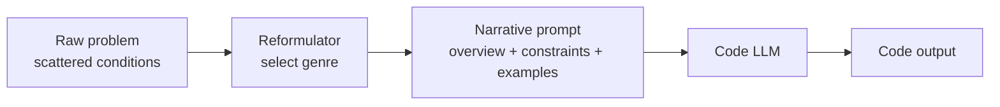

# Narrative Problem Reformulation for Code Generation

> Reformulate a scattered code-generation prompt into a coherent narrative with a task overview, constraints, and examples before passing it to the model — but only where the evidence shows it helps, not as a blanket default.

## The Technique

Competitive-programming-style prompts arrive as fragmented conditions: problem statement, constraints, edge cases, and example inputs scattered through prose. The model must reconstruct the structure before reasoning about an algorithm.

StoryCoder ([Jang et al., 2026](https://arxiv.org/abs/2604.14631)) proposes a preprocessing pass that rewrites the prompt into three explicit sections — task overview, constraints, example test cases — bound by a narrative genre the model selects to match the algorithmic strategy. The reformulated prompt is passed to the code-generation model in place of the raw problem.



## What the Evidence Shows

Across 11 models (Gemini-2.5-Flash, GPT-4.1-mini, Claude-3.5-Haiku, DeepSeek-Coder 6.7B and V2-Lite, Llama-3.1 8B, Gemma-2 9B/27B, Qwen-2.5-Coder 7B/32B, Mistral-Small 24B), the authors report an average 18.7% gain in zero-shot pass@10 ([arxiv:2604.14631](https://arxiv.org/abs/2604.14631)). Per-benchmark results:

| Benchmark | Baseline pass@10 | Narrative pass@10 | Delta |
|-----------|------------------|-------------------|-------|
| HumanEval | 81.31% | 89.76% | +8.45pp |
| LiveCodeBench | 26.36% | 32.22% | +5.86pp |
| CodeForces | 18.96% | 28.58% | +9.62pp |

The gain concentrates on harder competitive-programming problems, not on well-structured textbook tasks. HumanEval — where problem statements are already short and separable — shows the smallest delta.

The authors report that benefits "depend on narrative coherence and genre alignment": replacing aligned genres (fantasy adventure, sci-fi exploration, mathematical mystery) with incongruent ones (administrative, legal, memorial) produces a significant performance drop ([arxiv:2604.14631](https://arxiv.org/abs/2604.14631)). The improvement is not a free effect of extra tokens — it requires a narrative that matches the problem's algorithmic shape.

## Why It Works

Code LLMs are measurably fragile to surface framing. Independent work on LLM4Code robustness characterises this as "reasoning fragility" concentrated at reasoning-to-code, symbolic-commitment, and algorithmic-articulation points ([Liu et al., 2026](https://arxiv.org/abs/2604.12214)). Perturbing the input shifts which algorithms the model selects and where it commits implementation errors — in both directions.

StoryCoder's stated mechanism: co-locating task, constraints, and examples in a coherent narrative reduces the structural reconstruction cost the model would otherwise pay, front-loading algorithmic commitment before code generation begins ([arxiv:2604.14631](https://arxiv.org/abs/2604.14631)). This aligns with the broader finding that explicit structural scaffolds outperform free-form prose in code generation — Structured CoT with sequence/branch/loop placeholders beats plain CoT by up to 13.79% in Pass@1 ([Li et al., arxiv:2305.06599](https://arxiv.org/abs/2305.06599)). Narrative reformulation applies the scaffolding insight at the input layer rather than the reasoning layer. The [Task Framing Irrelevance Fallacy](../fallacies/task-framing-irrelevance-fallacy.md) page documents the same underlying sensitivity.

## When It Helps

Narrative reformulation is worth adding as a preprocessing step when:

- Problems arrive as **fragmented competitive-programming-style prompts** with scattered constraints, not as clean task/example pairs.
- The harness optimises for **pass@k sampling**, not single-shot commit — the paper's reported gains are on zero-shot pass@10.
- The **reformulator model is capable enough** to produce coherent narrative prose. Authors note effectiveness depends on the generator's expressive capacity.
- **Accuracy dominates latency** — reformulation adds an extra inference pass on the critical path.

## When It Does Not Help or Backfires

Four failure conditions, from the paper's limitations and adjacent robustness literature:

- **Simple, well-formed problems.** HumanEval shows the smallest gains; prompts that already separate task, constraints, and examples gain little.
- **Pass@1 agent harnesses.** The paper foregrounds pass@10. An agent that commits on the first candidate may pay full reformulation cost for a much smaller benefit; per-model pass@1 deltas are not reported at the same prominence.
- **Smaller base-model code LLMs.** Adding structure to smaller code LLMs can consistently hurt. CodeLlama-13B pass@1 on MHPP dropped from 17.1% to 8.1% when CoT was added ([Liu et al., 2026](https://arxiv.org/abs/2604.12214)). Narrative reformulation has not been evaluated against that failure class.
- **Latency-sensitive interactive loops.** Reformulation is a mandatory pre-call; two serial inference passes on the critical path cannot be parallelised.

Measure before adopting. Run an A/B on the target model and task distribution comparing both pass@1 and pass@k. See [pass@k and pass^k Metrics](../verification/pass-at-k-metrics.md) for the measurement framework.

## Relationship to Adjacent Techniques

Narrative reformulation is an **input-layer** transform. Other scaffolding patterns operate at different layers: [Self-Discover Reasoning](../agent-design/self-discover-reasoning.md) transforms the reasoning layer; [CoT Robustness in Code Generation](../verification/cot-robustness-code-generation.md) covers the reasoning-trace layer with failure modes (lengthening, branching, simplification) that also apply when reformulation destabilises smaller models; [Prompt Chaining](prompt-chaining.md) treats reformulation and generation as two gated chain steps. The research reports single-layer gains; it does not establish that stacking with SCoT or self-planning multiplies.

## Example

A narrative transformation for a graph traversal problem, following the StoryCoder template:

**Before — scattered conditions:**

```
Given a directed graph with n nodes and m edges, find the
shortest path from node 1 to node n. Constraints: 1 ≤ n ≤ 10^5,
1 ≤ m ≤ 2·10^5, edge weights 1..10^9. Input format: first line
n m, then m lines "u v w". Output: single integer or -1.
Example: 3 3 / 1 2 4 / 2 3 6 / 1 3 12 → 10.
```

**After — narrative reformulation (sci-fi exploration genre, matched to shortest-path algorithm):**

```
## Task Overview
A fleet of probes must route supplies through a network of space
stations connected by one-way jump gates. Find the cheapest route
from Station 1 to Station n, or report that no route exists.

## Constraints
- The network has up to 100,000 stations and 200,000 one-way gates.
- Each gate has a positive jump cost between 1 and 10^9 fuel units.
- Routes are directional — gate u→v does not imply gate v→u.

## Examples
- Three stations, three gates (1→2 cost 4, 2→3 cost 6, 1→3 cost 12):
  the optimal route is 1→2→3 at cost 10. Report 10, not 12.
```

The reformulated version is not more information — it is the same information reorganised so the algorithmic shape (weighted shortest path, Dijkstra-class) is visible before the model commits to code. The genre ("sci-fi exploration") is chosen to match the graph-traversal framing; replacing it with an incongruent genre drops measured performance ([arxiv:2604.14631](https://arxiv.org/abs/2604.14631)).

## Key Takeaways

- Narrative reformulation rewrites a fragmented problem into task overview, constraints, and examples bound by a genre matched to the algorithm; reported 18.7% average zero-shot pass@10 gain across 11 models.
- Gains concentrate on harder competitive-programming benchmarks (CodeForces +9.62pp) and shrink on simpler ones (HumanEval +8.45pp).
- Genre alignment matters — incongruent genres drop measured performance, so the mechanism is structural coherence, not added verbosity.
- Pass@1 deltas, smaller code LLMs, strict-schema tool calling, and latency-sensitive loops are failure conditions not covered by the reported gains — measure before adopting.
- Treat reformulation as an input-layer scaffold alongside [Self-Discover Reasoning](../agent-design/self-discover-reasoning.md) and [Structured CoT](../verification/cot-robustness-code-generation.md), not as a replacement or automatic stack.

## Related

- [Task Framing Irrelevance Fallacy](../fallacies/task-framing-irrelevance-fallacy.md) — Surface framing measurably changes LLM output; narrative reformulation is one response to this sensitivity
- [CoT Robustness in Code Generation](../verification/cot-robustness-code-generation.md) — Chain-of-thought is not uniformly beneficial; the same caution applies to narrative reformulation
- [Self-Discover Reasoning](../agent-design/self-discover-reasoning.md) — Reasoning-layer scaffolding as a complementary transform
- [pass@k and pass^k Metrics](../verification/pass-at-k-metrics.md) — Measuring capability versus consistency before enabling any prompt-layer change
- [Prompt Chaining](prompt-chaining.md) — Model reformulation and generation as two explicit chain steps rather than an implicit pass
- [Prompt Layering](prompt-layering.md) — How instructions from multiple sources compose in the final prompt surface
