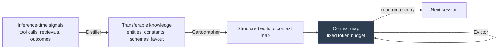

# PEEK: Orientation Cache for Recurring-Context Agents

> A constant-sized prompt artifact caching orientation knowledge — what a recurring context holds and how it is organised. Pays off only on stable, re-entered contexts.

## When This Pattern Applies

PEEK is conditional. The cache wins over per-session orientation (grep, file tree, [token-fitted repo maps](repository-map-pattern.md)) only when three conditions hold:

- **The same large context is re-entered repeatedly** — a long-lived repo, a corpus the agent revisits, a knowledge base touched across sessions. One-shot use does not amortise the cache.
- **The context is stable enough to outpace drift** — entities, constants, and schemas change slower than the agent re-enters. Fast-moving migrations invalidate entries before they pay back. ([Atlan, 2026](https://atlan.com/know/agent-harness-failures-anti-patterns/))
- **An invalidation surface exists** — a hook, watcher, lint, or test fails when the cache disagrees with the source of truth. Without one, drift accumulates silently as plausible-but-wrong claims. ([Tacnode, 2026](https://tacnode.io/post/your-ai-agents-are-spinning-their-wheels))

Without all three, fall through to per-session orientation: a [tree-sitter repo map](repository-map-pattern.md) for code, or just-in-time corpus retrieval.

## What PEEK Is Not

| Pattern | Stores | Lifecycle |
|---------|--------|-----------|
| **PEEK orientation cache** | What is in the context, how it is organised, useful entities/constants/schemas | Persisted; updated each re-entry under a fixed token budget |
| **[Evolving Playbooks (ACE)](evolving-playbooks.md)** | Strategies — *how the agent worked successfully* | Persisted; grows via incremental delta entries |
| **[Repository Map Pattern](repository-map-pattern.md)** | Top-ranked AST symbols of a code repository | Rebuilt per session, fitted to a token budget |
| **[AOCI](aoci-symbolic-semantic-indexing.md)** | Symbolic-plus-semantic blueprint | Built once offline, read whole before each task |
| **[Seeding Agent Context](seeding-agent-context.md)** | Static breadcrumbs (AGENTS.md, comments) | Edited by humans, discovered by the agent |

The closest neighbour is [Evolving Playbooks (ACE)](evolving-playbooks.md), which PEEK was evaluated against: ACE preserves *trajectories and strategies* — what worked; PEEK preserves *orientation knowledge of the context* — what is there. ([Gu et al., 2026](https://arxiv.org/abs/2605.19932))

## The Three-Stage Cache

PEEK frames the orientation artifact as a cache with a fixed token budget and three components. ([Gu et al., 2026](https://arxiv.org/abs/2605.19932))



- **Distiller** — extracts transferable orientation knowledge from inference-time signals (directories entered, symbols used, schemas looked up).
- **Cartographer** — converts that knowledge into structured *deltas* on the context map, not rewrites, preserving prior knowledge across updates.
- **Evictor** — when the map approaches its fixed token budget, removes entries by priority so the artifact stays constant-sized.

The fixed token budget is load-bearing — without the evictor the cache grows monotonically and re-introduces the lost-in-the-middle problem it was meant to avoid.

## Why It Works

Re-entry into the same large context is the dominant cost driver for recurring agent workloads — each session otherwise re-pays for discovery. A constant-sized artifact amortises that discovery across sessions, and the fixed token budget stops it from crowding out task-specific context. The savings come from skipping re-discovery, not from better reasoning: PEEK is a *cost-reduction* pattern for repeated re-entry, not a reasoning enhancement or a substitute for retrieval and tool design.

In the PEEK paper's evaluation, the cache delivered 6.3–34.0% improvement on long-context reasoning and information-aggregation tasks and 6.0–14.0% on in-context learning, against [ACE](evolving-playbooks.md) — the strongest prior framework for evolving prompts — with 93–145 fewer iterations and 1.7–5.8× lower cost, generalising across models and architectures including OpenAI Codex. These numbers come from one team's evaluation and are not yet independently replicated; treat them as a directional signal. ([Gu et al., 2026](https://arxiv.org/abs/2605.19932))

## When This Backfires

- **Fast-changing context** — codebases under heavy refactor, schemas in active migration, corpora that update daily. The cache drifts faster than it pays for itself and the agent acts on stale claims. Context drift is reported as the top failure mode of standing context files. ([Atlan, 2026](https://atlan.com/know/agent-harness-failures-anti-patterns/), [Tacnode, 2026](https://tacnode.io/post/your-ai-agents-are-spinning-their-wheels))
- **Small or single-session contexts** — a one-shot script, a small repo, a corpus touched once. Cache construction and maintenance cost exceeds the savings. ([Wojtyna, 2026](https://medium.com/@mike_7149/context-mapping-4b4909cf195a))
- **No invalidation surface** — nothing fails when the cache disagrees with the source of truth, so it becomes a confident-sounding source of falsehood. ([Atlan, 2026](https://atlan.com/know/agent-harness-failures-anti-patterns/))
- **High-stakes claims without cross-check** — a stale entry the agent trusts about a constant or schema can produce silently incorrect behaviour in security, finance, or compliance code.
- **Single-source benchmark** — the strong numbers come from one paper; adopting on those alone extrapolates from one team's setup. ([Gu et al., 2026](https://arxiv.org/abs/2605.19932))

Where any of these holds, prefer per-session orientation: a [token-fitted repo map](repository-map-pattern.md), agentic search, or [seeded breadcrumbs](seeding-agent-context.md) the agent rediscovers each session.

## Example

A practitioner analogue exists in repos that maintain a small, agent-authored orientation file alongside the human-authored `AGENTS.md` — the human file declares conventions, the agent file caches what successive sessions have learned about the codebase. Reported variants include dedicated `agents/` meta-repos that amortise re-exploration across multi-repo workloads. ([Augment Code, 2026](https://www.augmentcode.com/guides/how-to-build-agents-md))

A simplified entry the Cartographer might add after touching the authentication module:

```yaml
# Orientation cache entry — written by the Cartographer, read every session
domain: auth
entry_points:
  - src/auth/auth_service.py: AuthService.authenticate
  - src/auth/middleware.py: AuthMiddleware.__call__
useful_constants:
  - SESSION_TTL_S = 900    # src/config/auth.py
  - REFRESH_WINDOW_S = 300 # src/config/auth.py
schema_notes:
  - "Sessions live server-side; tokens are opaque references, not JWT claims"
  - "Rate-limit middleware sits before AuthService.authenticate on every path"
last_verified: "session-014"
```

Without the cache, every session re-discovers the entry points, re-reads the config to find the constants, and re-deduces the session model. With the cache, the same orientation rides along for free at the cost of a handful of tokens — *provided* a session-end hook fails when `last_verified` lags behind `git log -- src/auth/`.

## Key Takeaways

- PEEK caches *orientation knowledge of the recurring context* — distinct from trajectory replay, strategy memory, or token-fitted repo maps.
- The cache pays off only under three conditions together: repeated re-entry, stable-enough context, and a working invalidation surface.
- The Distiller / Cartographer / Evictor pipeline keeps the artifact under a fixed token budget; without the evictor the cache becomes a long-context problem of its own.
- Reported gains versus ACE are substantial (6.3–34.0% with 1.7–5.8× lower cost) but single-source; treat as a directional signal.
- Where the conditions do not hold, per-session orientation (repo map, agentic search, seeded breadcrumbs) is the safer default.

## Related

- [Evolving Playbooks](evolving-playbooks.md) — the ACE framework PEEK was evaluated against; stores strategies rather than orientation knowledge
- [Repository Map Pattern](repository-map-pattern.md) — per-session, token-fitted alternative for code repositories
- [AOCI: Symbolic-Semantic Repository Indexing](aoci-symbolic-semantic-indexing.md) — query-independent blueprint built offline, contrasted with PEEK's runtime-maintained cache
- [Seeding Agent Context](seeding-agent-context.md) — human-authored breadcrumbs that play the orientation role without a cache
- [Tiered Memory Architecture](../agent-design/tiered-memory-architecture.md) — episodic-to-semantic memory pipeline that complements an orientation cache
- [Discoverable vs Non-Discoverable Context](discoverable-vs-nondiscoverable-context.md) — what belongs in a persistent artifact versus left for the agent to find
