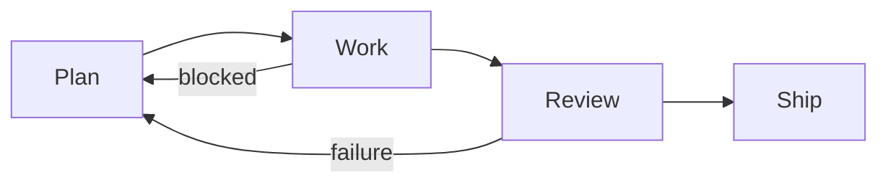

# Phase-Specific Context Assembly

> Optimise the orchestration layer that prepares each agent, not the agent itself.

When an agent produces poor output, the instinct is to improve the prompt or switch models. A more effective target is the **context bundle delivered to the agent for that phase** [unverified]. The question shifts from "what instructions should the agent follow?" to "what information does this agent need, at this step?"

## The Phase Model

A standard agentic workflow has four stages with distinct context needs:



| Phase | What the agent needs | What to exclude |
|-------|---------------------|-----------------|
| **Plan** | Architecture docs, constraints, migration patterns, high-level task | Implementation details, file contents |
| **Work** | Approved plan, exact file excerpts, validation commands, code patterns | Unrelated docs, planning rationale |
| **Review** | Original spec, diff, verification criteria | Implementation history, planning artifacts |
| **Ship** | Verified output, deployment checklist | Everything else |

Failures route back to an earlier stage. A blocked implementer means the plan was incomplete — return to planning with the specific gap identified.

## Orchestrators vs. Workers

- **Orchestrators** need condensed summaries (1,000–2,000 tokens) [unverified]. They route and decompose; file contents waste attention on decisions they do not make.
- **Workers** need targeted, granular information — the exact files they will edit, the validation commands that confirm correctness, nothing adjacent.

Giving both agents the same context bundle is a common source of drift. [unverified]

## JIT Loading over Upfront Loading

Agents perform better when they maintain lightweight references (file paths, stored queries) and retrieve on demand, rather than loading everything at session start [unverified].

```
# Instead of: load all docs at session start
# Do: give the planner a manifest; let workers fetch what they need

Planner receives:
  - task spec
  - architecture overview (compressed)
  - relevant constraint list

Worker receives at execution time:
  - approved plan excerpt for its subtask
  - file excerpts for files it will modify
  - test command to validate its output
```

This prevents stale context from persisting into later stages.

## Attention Anchoring

Over long sequences, agents drift from their objective. Two mechanisms counteract this:

- **Goal recitation**: a `todo.md` updated throughout execution keeps objectives in the recent attention window. See [Goal Recitation](goal-recitation.md).
- **Event-driven reminders**: inject remaining goals at stage transitions, not just at session start. See [Event-Driven System Reminders](../instructions/event-driven-system-reminders.md).

## Harness Engineering

The environment — repo structure, tests, linters — shapes what context is useful. When an agent struggles, identify what context was missing for that phase and add it to the orchestration layer, not the agent's system prompt. See [Harness Engineering](../agent-design/harness-engineering.md).

## Claude Code Native Implementation

Claude Code's sub-agents implement phase-specific context directly. Each receives only the tools relevant to its phase: **Explore** gets read-only file navigation, **Plan** gets research access before entering [Plan Mode](../workflows/plan-first-loop.md), and the general-purpose sub-agent gets full tool access with a targeted system prompt per skill.

## Example

### Python 2 to 3 code migration

A team is building a code-migration agent pipeline. Three agents run sequentially: a planner, an implementer, and a reviewer.

**Planner** receives:

- Architecture overview (500 tokens, compressed from 4,000-token internal doc)
- Migration constraints: "no third-party HTTP clients; use stdlib only"
- High-level task: "Migrate `user-service` from Python 2 to Python 3"

**Implementer** receives (assembled at execution time from the planner's output):

- The approved migration plan (planner output, ~800 tokens)
- Exact contents of `user_service/auth.py` and `user_service/db.py` — the two files it will modify
- Validation command: `pytest tests/user_service/ -x`
- Code pattern: example `urllib.request` usage replacing the deprecated `urllib2`

The implementer does not receive the architecture overview, the constraint rationale, or any files outside its subtask scope.

**Reviewer** receives:

- Original task spec
- Git diff of the implementer's changes
- Acceptance criteria: "all tests pass; no `urllib2` imports remain; no third-party HTTP clients introduced"

The reviewer does not receive the planner's reasoning or the implementer's intermediate drafts — only what it needs to verify the output.

### Database schema migration

Consider a three-phase workflow that migrates a database schema:

**Plan phase** — the planner agent receives:

- The migration spec (what tables change and why)
- Architecture overview (ORM in use, migration tool, naming conventions)
- Constraint list (no breaking changes to the public API, zero-downtime requirement)

It does not receive file contents from the codebase.

**Work phase** — a worker agent for each migration step receives:

- The approved plan excerpt for its specific subtask (e.g., "add `user_preferences` table")
- Exact file excerpts for the files it will modify (`models/user.py`, `migrations/`)
- The validation command (`pytest tests/db/ -k preferences`)

It does not receive the planning rationale or the full migration spec.

**Review phase** — the reviewer agent receives:

- The original migration spec
- The diff produced by the work phase
- Explicit verification criteria ("table exists, FK constraint in place, rollback script present")

It does not receive the implementation history or planning artifacts.

Each agent operates with under 3,000 tokens of input context; none receives the full project history.

## Unverified Claims

- Same-context-for-all-agents being a common source of drift is directionally consistent with practitioner reports but has no controlled study.
- Token ranges for orchestrator summaries (1,000–2,000) reflect Anthropic internal guidance and may not generalise.

## Related

- [Goal Recitation](goal-recitation.md)
- [Event-Driven System Reminders](../instructions/event-driven-system-reminders.md)
- [Trajectory Logging and Progress Files](../observability/trajectory-logging-progress-files.md)
- [Retrieval-Augmented Agent Workflows](retrieval-augmented-agent-workflows.md)
- [Context Hub](context-hub.md)
- [Sub-Agents Fan-Out](../multi-agent/sub-agents-fan-out.md)
- [Prompt Chaining](prompt-chaining.md)
- [Context Budget Allocation](context-budget-allocation.md)
- [Context Priming](context-priming.md)
- [Layered Context Architecture](layered-context-architecture.md)
- [Context-Injected Error Recovery](context-injected-error-recovery.md)
- [Seeding Agent Context](seeding-agent-context.md)
- [Dynamic System Prompt Composition](dynamic-system-prompt-composition.md)
- [Lost in the Middle](lost-in-the-middle.md)
- [Semantic Context Loading](semantic-context-loading.md)
- [Context Compression Strategies](context-compression-strategies.md)
- [Prompt Layering](prompt-layering.md)
- [Observation Masking](observation-masking.md)
- [Prompt Compression](prompt-compression.md)
- [Repository Map Pattern](repository-map-pattern.md)
- [Discoverable vs. Non-Discoverable Context](discoverable-vs-nondiscoverable-context.md)
