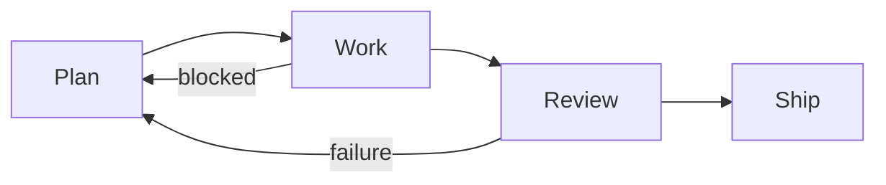

# Phase-Specific Context Assembly

> Phase-specific context assembly tailors the context bundle to each agent's role: planners get summaries, workers get file excerpts and validation commands, reviewers get diffs.

Related lesson: [Assembling the Prompt](https://learn.agentpatterns.ai/context-engineering/assembling-the-prompt/) — this concept features in a hands-on lesson with quizzes.

When an agent produces poor output, the instinct is to fix the prompt or switch models. A better target is the context bundle you deliver to the agent for that phase. The question shifts from "what instructions should the agent follow?" to "what information does this agent need, at this step?"

## The phase model

A standard agentic workflow has four stages with distinct context needs:


```mermaid
flowchart LR
    P[Plan] --> W[Work]
    W --> R[Review]
    R --> S[Ship]
    R -- failure --> P
    W -- blocked --> P
```

| Phase | What the agent needs | What to exclude |
|-------|---------------------|-----------------|
| Plan | Architecture docs, constraints, migration patterns, high-level task | Implementation details, file contents |
| Work | Approved plan, exact file excerpts, validation commands, code patterns | Unrelated docs, planning rationale |
| Review | Original spec, diff, verification criteria | Implementation history, planning artifacts |
| Ship | Verified output, deployment checklist | Everything else |

Failures route back to an earlier stage. A blocked implementer means the plan was incomplete — return to planning with the specific gap identified.

## Orchestrators versus workers

- Orchestrators need condensed summaries — enough to route and decompose tasks. File contents waste attention on decisions they do not make.
- Workers ([sub-agents](../patterns/multi-agent/sub-agents-fan-out.md)) need targeted, granular information — the exact files they will edit, the validation commands that confirm correctness, nothing adjacent.

Give both agents the same context bundle and they tend to drift. Orchestrators get distracted by implementation details; workers carry planning artifacts that crowd out actionable context. Anthropic's [multi-agent research system](https://www.anthropic.com/engineering/multi-agent-research-system) makes this split explicit: the lead agent coordinates and decomposes, while each subagent "needs an objective, an output format, guidance on the tools and sources to use, and clear task boundaries" — role-specific context rather than a shared bundle.

## JIT loading over upfront loading

Agents benefit from maintaining lightweight references (file paths, stored queries) and retrieving on demand, rather than loading everything at session start. This keeps early-stage context from persisting as stale noise into later stages.

```
# Instead of: load all docs at session start
# Do: give the planner a manifest; let workers fetch what they need

Planner receives:
  - task spec
  - architecture overview (compressed)
  - relevant constraint list

Worker receives at execution time:
  - approved plan excerpt for its subtask
  - file excerpts for files it will modify
  - test command to validate its output
```

## Attention anchoring

Over long sequences, agents drift from their objective. Two mechanisms counteract this:

- Goal recitation: a `todo.md` updated throughout execution keeps objectives in the recent attention window. See [Goal Recitation](goal-recitation.md).
- Event-driven reminders: inject remaining goals at stage transitions, not just at session start. See [Event-Driven System Reminders](../instructions/event-driven-system-reminders.md).

## Harness engineering

The environment — repo structure, tests, linters — shapes what context is useful. When an agent struggles, identify what context was missing for that phase and add it to the orchestration layer, not the agent's system prompt. See [Harness Engineering](../patterns/agent-design/harness-engineering.md).

## Claude Code native implementation

Claude Code's [built-in sub-agents](https://code.claude.com/docs/en/sub-agents) implement phase-specific context directly. Each receives only the tools relevant to its phase. Explore is read-only (Write and Edit denied). Plan is a read-only research agent used during [Plan Mode](../workflows/plan-first-loop.md) to gather context before presenting a plan. The general-purpose sub-agent has all tools available for multi-step tasks that need both exploration and modification.

## When this backfires

Phase-specific assembly adds orchestration overhead that is not always justified:

- Flat workflows — single-phase or two-step pipelines (prompt to response) gain nothing from phase decomposition, and the added assembly logic creates latency without benefit.
- Emergent replanning — when agents frequently revise their plan mid-execution, strict phase isolation forces expensive context re-assemblies. A single unified context that the agent can reread on demand can be cheaper.
- Cross-phase dependencies — if the reviewer needs [implementation history](selective-rewind-summarization.md) to catch subtle regressions, stripping it out per the review-phase rules causes missed findings. Check whether cross-phase context actually matters before excluding it.
- Small token budgets — if the entire project fits comfortably within context, filtering costs more than inclusion. Apply phase-specific assembly when context exceeds what the model can usefully attend to.

## Example

### Python 2 to 3 code migration

A team is building a code-migration agent pipeline. Three agents run sequentially: a planner, an implementer, and a reviewer.

Planner receives:

- Architecture overview (500 tokens, compressed from 4,000-token internal doc)
- Migration constraints: "no third-party HTTP clients; use stdlib only"
- High-level task: "Migrate `user-service` from Python 2 to Python 3"

Implementer receives (assembled at execution time from the planner's output):

- The approved migration plan (planner output, ~800 tokens)
- Exact contents of `user_service/auth.py` and `user_service/db.py` — the two files it will modify
- Validation command: `pytest tests/user_service/ -x`
- Code pattern: example `urllib.request` usage replacing the deprecated `urllib2`

The implementer does not receive the architecture overview, the constraint rationale, or any files outside its subtask scope.

Reviewer receives:

- Original task spec
- Git diff of the implementer's changes
- Acceptance criteria: "all tests pass; no `urllib2` imports remain; no third-party HTTP clients introduced"

The reviewer does not receive the planner's reasoning or the implementer's intermediate drafts — only what it needs to verify the output.

### Database schema migration

Consider a three-phase workflow that migrates a database schema:

Plan phase — the planner agent receives:

- The migration spec (what tables change and why)
- Architecture overview (ORM in use, migration tool, naming conventions)
- Constraint list (no breaking changes to the public API, zero-downtime requirement)

It does not receive file contents from the codebase.

Work phase — a worker agent for each migration step receives:

- The approved plan excerpt for its specific subtask (for example, "add `user_preferences` table")
- Exact file excerpts for the files it will modify (`models/user.py`, `migrations/`)
- The validation command (`pytest tests/db/ -k preferences`)

It does not receive the planning rationale or the full migration spec.

Review phase — the reviewer agent receives:

- The original migration spec
- The diff produced by the work phase
- Explicit verification criteria ("table exists, FK constraint in place, rollback script present")

It does not receive the implementation history or planning artifacts.

Each agent operates with under 3,000 tokens of input context; none receives the full project history.

## Key Takeaways

- The lever for poor agent output is often the per-phase context bundle, not the prompt or the model — ask "what does this agent need, at this step?"
- Plan, Work, Review, and Ship phases have distinct context needs; deliver only what each phase uses and route failures back to the phase that caused them.
- Orchestrators need condensed summaries to route and decompose; workers need the exact files, excerpts, and validation commands for their subtask — the same bundle to both causes drift.
- Store the reference itself (file path, stored query), not resolved content, and leave it [retrieved on demand](retrieval-augmented-agent-workflows.md) only when the phase that uses it runs.
- Skip phase-specific assembly for flat workflows, heavy emergent replanning, genuine cross-phase dependencies, or projects small enough to fit in context — filtering costs more than it saves there.

## Related

- [Goal Recitation](goal-recitation.md)
- [Retrieval-Augmented Agent Workflows](retrieval-augmented-agent-workflows.md)
- [Context Budget Allocation](context-budget-allocation.md)
- [Layered Context Architecture](layered-context-architecture.md)
- [Sub-Agents Fan-Out](../patterns/multi-agent/sub-agents-fan-out.md)
- [Harness Engineering](../patterns/agent-design/harness-engineering.md)
- [Context Engineering](context-engineering.md)
- [Treat Task Scope as a Security Boundary](../security/task-scope-security-boundary.md) — scoping each phase's context also limits injection attack surface
- [Conversation Registers](conversation-registers.md) — the human-facing counterpart: naming your interaction mode and resetting context when it changes
