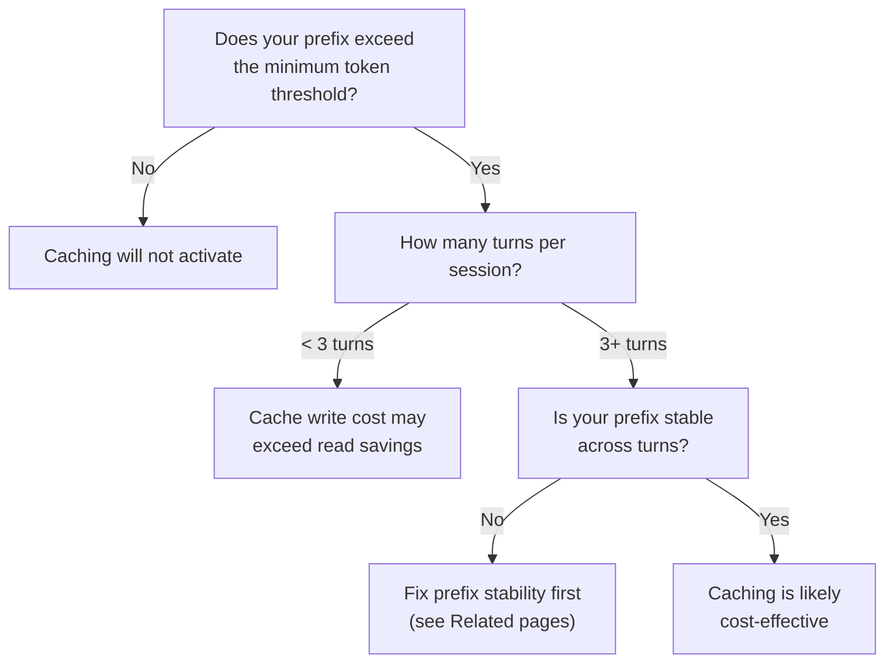

# Prompt Cache Economics Across Providers

> Prompt caching discounts range from 50% to 90% depending on the provider, but each has different activation rules, TTLs, and hidden costs.

Prompt caching skips recomputation for repeated token prefixes. Pay more on the first request (cache write) to pay less on subsequent ones (cache read). Net savings depend on session length, request frequency, and provider pricing.

## Provider Comparison

| | Anthropic | OpenAI | Google Gemini |
|---|---|---|---|
| **Discount on cached tokens** | 90% (reads cost 0.1x base) | 50% | ~90% (implicit); ~90% (explicit) |
| **Cache write cost** | 1.25x (5-min TTL) or 2x (1-hour TTL) | No write premium | No write premium (implicit); hourly storage fee (explicit) |
| **Activation** | Explicit breakpoints (up to 4) or automatic mode | Automatic for prompts >1,024 tokens | Implicit (automatic, no guarantee) or explicit (manual) |
| **Minimum tokens** | 1,024--4,096 (varies by model) | 1,024 | Not documented for implicit |
| **TTL** | 5 min or 1 hour (configurable) | Undocumented; evicted when unused | 1 hour default (explicit, configurable); undocumented (implicit) |
| **Cache sharing** | Workspace-isolated (since Feb 2026) | Organization-level | Not documented |
| **Monitoring field** | `cache_read_input_tokens` | `usage.prompt_tokens_details.cached_tokens` | Not documented for implicit |
| **Storage fees** | None | None | $1.00--$4.50/MTok/hour for explicit caching |

Sources: [Anthropic docs](https://platform.claude.com/docs/en/build-with-claude/prompt-caching), [OpenAI cookbook](https://developers.openai.com/cookbook/examples/prompt_caching101), [Gemini caching](https://ai.google.dev/gemini-api/docs/caching), [Gemini pricing](https://ai.google.dev/pricing)

### Anthropic Model-Specific Thresholds

Minimum tokens before a cache breakpoint activates ([Anthropic docs](https://platform.claude.com/docs/en/build-with-claude/prompt-caching)):

| Minimum tokens | Models |
|---|---|
| 1,024 | Sonnet 4/4.5, Opus 4/4.1 |
| 2,048 | Sonnet 4.6, Haiku 3.5 |
| 4,096 | Opus 4.5/4.6, Haiku 3, Haiku 4.5 |

## Worked Example: 50-Turn Agent Session

A coding agent with a 4,000-token stable prefix, 200 new tokens per turn, 50 turns:

=== "Anthropic (Claude Sonnet, $3/MTok uncached)"

    | | No caching | With caching |
    |---|---|---|
    | Prefix tokens (50 turns) | 200,000 | 200,000 |
    | Prefix cost | $0.60 | $0.06 (cache reads at $0.30/MTok) |
    | Cache write (turn 1) | -- | $0.015 (4K tokens at $3.75/MTok) |
    | Dynamic tail tokens | ~255,000 | ~255,000 |
    | Dynamic tail cost | $0.77 | $0.77 |
    | **Total input cost** | **$1.37** | **$0.84** |
    | **Savings** | -- | **38%** |

=== "OpenAI (GPT-4.1, $2/MTok uncached)"

    | | No caching | With caching |
    |---|---|---|
    | Prefix tokens (50 turns) | 200,000 | 200,000 |
    | Prefix cost | $0.40 | $0.20 (cache reads at $1/MTok) |
    | Cache write | -- | automatic, no premium |
    | Dynamic tail tokens | ~255,000 | ~255,000 |
    | Dynamic tail cost | $0.51 | $0.51 |
    | **Total input cost** | **$0.91** | **$0.71** |
    | **Savings** | -- | **22%** |

**Per-session cache savings** = `prefix_tokens` x `turns` x `base_price` x `discount_rate` - `cache_write_cost`

## When Caching Helps vs. When It Does Not

**Short sessions (1--2 turns)**: Anthropic's write premium (1.25x or 2x) requires 2--3 cache reads to break even.

**High parallelism**: On Anthropic, a cache entry only becomes available after the first response begins — simultaneous requests each miss the cache and pay the write cost ([Anthropic docs](https://platform.claude.com/docs/en/build-with-claude/prompt-caching)). Sequence the first request before fanning out.

**Google explicit caching**: Storage fees ($1.00--$4.50/MTok/hour) exceed read savings unless the cache is hit several times per hour.

**Anthropic 20-block lookback**: The system checks at most 20 block positions per breakpoint; modifications beyond 20 blocks from a breakpoint cause full cache misses ([Anthropic docs](https://platform.claude.com/docs/en/build-with-claude/prompt-caching)).

## Monitoring Cache Performance

| Provider | Metric field | Healthy signal |
|---|---|---|
| Anthropic | `cache_read_input_tokens` vs `cache_creation_input_tokens` | High reads, near-zero creation after turn 1 |
| OpenAI | `usage.prompt_tokens_details.cached_tokens` | Non-zero cached tokens on turns 2+ |
| Google (explicit) | Cache hit metadata in response | Hits on the named cache resource |

A creation-token spike mid-session signals prefix mutation -- see [Prompt Caching as Architectural Discipline](prompt-caching-architectural-discipline.md).

## Related

- [Prompt Caching as Architectural Discipline](prompt-caching-architectural-discipline.md)
- [Static Content First for Cache Hits](static-content-first-caching.md)
- [Dynamic Tool Fetching Breaks KV Cache](../anti-patterns/dynamic-tool-fetching-cache-break.md)
- [Cost-Aware Agent Design](../agent-design/cost-aware-agent-design.md)
- [Dynamic System Prompt Composition](dynamic-system-prompt-composition.md)
- [Context Engineering](context-engineering.md)
- [Disable Attribution Headers to Preserve KV Cache](kv-cache-invalidation-local-inference.md)
- [Context Budget Allocation](context-budget-allocation.md)
- [Prompt Compression](prompt-compression.md)
- [Attention Sinks](attention-sinks.md)
- [Context Compression Strategies](context-compression-strategies.md)
- [Context Priming](context-priming.md)
