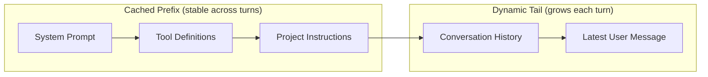

# Prompt Caching as Architectural Discipline

> Treat prompt caching as a structural constraint that shapes how you compose, extend, and compact agent context — not as an optimization you toggle on after the fact.

!!! info "Also known as"
    Keep Agent Loop Prompts Stateless, Stateless Agent Loop Design

## Why Architecture, Not Configuration

Prompt caching reuses [KV cache](https://www.dailydoseofds.com/p/kv-caching-in-llms-explained-visually/) representations of previously computed tokens. When a new request shares an exact prefix with a cached request, the provider skips recomputation for the shared portion. Cached reads cost [10% of the base input price on Anthropic's API](https://platform.claude.com/docs/en/build-with-claude/prompt-caching), while cache writes cost 125–200%. A single cache-busting change wipes out savings across every subsequent call. The prompt layout — what goes where, what can change, what must not — determines whether you pay 10% or 100% on every turn.

## The Immutable Prefix Pattern

Agent systems that achieve high cache efficiency share a common layout: a stable prefix followed by a growing tail.



The [Bui (2026) paper on OpenDev](https://arxiv.org/abs/2603.05344) describes this as "modular prompt composition": core identity and policies form the stable prefix; conversation history occupies the dynamic suffix. [Manus reports](https://manus.im/blog/Context-Engineering-for-AI-Agents-Lessons-from-Building-Manus) that KV-cache hit rate is "the single most important metric for a production-stage AI agent," noting a 10x price differential on Claude Sonnet.

## Three Rules That Break Caching

Prefix caching requires exact byte-level matches. Three patterns consistently bust the cache:

**Adding or removing tools mid-session.** Tool definitions sit in the prefix. Changing them invalidates everything after. Keep the tool list static across the session [unverified].

**Switching models.** Model-specific instructions are injected into the prefix. A model change [invalidates the cache](https://openai.com/index/unrolling-the-codex-agent-loop/) for the entire session. Treat model switches as context boundaries.

**Mutating the prefix to convey state.** Timestamps, config, or metadata in early sections bust the cache on every call. Place variable state in the dynamic tail instead.

## Stateless Requests: Caching and ZDR Compatibility

The caching layout only works when each request is a pure prefix extension of the prior one. This requires resending the full conversation history on every call.

```
Turn 1: [system prompt] + [user message 1]
Turn 2: [system prompt] + [user message 1] + [assistant turn 1] + [user message 2]
Turn 3: [system prompt] + [user message 1] + ... + [user message 3]
```

Turns 2 and 3 hit the cache for all tokens before the new content. [Source: [Unlocking the Codex Harness](https://openai.com/index/unlocking-the-codex-harness/)]

This design also satisfies Zero Data Retention (ZDR) requirements. ZDR prohibits the provider from persisting user data server-side; session-based APIs are inherently incompatible. Stateless requests have no server-side session dependency. [Source: [Unlocking the Codex Harness](https://openai.com/index/unlocking-the-codex-harness/)]

**Portability.** The same harness code works across providers; the full conversation state lives in the client.

**Trade-off.** Request payload grows with conversation length. Mitigate with [observation masking](observation-masking.md), [context compression](context-compression-strategies.md), and truncation policies.

## Cache-Safe Forking for Compaction

Naive compaction rebuilds the prompt from scratch, losing the cached prefix. Cache-safe compaction [preserves the prefix and appends a compaction instruction as new content](https://arxiv.org/abs/2603.05344) in the dynamic tail.

Fork the conversation: keep the identical prefix, append a summary of prior history as a new user message, then continue. The prefix cache carries over to the forked context.

## Monitoring Cache Health

Anthropic's API returns `cache_creation_input_tokens` (tokens written), `cache_read_input_tokens` (tokens served from cache), and `input_tokens` (uncached). [Source: [Anthropic prompt caching docs](https://platform.claude.com/docs/en/build-with-claude/prompt-caching)]

Track `cache_read_input_tokens` / total as a session metric. A healthy session shows near-zero `cache_creation_input_tokens` after the first turn; a mid-session spike signals a prefix change.

## SDK Cache Invalidation: A Case Study

Claude Code's SDK `query()` method contained a bug (fixed in v2.1.72/v2.1.73) that caused cache invalidation on every call, resulting in up to 12x higher input token costs [unverified]. Cache misses are silent — the API charges the full rate without erroring. Monitor `cache_read_input_tokens` vs `cache_creation_input_tokens`; anomalies indicate structural problems.

## Key Takeaways

- Stable prefix first, dynamic content last — this determines whether you pay 10% or 100% per turn.
- Three cache-busters: modifying tool definitions, switching models, injecting variable data into the prefix.
- Resend full conversation history on every request — enables caching and ZDR compatibility simultaneously.
- Compact by forking with the prefix intact; append the summary as new tail content.
- Monitor `cache_read_input_tokens` vs `cache_creation_input_tokens` — cache misses are silent.

## Example

A Python harness that maintains an immutable prefix and appends each new turn to the dynamic tail:

```python
import anthropic

client = anthropic.Anthropic()

SYSTEM_PROMPT = "You are a senior code reviewer..."
TOOL_DEFINITIONS = [
    {"name": "read_file", "description": "Read a file from disk", "input_schema": {...}},
    {"name": "run_tests", "description": "Run the test suite", "input_schema": {...}},
]

conversation = []

def send_turn(user_message: str) -> str:
    conversation.append({"role": "user", "content": user_message})

    response = client.messages.create(
        model="claude-sonnet-4-20250514",
        max_tokens=4096,
        system=[{"type": "text", "text": SYSTEM_PROMPT, "cache_control": {"type": "ephemeral"}}],
        tools=TOOL_DEFINITIONS,
        messages=conversation,  # full history resent every call
    )

    conversation.append({"role": "assistant", "content": response.content})

    # Monitor cache health
    usage = response.usage
    cache_hit_rate = usage.cache_read_input_tokens / (
        usage.cache_read_input_tokens + usage.cache_creation_input_tokens + usage.input_tokens
    )
    print(f"Cache hit rate: {cache_hit_rate:.0%}  "
          f"(read={usage.cache_read_input_tokens}, "
          f"write={usage.cache_creation_input_tokens}, "
          f"uncached={usage.input_tokens})")

    return response.content[0].text
```

After the first turn, `cache_read_input_tokens` should cover the system prompt and tool definitions. A mid-session spike in `cache_creation_input_tokens` signals a prefix change — check whether tool definitions or system prompt content was modified between calls.

## Related

- [Dynamic System Prompt Composition](dynamic-system-prompt-composition.md)
- [Static Content First: Maximizing Prompt Cache Hits](static-content-first-caching.md)
- [Prompt Cache Economics: Comparing Costs by Provider](prompt-cache-economics.md)
- [KV Cache Invalidation in Local Inference](kv-cache-invalidation-local-inference.md)
- [Observation Masking: Filter Tool Outputs from Context](observation-masking.md)
- [Cost-Aware Agent Design](../agent-design/cost-aware-agent-design.md)
- [Context Compression Strategies](context-compression-strategies.md)
- [Dynamic Tool Fetching Breaks KV Cache](../anti-patterns/dynamic-tool-fetching-cache-break.md)
- [Context Budget Allocation: Every Token Has a Cost](context-budget-allocation.md)
- [Prompt Compression: Maximizing Signal Per Token](prompt-compression.md)
