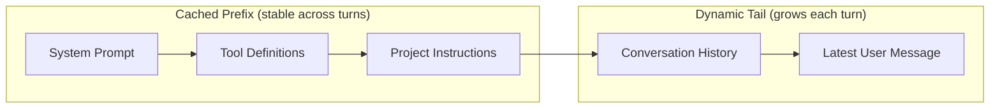

# Prompt Caching: Architectural Discipline for Agents

> Treat prompt caching as a structural constraint that shapes how you compose, extend, and compact agent context — not an optimization toggled on afterward.

**Learn it hands-on:** [The Immutable Prefix](https://learn.agentpatterns.ai/context-engineering/caching-static-first/) — guided lesson with quizzes.

!!! info "Also known as"
    Keep Agent Loop Prompts Stateless, Stateless Agent Loop Design

## Why Architecture, Not Configuration

Prompt caching reuses [KV cache](https://www.dailydoseofds.com/p/kv-caching-in-llms-explained-visually/) representations of previously computed tokens. When a new request shares an exact prefix with a cached request, the provider skips recomputation for the shared portion. Cached reads cost [10% of the base input price on Anthropic's API](https://platform.claude.com/docs/en/build-with-claude/prompt-caching), while cache writes cost 125–200%. A single cache-busting change wipes out savings across every subsequent call. The prompt layout — what goes where, what can change, what must not — determines whether you pay 10% or 100% on every turn.

## The Immutable Prefix Pattern

Agent systems that achieve high cache efficiency share a common layout: a stable prefix followed by a growing tail.


```mermaid
graph LR
    subgraph "Cached Prefix (stable across turns)"
        A[System Prompt] --> B[Tool Definitions]
        B --> C[Project Instructions]
    end
    subgraph "Dynamic Tail (grows each turn)"
        C --> D[Conversation History]
        D --> E[Latest User Message]
    end
```

The [Bui (2026) paper on OpenDev](https://arxiv.org/abs/2603.05344) describes this as "modular prompt composition": core identity and policies form the stable prefix; conversation history occupies the dynamic suffix. [Manus reports](https://manus.im/blog/Context-Engineering-for-AI-Agents-Lessons-from-Building-Manus) that KV-cache hit rate is "the single most important metric for a production-stage AI agent," noting a 10x price differential on Claude Sonnet.

## Three Rules That Break Caching

Prefix caching requires exact byte-level matches. Three patterns consistently bust the cache:

**Adding or removing tools mid-session.** Tool definitions sit in the prefix. Changing them invalidates everything after. Keep the tool list static across the session — [Anthropic's caching docs](https://platform.claude.com/docs/en/build-with-claude/prompt-caching) confirm that modifying tool definitions (names, descriptions, parameters) invalidates the entire cache.

**Switching models.** Model-specific instructions are injected into the prefix. A model change [invalidates the cache](https://openai.com/index/unrolling-the-codex-agent-loop/) for the entire session. Treat model switches as context boundaries.

**Mutating the prefix to convey state.** Timestamps, config, or metadata in early sections bust the cache on every call. Place variable state in the dynamic tail instead.

## Stateless Requests: Caching and ZDR Compatibility

The caching layout only works when each request is a pure prefix extension of the prior one. Resend the full conversation history on every call.

```
Turn 1: [system prompt] + [user message 1]
Turn 2: [system prompt] + [user message 1] + [assistant turn 1] + [user message 2]
Turn 3: [system prompt] + [user message 1] + ... + [user message 3]
```

Turns 2 and 3 hit the cache for all tokens before the new content. [Source: [Unlocking the Codex Harness](https://openai.com/index/unlocking-the-codex-harness/)]

This design also satisfies Zero Data Retention (ZDR) requirements. ZDR prohibits persisting user data server-side; session-based APIs are incompatible. Stateless requests have no server-side session dependency. [Source: [Unlocking the Codex Harness](https://openai.com/index/unlocking-the-codex-harness/)]

**Portability.** The same harness code works across providers; the full conversation state lives in the client.

**Trade-off.** Request payload grows with conversation length. Mitigate with [observation masking](observation-masking.md), [context compression](context-compression-strategies.md), and truncation policies.

## Cache-Safe Forking for Compaction

Naive compaction rebuilds the prompt from scratch, losing the cached prefix. Cache-safe compaction [preserves the prefix and appends a compaction instruction as new content](https://arxiv.org/abs/2603.05344) in the dynamic tail.

Fork the conversation: keep the identical prefix, append a summary of prior history as a new user message, then continue. The prefix cache carries over to the forked context.

## Monitoring Cache Health

Anthropic's API returns `cache_creation_input_tokens` (tokens written), `cache_read_input_tokens` (tokens served from cache), and `input_tokens` (uncached). [Source: [Anthropic prompt caching docs](https://platform.claude.com/docs/en/build-with-claude/prompt-caching)]

Track `cache_read_input_tokens` / total as a session metric. A healthy session shows near-zero `cache_creation_input_tokens` after the first turn; a mid-session spike signals a prefix change.

## SDK Cache Invalidation: A Case Study

Claude Code's SDK `query()` method contained a bug (fixed in [v2.1.72](https://github.com/anthropics/claude-code/releases/tag/v2.1.72)) that caused cache invalidation on every call, reducing input token costs up to 12x when fixed. Cache misses are silent — the API charges the full rate without erroring. Monitor `cache_read_input_tokens` vs `cache_creation_input_tokens`; anomalies indicate structural problems.

## When This Backfires

Three conditions where prefix-first discipline loses to the alternative:

- **Memory-augmented agents with shifting context.** In systems like MemGPT, archival documents and recalled conversations move across turns. Prefix caching misses the reuse because the same content sits at a different offset; block-based caching recovers more. [Source: [MemGPT: Where Prefix Caching Fails](https://medium.com/@tensormesh/memgpt-where-prefix-caching-fails-and-non-prefix-caching-succeeds-c6f3351bcc69)]
- **Mostly-dynamic prompts.** If the prefix stabilises for only a few turns, the 25–100% write premium is paid repeatedly without enough reads to amortise it. An uncached flow is cheaper. [Source: [Don't Break the Cache (arxiv 2601.06007)](https://arxiv.org/abs/2601.06007)]
- **Memory-bound deployments.** Each live prefix occupies KV memory on the server. In self-hosted or high-concurrency setups, reserved cache slots cap concurrent requests; letting caches expire can raise throughput. [Source: [Don't Break the Cache (arxiv 2601.06007)](https://arxiv.org/abs/2601.06007)]

Audit the hit-rate trace first; if reads do not dominate writes after a few turns, the cost is not paid back.

## Cache Economics Across Providers

The architectural discipline above decides whether caching activates at all; the economics decide whether it pays. Prompt caching skips recomputation for repeated token prefixes — you pay more on the first request (cache write) to pay less on subsequent ones (cache read). Net savings depend on session length, request frequency, and provider pricing.

| | Anthropic | OpenAI | Google Gemini |
|---|---|---|---|
| **Discount on cached tokens** | 90% (reads cost 0.1x base) | 50% | ~90% (implicit); ~90% (explicit) |
| **Cache write cost** | 1.25x (5-min TTL) or 2x (1-hour TTL) | No write premium | No write premium (implicit); hourly storage fee (explicit) |
| **Activation** | Explicit breakpoints (up to 4) or automatic mode | Automatic for prompts >1,024 tokens | Implicit (automatic, no guarantee) or explicit (manual) |
| **Minimum tokens** | 1,024--4,096 (varies by model) | 1,024 | Not documented for implicit |
| **TTL** | 5 min or 1 hour (configurable) | Undocumented; evicted when unused | 1 hour default (explicit, configurable); undocumented (implicit) |
| **Cache sharing** | Workspace-isolated (since Feb 2026) | Organization-level | Not documented |
| **Storage fees** | None | None | $1.00--$4.50/MTok/hour for explicit caching |

Sources: [Anthropic docs](https://platform.claude.com/docs/en/build-with-claude/prompt-caching), [OpenAI cookbook](https://developers.openai.com/cookbook/examples/prompt_caching101), [Gemini caching](https://ai.google.dev/gemini-api/docs/caching), [Gemini pricing](https://ai.google.dev/pricing)

Anthropic's per-model minimum tokens before a breakpoint activates: 1,024 (Sonnet 4/4.5, Opus 4/4.1), 2,048 (Sonnet 4.6, Haiku 3.5), 4,096 (Opus 4.5/4.6, Haiku 3, Haiku 4.5). [Source: [Anthropic docs](https://platform.claude.com/docs/en/build-with-claude/prompt-caching)]

**Break-even turns matter more than headline discount.** For a coding agent with a 4,000-token stable prefix, 200 new tokens per turn, over 50 turns:

=== "Anthropic (Claude Sonnet, $3/MTok uncached)"

    | | No caching | With caching |
    |---|---|---|
    | Prefix cost | $0.60 | $0.06 (cache reads at $0.30/MTok) |
    | Cache write (turn 1) | -- | $0.015 (4K tokens at $3.75/MTok) |
    | Dynamic tail cost | $0.77 | $0.77 |
    | **Total input cost** | **$1.37** | **$0.84** |
    | **Savings** | -- | **38%** |

=== "OpenAI (GPT-4.1, $2/MTok uncached)"

    | | No caching | With caching |
    |---|---|---|
    | Prefix cost | $0.40 | $0.20 (cache reads at $1/MTok) |
    | Cache write | -- | automatic, no premium |
    | Dynamic tail cost | $0.51 | $0.51 |
    | **Total input cost** | **$0.91** | **$0.71** |
    | **Savings** | -- | **22%** |

Per-session cache savings = `prefix_tokens` × `turns` × `base_price` × `discount_rate` − `cache_write_cost`. Caching can lose money in three economic conditions even when the prefix is stable: short sessions (1--2 turns), where Anthropic's 1.25x or 2x write premium needs 2--3 reads to recoup; high parallelism, where simultaneous requests each miss the cache and pay the write because the entry only becomes available after the first response begins (sequence the first request before fanning out); and Google explicit caching, where storage fees ($1.00--$4.50/MTok/hour) exceed read savings unless the cache is hit several times per hour. [Source: [Anthropic docs](https://platform.claude.com/docs/en/build-with-claude/prompt-caching)]

Monitor per provider: Anthropic `cache_read_input_tokens` vs `cache_creation_input_tokens` (high reads, near-zero creation after turn 1); OpenAI `usage.prompt_tokens_details.cached_tokens` (non-zero on turns 2+); Google explicit caching hit metadata. A creation-token spike mid-session signals prefix mutation, not a pricing question.

## Extended Cache TTL for Long Sessions

Anthropic's prompt cache defaults to a 5-minute TTL: a cached prefix is evicted 5 minutes after its last read, and the next request pays the full cache-write cost. The 1-hour TTL is an opt-in alternative — writes cost 2x base input (vs 1.25x for 5-minute) but the entry stays warm for an hour. In Claude Code, opt in via `ENABLE_PROMPT_CACHING_1H=1` (added in v2.1.108, April 14, 2026); at the raw API level, set `cache_control: {"type": "ephemeral", "ttl": "1h"}` on the breakpoint. [Source: [Anthropic prompt caching docs](https://platform.claude.com/docs/en/build-with-claude/prompt-caching), [Claude Code changelog](https://code.claude.com/docs/en/changelog)]

The decision reduces to session shape:

| Session shape | Idle gap pattern | TTL |
|---|---|---|
| Autonomous loop, no human in the middle | Continuous turns, < 5 min apart | 5-minute |
| Interactive code review | Mixed: most < 5 min, some 5–30 min | 1-hour |
| Agent waiting on side-agents or human review | Mostly 5–60 min idle | 1-hour |
| Walk-away workflows (return next day) | > 60 min idle | Neither — cache will expire |

**Why the break-even is the multiplier ratio, not the prefix size.** A 1-hour cache write costs 2x base input; two consecutive 5-minute writes cost 2 × 1.25x = 2.5x. When a session idles longer than 5 minutes but resumes within the hour, the 1-hour write is strictly cheaper than rewriting the 5-minute cache on resume. Skidmore (2026) derives the closed form for the related *refresh vs let-expire* decision: `T = 5 × (W / R) = 5 × (1.25 / 0.10) = 62.5 min`, with token count and per-token price cancelling out — the crossover is identical for a 5K Sonnet prefix and a 500K Opus prefix. [Source: [Skidmore: 62.5-minute rule](https://skids.dev/blog/anthropic-cache-tokenomics/)]

| Model | Base input | 5-min write | 1-hour write | Cache read |
|---|---|---|---|---|
| Opus 4.7 | $5/MTok | $6.25/MTok | $10/MTok | $0.50/MTok |
| Sonnet 4.6 | $3/MTok | $3.75/MTok | $6/MTok | $0.30/MTok |
| Haiku 4.5 | $1/MTok | $1.25/MTok | $2/MTok | $0.10/MTok |

Source: [Anthropic prompt caching docs](https://platform.claude.com/docs/en/build-with-claude/prompt-caching).

Verify the flag is doing work via the `usage` block, which separates 5-minute and 1-hour writes — the system prompt and tool definitions should appear in `ephemeral_1h_input_tokens` on turn 1 and in `cache_read_input_tokens` thereafter. If they keep landing in `ephemeral_5m_input_tokens` or `cache_creation_input_tokens` mid-session, the flag is not honoured or a prefix mutation is busting the cache before the longer TTL can help.

The longer TTL backfires in the same prefix-mutation cases as the default cache, plus three of its own: walk-away workflows past one hour (the cache evicts anyway, so you paid 2x for nothing — at T = 90 min, holding a 500K Opus prefix costs $1.375 more than letting it expire); a session-wide flag with mixed block sizes (`ENABLE_PROMPT_CACHING_1H` paints every breakpoint with the 1-hour premium, so set `ttl: "1h"` per breakpoint for finer control, 1-hour blocks before 5-minute blocks in the same request); and 20-block lookback exhaustion (each breakpoint scans at most 20 content blocks backwards, and a long tool-heavy session can exceed that depth and silently miss the cache regardless of TTL). [Source: [Skidmore](https://skids.dev/blog/anthropic-cache-tokenomics/)]

## Key Takeaways

- Stable prefix first, dynamic content last — this determines whether you pay 10% or 100% per turn.
- Three cache-busters: modifying tool definitions, switching models, injecting variable data into the prefix.
- Resend full conversation history on every request — enables caching and ZDR compatibility simultaneously.
- Compact by forking with the prefix intact; append the summary as new tail content.
- Monitor `cache_read_input_tokens` vs `cache_creation_input_tokens` — cache misses are silent.

## Example

A Python harness that maintains an immutable prefix and appends each new turn to the dynamic tail:

```python
import anthropic

client = anthropic.Anthropic()

SYSTEM_PROMPT = "You are a senior code reviewer..."
TOOL_DEFINITIONS = [
    {"name": "read_file", "description": "Read a file from disk", "input_schema": {...}},
    {"name": "run_tests", "description": "Run the test suite", "input_schema": {...}},
]

conversation = []

def send_turn(user_message: str) -> str:
    conversation.append({"role": "user", "content": user_message})

    response = client.messages.create(
        model="claude-sonnet-4-20250514",
        max_tokens=4096,
        system=[{"type": "text", "text": SYSTEM_PROMPT, "cache_control": {"type": "ephemeral"}}],
        tools=TOOL_DEFINITIONS,
        messages=conversation,  # full history resent every call
    )

    conversation.append({"role": "assistant", "content": response.content})

    # Monitor cache health
    usage = response.usage
    cache_hit_rate = usage.cache_read_input_tokens / (
        usage.cache_read_input_tokens + usage.cache_creation_input_tokens + usage.input_tokens
    )
    print(f"Cache hit rate: {cache_hit_rate:.0%}  "
          f"(read={usage.cache_read_input_tokens}, "
          f"write={usage.cache_creation_input_tokens}, "
          f"uncached={usage.input_tokens})")

    return response.content[0].text
```

After the first turn, `cache_read_input_tokens` should cover the system prompt and tool definitions. A mid-session spike in `cache_creation_input_tokens` signals a prefix change — check whether tool definitions or system prompt content was modified between calls.

## Related

- [Dynamic System Prompt Composition](dynamic-system-prompt-composition.md)
- [Static Content First: Maximizing Prompt Cache Hits](static-content-first-caching.md)
- [KV Cache Invalidation in Local Inference](kv-cache-invalidation-local-inference.md) — disabling attribution headers to preserve the local KV cache
- [Peek-Orientation Cache](peek-orientation-cache.md) — caching orientation reads so re-priming does not bust the prefix
- [Observation Masking: Filter Tool Outputs from Context](observation-masking.md)
- [Dynamic Tool Fetching Breaks KV Cache](../anti-patterns/dynamic-tool-fetching-cache-break.md)
- [Context Compression Strategies](context-compression-strategies.md)
- [Manual Compaction as Dumb Zone Mitigation](manual-compaction-dumb-zone-mitigation.md)
  - long-form
