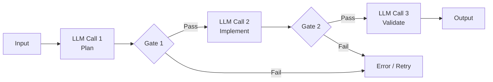

# Prompt Chaining

> Decompose a complex task into a sequence of LLM calls where each step processes the output of the previous one, enabling verification and gate-checking at each stage.

## Structure

A prompt chain is a directed sequence of LLM calls. Each call has:

- A single, well-defined responsibility
- The output of the previous call as its primary input
- Optionally, a programmatic gate that checks the output before passing it forward



Per [Anthropic's effective agents post](https://www.anthropic.com/engineering/building-effective-agents), prompt chaining is the foundational sequential pattern — appropriate when a task has discrete phases that benefit from focused attention and intermediate verification. The [Anthropic cookbook](https://platform.claude.com/cookbook/patterns-agents-basic-workflows) characterises it as decomposing a task into sequential subtasks where each step builds on previous results.

## When to Use

Chaining is the right choice when:

- The task has multiple distinct reasoning phases (plan → implement → validate)
- Earlier phases produce output that can be checked programmatically before proceeding
- Errors in early steps, if uncaught, would compound into later steps
- The intermediate outputs are valuable to inspect, log, or route conditionally

Do not chain when steps have no interdependency — parallel execution is more efficient and chaining adds unnecessary latency.

## Gate Checks

The defining feature of a well-designed chain is the gate between steps. A gate is a programmatic check on the intermediate output:

- Does the plan include all required components?
- Does the implementation compile / pass syntax checks?
- Do the tests pass?

Gates intercept errors at the point they occur rather than at final output. A failed gate can trigger a retry of that step, escalate to human review, or terminate the chain with a structured error — all without polluting the next step with bad input.

## Single Responsibility per Step

Each call in the chain should do one thing. A call that plans and implements simultaneously defeats the purpose of the chain: errors in either phase contaminate the other, and the gate between planning and implementation cannot fire.

If a call is producing output that requires significantly different evaluation criteria in two parts, split it into two calls.

## Latency Trade-Off

Chaining adds latency proportional to the number of steps. This is the primary cost: sequential execution cannot be parallelized. The trade-off is worthwhile when:

- Accuracy matters more than speed
- Intermediate outputs need inspection or logging
- The task cannot be reliably completed in a single prompt

For tasks where speed dominates and single-prompt performance is acceptable, chaining introduces cost without benefit.

## Relationship to Other Patterns

Prompt chaining is the simplest multi-step agent architecture. More complex patterns build on it:

- **Orchestrator-worker** — the orchestrator uses a chain to decompose the task, then spawns parallel workers
- **Evaluator-optimizer** — a two-node chain where the second call evaluates and feeds back to the first
- **Fan-out synthesis** — multiple chains run in parallel, converging to a synthesis step

Understanding chaining is a prerequisite for these patterns because they all rely on the same gate-check mechanics.

## Key Takeaways

- Each LLM call in the chain has a single responsibility; combined calls defeat the purpose of chaining
- Gates between steps are mandatory — they intercept errors at the point of origin, not at final output
- Chaining trades latency for accuracy and traceability; use it when accuracy is the priority
- Do not chain independent steps — parallelization is more efficient when steps have no interdependencies
- More complex patterns (orchestrator-worker, evaluator-optimizer) are specializations of the basic chain

## Example

A three-step chain that drafts, reviews, and finalises a technical specification:

```python
import anthropic

client = anthropic.Anthropic()

def gate_check(output: str, required_sections: list[str]) -> bool:
    return all(section.lower() in output.lower() for section in required_sections)

def run_spec_chain(feature_request: str) -> str:
    draft = client.messages.create(
        model="claude-opus-4-5",
        max_tokens=1024,
        messages=[{"role": "user", "content": f"Write a technical specification for: {feature_request}"}]
    ).content[0].text

    if not gate_check(draft, ["overview", "requirements", "api design", "error handling"]):
        raise ValueError("Draft missing required sections — aborting chain")

    review = client.messages.create(
        model="claude-opus-4-5",
        max_tokens=512,
        messages=[{"role": "user", "content": f"""Review this specification for gaps and risks:

{draft}

Return JSON: {{"issues": [...], "approved": true/false}}"""}]
    ).content[0].text

    import json
    review_result = json.loads(review)
    if not review_result.get("approved"):
        raise ValueError(f"Review failed — issues: {review_result['issues']}")

    final = client.messages.create(
        model="claude-opus-4-5",
        max_tokens=1024,
        messages=[{"role": "user", "content": f"""Finalise this specification addressing: {review_result['issues']}

Draft:
{draft}"""}]
    ).content[0].text

    return final
```

Each step has a single responsibility. Gate 1 prevents incomplete drafts from reaching the reviewer. Gate 2 prevents unapproved drafts from reaching the finaliser.

## Related

- [Evaluator-Optimizer Pattern](../agent-design/evaluator-optimizer.md)
- [Fan-Out Synthesis Pattern](../multi-agent/fan-out-synthesis.md)
- [Sub-Agents for Fan-Out Research and Context Isolation](../multi-agent/sub-agents-fan-out.md)
- [Orchestrator-Worker Pattern](../multi-agent/orchestrator-worker.md)
- [Separation of Knowledge and Execution](../agent-design/separation-of-knowledge-and-execution.md)
- [Cognitive Reasoning vs Execution: A Two-Layer Agent Architecture](../agent-design/cognitive-reasoning-execution-separation.md)
- [Phase-Specific Context Assembly](phase-specific-context-assembly.md)
- [Prompt Layering](prompt-layering.md)
