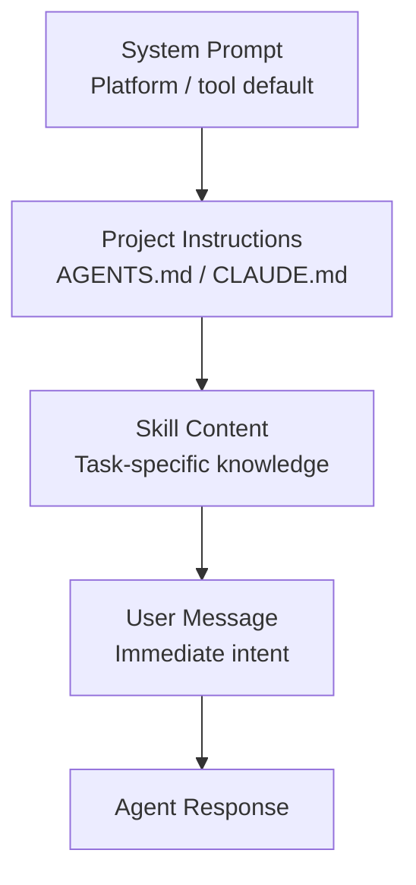

# Prompt Layering: How Instructions Stack and Override

> Prompt layering stacks agent instructions across four sources — system prompt, project instructions, skill content, user message — where specificity determines precedence on conflicts. Knowing this stack prevents unpredictable behavior and makes debugging tractable.

## The Layer Stack

Instructions reach an agent from several sources, each loaded at a different point in the session lifecycle:

Each layer is more specific than the one above it. Specificity generally determines precedence when layers conflict: the user message overrides the skill, which overrides project instructions, which overrides the system prompt — because the more specific instruction is closer to the actual task.

This is a behavioral tendency, not a formal rule enforced by the model. Contradictions between layers produce unpredictable outputs.

## What Each Layer Is For

**System prompt.** The outermost layer — set by the tool or platform. Defines the agent's role, permissions, and baseline constraints.

**Project instructions.** `AGENTS.md`, `CLAUDE.md`, [`.github/copilot-instructions.md`](../tools/copilot/copilot-instructions-md-convention.md) — loaded at session start, applies to every task in the project. Conventions, constraints, tooling preferences. This layer must apply universally; if a rule is task-specific, it does not belong here.

**Skill content.** Task-specific knowledge loaded when a skill runs. A code review skill carries review conventions; a documentation skill carries writing standards. Skills extend or refine project instructions for a specific task type — they do not repeat them. Repeating project conventions in a skill creates a second source of truth that can drift.

**User message.** The immediate task. Overrides everything below it because it represents the most specific current intent. If the user message contradicts a higher layer, the agent typically follows the user message — correct for the immediate task, but may violate project conventions.

## Subagents Break the Stack

Subagents do not inherit the parent agent's context. A subagent invoked by a parent agent starts fresh with its own system prompt — typically one injected at invocation time ([Claude Code sub-agents docs](https://code.claude.com/docs/en/sub-agents)). The parent's project instructions, loaded skills, and conversation history are not present unless explicitly passed.

A subagent can violate project conventions the parent was following unless the parent explicitly passes the relevant constraints. Debugging requires knowing what the subagent received at invocation, not what the parent had.

## Conflicts and Debugging

When an agent ignores an instruction, diagnose by layer:

1. **Which layer does the instruction come from?** An instruction buried in the middle of a long AGENTS.md competes with primacy bias — models show measurable performance degradation on constraints placed later in multi-constraint prompts ([Chen et al., 2024](https://arxiv.org/abs/2407.01419)); instructions near the top receive more reliable attention. For critical rules, [repeat them at both ends](../instructions/critical-instruction-repetition.md).
2. **Is there a conflicting instruction closer to the task?** A user message that says "skip tests for now" overrides a project instruction to always write tests.
3. **Is the agent a subagent?** If so, the project-level instructions may not be in its context.
4. **Is the instruction past the compliance ceiling?** The more rules in the stack, the more likely lower-priority rules are ignored.

## Designing for the Stack

Avoid duplicating instructions across layers. If a convention is in both AGENTS.md and a skill, changing one without the other produces a contradiction. The convention belongs in one layer; other layers refer to it or omit it.

Scope each layer tightly:

- **Project layer:** only what applies to every task
- **Skill layer:** only what applies to this task type
- **User message:** only the immediate task

Instructions that belong in the skill layer but sit in the project layer crowd context for every task, including those where the skill is not running.

## Example

A team configures Claude Code with a project-level `CLAUDE.md` that says: "Always write tests for new functions." A developer runs a code-generation task and adds a user message: "Generate the helper function — skip the tests for now, I'll add them later."

The user message overrides the project instruction. Claude Code generates the function without tests. The more specific instruction (immediate task) takes precedence over the less specific one (project convention).

Now the team adds a code-review skill that includes: "Flag any function without a corresponding test." When this skill runs on the same helper function, it flags the missing test — because the skill layer is more specific than the project layer for that task type, and the instruction to flag is not in conflict with the earlier user message (which was about generation, not review).

The gap is intentional: the project layer sets policy, the skill layer enforces it contextually, and the user message scopes the immediate action. Keeping these concerns in separate layers prevents the skill from being silenced by a user message that wasn't meant to apply to it.

## Key Takeaways

- Instructions stack in order: system prompt → project instructions → skill content → user message; specificity determines precedence on conflicts
- Subagents do not inherit parent context — they receive only what is explicitly passed at invocation
- Duplicate instructions across layers create drift; each convention belongs in exactly one layer
- When an agent ignores an instruction, check: layer position, conflicting instructions closer to the task, subagent context isolation, total compliance ceiling

## When This Backfires

Prompt layering assumes the model will respect layer precedence — but that assumption fails:

- **Silent contradictions go undetected.** When project instructions and a skill both define a convention differently, the model picks one without signaling the conflict. A flat single-layer system prompt makes contradictions at least visible in one file.
- **Compliance degrades with stack depth.** Each added layer increases total instruction volume. Beyond the compliance ceiling, low-priority rules (typically the project layer) are silently dropped. Ten critical rules in a flat prompt outperform forty rules spread across four layers.
- **Subagent isolation amplifies drift.** Subagents start fresh — if the parent's project layer isn't explicitly passed, the subagent ignores those conventions entirely. Layering without an explicit injection protocol is operationally equivalent to having no project layer for subagents.

## Related

- [AGENTS.md: A README for AI Coding Agents](../standards/agents-md.md)
- [Project Instruction File Ecosystem: CLAUDE.md, copilot-instructions, AGENTS.md](../instructions/instruction-file-ecosystem.md)
- [The Instruction Compliance Ceiling](../instructions/instruction-compliance-ceiling.md)
- [Phase-Specific Context Assembly](phase-specific-context-assembly.md)
- [Dynamic System Prompt Composition](dynamic-system-prompt-composition.md)
- [Layered Context Architecture](layered-context-architecture.md)
- [Lost in the Middle: The U-Shaped Attention Curve](lost-in-the-middle.md)
- [Seeding Agent Context](seeding-agent-context.md)
- [Agent Debugging: Diagnosing Bad Agent Output](../observability/agent-debugging.md) — diagnosing instruction conflicts using the layer stack
