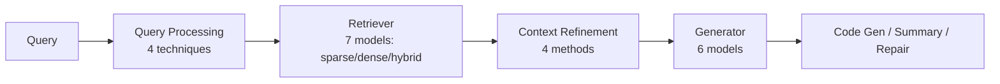
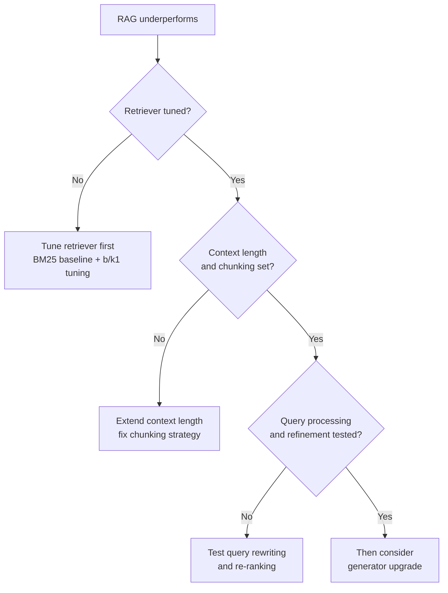

# Component-Wise RAG Prioritization for Software Engineering Tasks

> For software engineering RAG, retriever choice influences quality more than generator choice, and BM25 is the robust default on identifier-heavy code corpora.

## The counter-intuitive result

When a RAG pipeline underperforms, the reflex is to upgrade the generator. A component-wise study of 21+ models across the RAG pipeline reports the opposite priority for software engineering workloads: retriever choice shapes performance more than generator choice across code generation, summarization, and program repair ([Ke et al., 2026](https://arxiv.org/abs/2605.14503)).

The same study reports that classical lexical BM25 is "exceptionally robust" across the three SE tasks — competitive with or better than dense and hybrid retrievers ([Ke et al., 2026](https://arxiv.org/abs/2605.14503)).

## The four component axes

The study splits an SE-task RAG pipeline into four independent axes and isolates each one against the others ([Ke et al., 2026](https://arxiv.org/abs/2605.14503)):



| Axis | Variants | Dominance rank |
|------|----------|------------------------|
| Retriever | 7 models — sparse (BM25), dense, hybrid | Largest effect |
| Query processing | 4 techniques (rewriting, expansion, decomposition) | Conditional on retriever |
| Context refinement | 4 methods (re-ranking, filtering, compression) | Conditional |
| Generator | 6 models across capability tiers | Smaller than retriever |

Component effects are not independent: query processing helps some retrievers more than others ([Ke et al., 2026](https://arxiv.org/abs/2605.14503)).

## Why retrievers dominate

The generator can only reason about the tokens it sees. If the retriever misses the relevant function definition, error type, or test fixture, the generator cannot recover it — retrieval recall bounds generator accuracy from above. A stronger generator does nothing for documents that were never retrieved.

The companion chunking study shows the same pattern: doubling cross-file context length from 2k to 8k tokens delivers more accuracy gain than picking among non-dominated chunking strategies ([Wu et al., 2026](https://arxiv.org/abs/2605.04763)). Retrieval-side levers dominate.

## Why BM25 holds up on SE tasks

SE retrieval queries — function names, identifiers, error messages, API symbols — share heavy lexical overlap with target documents. BM25's term-frequency signal is strong precisely when that overlap is high. Dense embeddings add value when surface forms diverge (natural-language queries against code, semantic paraphrases), but in SE-task retrieval the corpus structure often closes the term gap already ([Ke et al., 2026](https://arxiv.org/abs/2605.14503)).

Independent agentic-search evidence agrees: a tuned BM25 paired with a frontier agent reaches 83.1% answer accuracy on BrowseComp-Plus, outperforming dense-retriever search agents ([Hsu, Yang, Lin, 2026](https://arxiv.org/abs/2605.10848)).

## Prioritization order

The findings translate to a concrete investment order for SE-task RAG:



1. Retriever first — tune BM25's `b` and `k1` against representative SE queries before assuming sophisticated retrievers help. Ke et al. reframe BM25 as a default, not a fallback ([Ke et al., 2026](https://arxiv.org/abs/2605.14503)).
2. Context length and chunking — pick a Pareto-optimal chunker (Sliding Window or cAST) and extend cross-file context within the model's effective range ([Wu et al., 2026](https://arxiv.org/abs/2605.04763)).
3. Query processing and refinement — gains depend on the retriever in use, so test against the tuned retriever, not a stock one ([Ke et al., 2026](https://arxiv.org/abs/2605.14503)).
4. Generator — the smallest lever in the study. Upgrade only after the retrieval side is exhausted.

## When the default inverts

The Ke et al. findings are conditional. The opposite prioritization — generator-first, dense-retriever default — wins under these conditions:

- Sub-frontier generators: weaker generators cannot compensate for retrieval-rank noise. On BrowseComp-Plus, Search-R1 + BM25 reaches 3.86% accuracy while GPT-5 + Qwen3-Embedding-8B reaches 70.1% ([Chen et al., 2025](https://arxiv.org/abs/2508.06600)). With a constrained generator budget, dense retrieval shifts the precision burden off the agent.
- Natural-language-to-code retrieval: when queries are user-typed descriptions ("deduplicate a list while preserving order") and target documents are identifiers (`unique_ordered`), the lexical signal collapses. Dense retrieval bridges the term gap. BM25 does not.
- Drifting corpora: BM25's tuned `b` and `k1` parameters age with the codebase. Post-refactor, post-rename, or in fast-moving repos, dense embeddings re-index without parameter retuning.
- Open-domain or non-SE workloads: the Ke et al. result is specific to SE corpora with high identifier-query overlap. It does not transfer to general QA, multilingual retrieval, or RAG over prose.

Outside these conditions, the retriever-first, BM25-default ordering is the higher-yield choice.

## Example

A team runs a RAG-augmented code repair assistant over a 200k-file Python monorepo. The current pipeline uses a managed dense embedding service, a reranker, and an upgrade plan to swap the generator from a mid-tier model to a frontier one.

Before — generator-first investment, dense + reranker default:

```yaml
retriever:
  primary: dense
  embedder: text-embedding-3-large
  reranker: bge-reranker-v2-m3
  top_k: 10
generator:
  current: mid-tier
  upgrade_target: frontier-tier
infrastructure:
  vector_db: managed
  monthly_cost_usd: 4200
```

After — retriever-first, BM25 baseline, generator upgrade deferred:

```yaml
retriever:
  primary: bm25
  tuning:
    b: 0.65       # calibrated against held-out SE queries
    k1: 1.4
  top_k: 30        # higher recall, agent filters
  fallback: dense  # used only when BM25 recall is low
generator:
  current: mid-tier
  upgrade_target: deferred-until-retriever-exhausted
infrastructure:
  bm25_index: self-hosted
  monthly_cost_usd: 400
```

The retriever-first ordering removes the dense-stack cost, defers the generator upgrade until the retrieval side is exhausted, and matches the prioritization the Ke et al. component-wise study supports ([Ke et al., 2026](https://arxiv.org/abs/2605.14503)). Re-evaluate on held-out repair tasks before committing — the directionality is supported, but absolute deltas depend on corpus identifier-query overlap.

## Key Takeaways

- Before budgeting a generator upgrade for a lagging SE-task RAG pipeline, audit retriever recall first — the component-wise study puts the larger effect there for code generation, summarization, and program repair ([Ke et al., 2026](https://arxiv.org/abs/2605.14503)).
- Benchmark any dense or hybrid retriever against a tuned BM25 baseline before adopting it for an SE corpus; the added infrastructure cost has to beat, not just match, the classical baseline ([Ke et al., 2026](https://arxiv.org/abs/2605.14503)).
- Stop tuning retrieval and move to a generator upgrade only after BM25's `b`/`k1`, context length and chunking, and query processing and refinement have each been tested — a generator swap attempted earlier is the lowest-yield lever in the study.
- Check these four conditions before defaulting to BM25-first: generator capability tier, whether queries are natural language against code rather than identifier-to-identifier, corpus drift rate versus retuning cadence, and whether the workload is SE-specific at all — any one flips the default.
- The retriever-dominance mechanism is consistent across SE-task RAG ([Ke et al., 2026](https://arxiv.org/abs/2605.14503)), code-completion chunking ([Wu et al., 2026](https://arxiv.org/abs/2605.04763)), and frontier-agent deep-research search ([Hsu, Yang, Lin, 2026](https://arxiv.org/abs/2605.10848)) — retrieval-side levers dominate generator-side levers when the generator is strong enough to use what it sees.

## Related

- [Chunking Strategy for RAG-Based Code Completion](chunking-strategy-rag-code-completion.md) — companion empirical study; chunk strategy is a smaller lever than context length, both retrieval-side
- [Repository-Level Retrieval for Code Generation](repository-level-retrieval-code-generation.md) — RACG survey covering the retrieval-strategy hierarchy (lexical, semantic, graph, hybrid)
- [Lexical-First Retrieval for Agentic Search](../tool-engineering/lexical-first-retrieval-for-agentic-search.md) — independent evidence that BM25 + frontier agent matches or beats dense retrieval in deep-research loops
- [Retrieval-Augmented Agent Workflows](retrieval-augmented-agent-workflows.md) — JIT-context strategy that pairs with whichever retriever you select
- [Repository Map Pattern](repository-map-pattern.md) — AST + PageRank symbol selection; structural retrieval complementary to BM25 or dense
- [Semantic Context Loading](semantic-context-loading.md) — LSP-based retrieval bypassing chunk-based RAG entirely for symbol-level navigation
- [Codebase-Derived Pattern Libraries as Agent Context](codebase-pattern-library-context.md) — narrows the retrieval corpus to vetted in-house code rather than tuning the retriever over a fixed corpus
