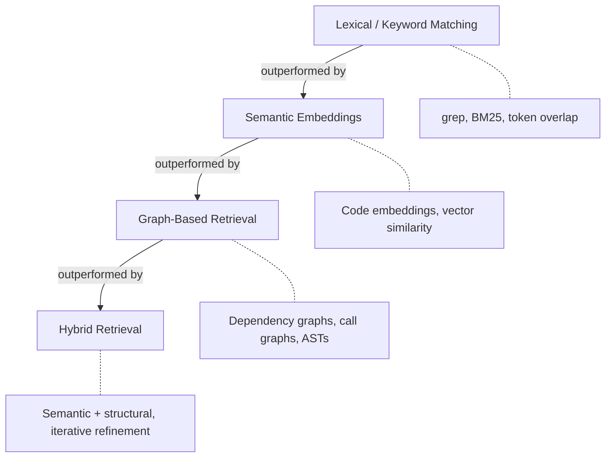

# Repository-Level Retrieval for Code Generation

> Grounding code generation in repository-wide context -- dependency graphs, cross-file references, and structural embeddings -- produces more accurate output than single-file retrieval alone.

## Why Local Context Is Not Enough

Function-level and file-level code generation treats each unit in isolation. The agent sees the current file but not the authentication middleware three directories away, the shared error types in a common package, or the test patterns the team follows.

Repository-level code generation retrieves cross-file context before generation. A [survey of retrieval-augmented code generation (RACG)](https://arxiv.org/abs/2510.04905) found that repository-level approaches consistently outperform single-file methods by leveraging broader contextual information.

## The Retrieval Strategy Hierarchy

Not all retrieval methods perform equally. The survey identifies a clear hierarchy:

| Strategy | Mechanism | Strength | Weakness |
|----------|-----------|----------|----------|
| **Lexical** | Keyword matching, BM25 | Fast, zero preprocessing | Misses semantic relationships |
| **Semantic** | Code embeddings, vector search | Captures meaning similarity | Ignores structural dependencies |
| **Graph-based** | Dependency graphs, call graphs, ASTs | Captures cross-file relationships | Expensive to build and maintain |
| **Hybrid** | Combines semantic + structural signals | Best accuracy on complex tasks | Highest computational cost |

Graph-based retrieval captures dependencies that text similarity cannot: a function importing a type from another module, a test exercising a specific code path, or a configuration file constraining runtime behavior [unverified -- the claim that graph-based "consistently" outperforms other methods may be benchmark-dependent; individual results vary by task type and codebase size].

## How Repository-Level Retrieval Works

The pipeline has three phases: **index** the repository into a searchable structure (ASTs, dependency graphs -- see [Repository Map Pattern](repository-map-pattern.md)), **retrieve** relevant code for the current task, and **augment** the generation prompt with that context.

The retrieval step identifies:

- **Direct dependencies**: modules imported by the target file
- **Structural neighbors**: functions that call or are called by the target
- **Similar implementations**: existing handlers or test cases matching the task semantically
- **Convention signals**: naming patterns, error handling styles, and architectural decisions in related files

This is distinct from [on-demand agent retrieval](retrieval-augmented-agent-workflows.md), which fetches context via tool calls at runtime. Repository-level retrieval happens at the *model* level before generation begins.

## What Developers Can Control

**Structure code for retrievability.** Clean module boundaries, explicit imports, and consistent naming help retrieval systems find relevant context. Circular dependencies and implicit conventions produce noisier results.

**Prefer tools with structural awareness.** Agents using dependency graphs or ASTs (like [semantic context loading](semantic-context-loading.md) via LSP) produce better cross-file generation than grep-based search.

**Scope retrieval to service boundaries.** For large monorepos, scoping retrieval to the relevant package rather than the entire repository reduces noise and improves quality.

**Verify cross-file generation with tests.** Functional correctness (tests passing) is more reliable than similarity scores. AI-generated code spanning multiple files has higher error rates than single-file output.

## Limitations

- **Domain shift**: models trained on public repositories perform poorly on proprietary codebases with custom frameworks and conventions
- **Noise in retrieval**: large repositories surface irrelevant context that can mislead generation
- **Staleness**: indexed repository representations go stale as code changes; incremental re-indexing adds complexity
- **Cross-language gaps**: retrieval across language boundaries (e.g., a Python service calling a Go microservice) remains weak
- **Privacy**: sending repository context to cloud-hosted models creates data exposure risk for proprietary code

## Example

Aider uses a repository map built from ASTs (tree-sitter) and PageRank to select cross-file context before each code generation request. Given a task like "add rate limiting to the `/upload` endpoint," Aider:

1. Parses the repository into a graph of symbols (functions, classes, imports) using tree-sitter
2. Identifies `upload_handler` in `routes/upload.py` and its direct dependencies: `auth_middleware` in `middleware/auth.py`, `RateLimitError` in `exceptions/errors.py`
3. Ranks symbols by relevance using PageRank weighted toward the edit target
4. Includes the top-ranked context (signatures, docstrings, import chains) in the generation prompt alongside the target file

The resulting prompt contains cross-file type signatures and conventions that a single-file approach would miss, reducing errors from mismatched function signatures or unknown error types.

## Unverified Claims

- Graph-based retrieval "consistently" outperforms lexical and semantic methods across all task types [unverified -- survey aggregates across studies but individual results vary by task type and codebase size]
- Maintaining clear dependency structure improves AI retrieval quality [unverified -- logically sound but not directly tested in the survey]

## Related

- [Retrieval-Augmented Agent Workflows: On-Demand Context](retrieval-augmented-agent-workflows.md) -- agent-side pattern for JIT context retrieval via tool calls
- [Repository Map Pattern: AST + PageRank for Dynamic Code Context](repository-map-pattern.md) -- structural indexing technique that implements part of the graph-based retrieval approach
- [Semantic Context Loading: Language Server Plugins for Agents](semantic-context-loading.md) -- LSP-based retrieval for symbol-level code navigation
- [Context Hub: On-Demand Versioned API Docs for Coding Agents](context-hub.md) -- documentation retrieval pattern complementary to code retrieval
- [Environment Specification as Context](environment-specification-as-context.md) -- feeding dependency versions and runtime constraints into agent context
- [Context Budget Allocation: Every Token Has a Cost](context-budget-allocation.md) -- framework for deciding how much context budget to allocate to retrieval results
- [Context Priming](context-priming.md) -- pre-loading relevant context before generation, complementary to retrieval-based approaches
- [Discoverable vs Non-Discoverable Context](discoverable-vs-nondiscoverable-context.md) -- classifying which context an agent can retrieve versus what must be provided upfront
- [Structured Domain Retrieval](structured-domain-retrieval.md) -- knowledge graph and case-based retrieval strategies complementary to code-level graph retrieval
- [Token-Efficient Code Generation](token-efficient-code-generation.md) -- reducing token cost of generated code, relevant when retrieval expands prompt size
- [Context Compression Strategies](context-compression-strategies.md) -- compressing retrieved context to fit within budget after repository-level retrieval
