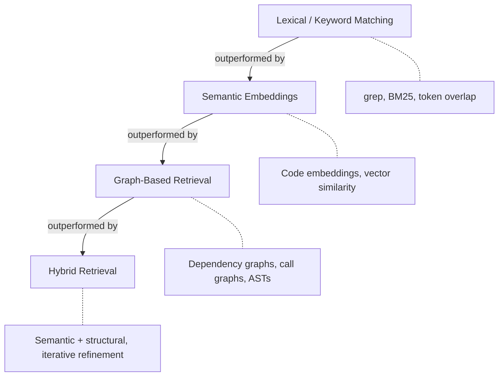
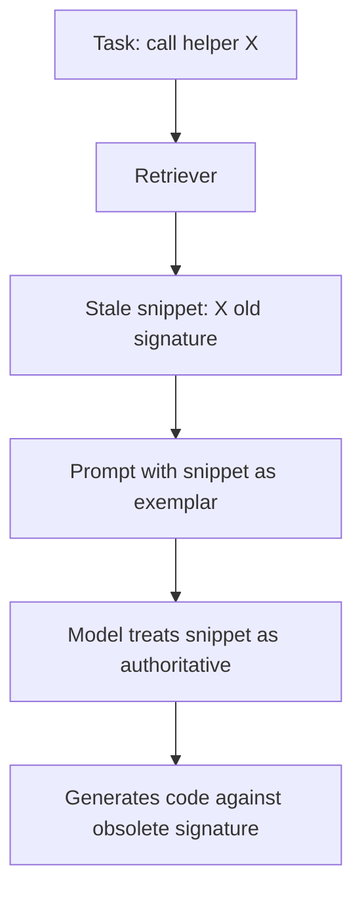

# Repository-Level Retrieval for Code Generation

> Grounding code generation in repository-wide context — dependency graphs, cross-file references, and structural embeddings — produces more accurate output than single-file retrieval alone.

## Why local context is not enough

Function-level and file-level code generation treats each unit in isolation. The agent sees the current file but not the authentication middleware three directories away, the shared error types in a common package, or the test patterns the team follows.

A [survey of retrieval-augmented code generation (RACG)](https://arxiv.org/abs/2510.04905) found that repository-level approaches consistently outperform single-file methods because they draw on broader context.

## The retrieval strategy hierarchy

Not all retrieval methods perform equally. The survey identifies a clear hierarchy:

```mermaid
graph TD
    L[Lexical / Keyword Matching] -->|outperformed by| S[Semantic Embeddings]
    S -->|outperformed by| G[Graph-Based Retrieval]
    G -->|outperformed by| H[Hybrid Retrieval]

    L -.- L1["grep, BM25, token overlap"]
    S -.- S1["Code embeddings, vector similarity"]
    G -.- G1["Dependency graphs, call graphs, ASTs"]
    H -.- H1["Semantic + structural, iterative refinement"]
```

| Strategy | Mechanism | Strength | Weakness |
|----------|-----------|----------|----------|
| Lexical | Keyword matching, BM25 | Fast, zero preprocessing | Misses semantic relationships |
| Semantic | Code embeddings, vector search | Captures meaning similarity | Ignores structural dependencies |
| Graph-based | Dependency graphs, call graphs, ASTs | Captures cross-file relationships | Expensive to build and maintain |
| Hybrid | Combines semantic + structural signals | Best accuracy on complex tasks | Highest computational cost |

A strong agent loop can partly offset lexical retrieval's weakness by reading and filtering more candidates itself — see [Lexical-First Retrieval for Agentic Search](../tool-engineering/lexical-first-retrieval-for-agentic-search.md) for when that trade-off favors BM25. Graph-based retrieval captures dependencies that text similarity misses: a function importing a type from another module, a test exercising a specific code path, or a configuration file constraining runtime behavior. Relative performance is task-dependent: [one study](https://arxiv.org/abs/2503.20589v1) reports that retrieved similar code can introduce noise and degrade generation accuracy by up to 15%, while graph-based retrieval provides the largest gains on tasks whose required dependencies share no vocabulary with the task description.

## How repository-level retrieval works

The pipeline has three phases:

1. Index the repository into a searchable structure (ASTs, dependency graphs — see [Repository Map Pattern](repository-map-pattern.md)).
2. Retrieve relevant code for the current task.
3. Augment the generation prompt with that context.

The retrieval step identifies:

- Direct dependencies: modules imported by the target file
- Structural neighbors: functions that call or are called by the target
- Similar implementations: existing handlers or test cases that match the task semantically
- Convention signals: naming patterns, error handling styles, and architectural decisions nearby

This differs from [on-demand agent retrieval](retrieval-augmented-agent-workflows.md), which fetches context via tool calls at runtime. Repository-level retrieval happens before generation begins.

## What developers can control

- Structure code for retrievability: clean module boundaries, explicit imports, and consistent naming help retrieval systems find relevant context, while circular dependencies and implicit conventions produce noisier results.
- Prefer tools with structural awareness: agents that use dependency graphs or ASTs (like [semantic context loading](semantic-context-loading.md) via LSP) outperform grep-based search for cross-file generation.
- Scope retrieval to service boundaries: in monorepos, scoping retrieval to the relevant package rather than the whole repository reduces noise.
- Verify cross-file generation with tests: functional correctness is more reliable than similarity scores, and multi-file generated code has higher error rates than single-file output.

## Limitations

- Domain shift: models trained on public repositories perform poorly on proprietary codebases with custom frameworks
- Noise in retrieval: large repositories surface irrelevant context that misleads generation
- Staleness: indexed representations go stale as code changes, and incremental re-indexing adds overhead
- Cross-language gaps: retrieval across language boundaries (for example, Python calling a Go microservice) remains weak
- Privacy: sending repository context to cloud-hosted models creates data exposure risk

## Case study: stale retrieval induces incorrect code

The staleness limitation above is active: stale snippets bias completion toward obsolete signatures. A controlled diagnostic study on 17 production helper-signature changes from five Python repositories compared four retrieval conditions (current-only, stale-only, no-retrieval, mixed) under prompts that hid commit recency from the model. Stale-only retrieval increased references to obsolete signatures by 88.2 percentage points on Qwen2.5-Coder-7B-Instruct (15 of 17 samples affected) and 76.5 percentage points on GPT-4.1-mini (13 of 17), with 75% overlap on which samples failed across the two models. The no-retrieval baseline produced zero stale references but only one passing completion overall — retrieval still helps; the problem is unfiltered temporal staleness, not retrieval itself. [Source: [Weng et al., 2026](https://arxiv.org/abs/2605.14478v1)]

```mermaid
graph TD
    Q[Task: call helper X] --> R[Retriever]
    R --> S[Stale snippet: X old signature]
    S --> P[Prompt with snippet as exemplar]
    P --> M[Model treats snippet as authoritative]
    M --> O[Generates code against obsolete signature]
```

A retrieved snippet showing a helper called with its previous signature is a high-confidence textual exemplar. The model conditions on it as in-context-learning input and reproduces the call shape. The model is doing exactly what RAG asks of it, with bad inputs. This is not hallucination or training-data lag.

Mixed current and stale retrieval largely resolves the failure. Adding fresh evidence alongside stale snippets is enough — the model follows the current exemplar when both are present. This shapes the practical response. Hard recency filters that drop older snippets risk losing structural and convention signal that is still valid, so co-retrieving current evidence (for example, fetching the current declaration of any helper referenced in a retrieved usage) addresses the failure without discarding context. This is related to but distinct from [Context Poisoning](../patterns/anti-patterns/context-poisoning.md), where a hallucinated premise propagates: stale retrieval's bad content comes from a real prior repository state, and co-retrieving current evidence remedies it, whereas it does not help once an agent has committed to a hallucinated premise.

Three checks indicate exposure:

- Index freshness lag: how far behind `HEAD` the index is. Nightly rebuilds against a fast-moving codebase routinely retrieve snippets that predate current signatures.
- Signature drift rate: the susceptible population — helpers whose signatures change often, since stable APIs are unaffected.
- Co-retrieval of declarations: whether, when a usage snippet is retrieved, the [current declaration](context-hub.md) of the called helper is also pulled in.

[Source: [Weng et al., 2026](https://arxiv.org/abs/2605.14478)]

Scope and limits: the study covers 17 samples and two models. The effect direction is consistent and the mechanism well-specified, but you should not extrapolate the absolute percentages beyond signature-change tasks in Python. Mixed-context recovery depends on the current evidence actually being retrieved, so a retriever that surfaces only stale snippets will not benefit. The finding does not generalize to retrieval tasks that do not depend on exact signatures (docstring generation, comment completion, naming suggestions). The broader RAG-for-code research treats keeping the index current as a failure mode distinct from semantic-relevance retrieval — semantic similarity scoring does not, on its own, surface temporal staleness. [Source: [survey of retrieval-augmented code generation](https://arxiv.org/abs/2510.04905v3), [kapa.ai on RAG failure modes](https://www.kapa.ai/blog/rag-gone-wrong-the-7-most-common-mistakes-and-how-to-avoid-them)]

## Key Takeaways

- Default to repository-level retrieval (dependency graphs, cross-file references, structural embeddings) over single-file scope for code-generation tasks.
- The strategy hierarchy runs lexical < semantic < graph-based < hybrid; graph-based gains most on tasks whose dependencies share no vocabulary with the task description.
- Structure code for retrievability, prefer structurally-aware tools, scope retrieval to service boundaries, and verify cross-file output with tests.
- Stale retrieved snippets bias completion toward obsolete signatures (76.5–88.2 pp on a 17-sample Python diagnostic); co-retrieve current declarations rather than hard recency-filtering.

## Example

Aider uses a repository map built from ASTs (tree-sitter) and PageRank to select cross-file context before each code generation request. Given a task like "add rate limiting to the `/upload` endpoint," Aider:

1. Parses the repository into a graph of symbols (functions, classes, imports) using tree-sitter.
2. Identifies `upload_handler` in `routes/upload.py` and its direct dependencies: `auth_middleware` in `middleware/auth.py`, `RateLimitError` in `exceptions/errors.py`.
3. Ranks symbols by relevance using PageRank weighted toward the edit target.
4. Includes the top-ranked context (signatures, docstrings, import chains) in the generation prompt alongside the target file.

The resulting prompt contains cross-file type signatures and conventions that a single-file approach would miss. This reduces errors from mismatched function signatures or unknown error types.

## Related

- [Retrieval-Augmented Agent Workflows: On-Demand Context](retrieval-augmented-agent-workflows.md) — agent-side pattern for JIT context retrieval via tool calls
- [Repository Map Pattern: AST + PageRank for Dynamic Code Context](repository-map-pattern.md) — structural indexing technique that implements part of the graph-based retrieval approach
- [Semantic Context Loading: Language Server Plugins for Agents](semantic-context-loading.md) — LSP-based retrieval for symbol-level code navigation
- [Context Hub: On-Demand Versioned API Docs for Coding Agents](context-hub.md) — documentation retrieval pattern complementary to code retrieval
- [Environment Specification as Context](environment-specification-as-context.md) — feeding dependency versions and runtime constraints into agent context
- [Context Budget Allocation: Every Token Has a Cost](context-budget-allocation.md) — framework for deciding how much context budget to allocate to retrieval results
- [Token-Efficient Code Generation](../token-engineering/token-efficient-code-generation.md) — reducing token cost of generated code, relevant when retrieval expands prompt size
- [Context Compression Strategies](context-compression-strategies.md) — compressing retrieved context to fit within budget after repository-level retrieval
- [Per-Object Context Allocation](per-object-context-allocation.md) — the stage after this one: how ranked candidates are packed into a bounded prompt, and why retrieved evidence still goes missing
  - long-form
