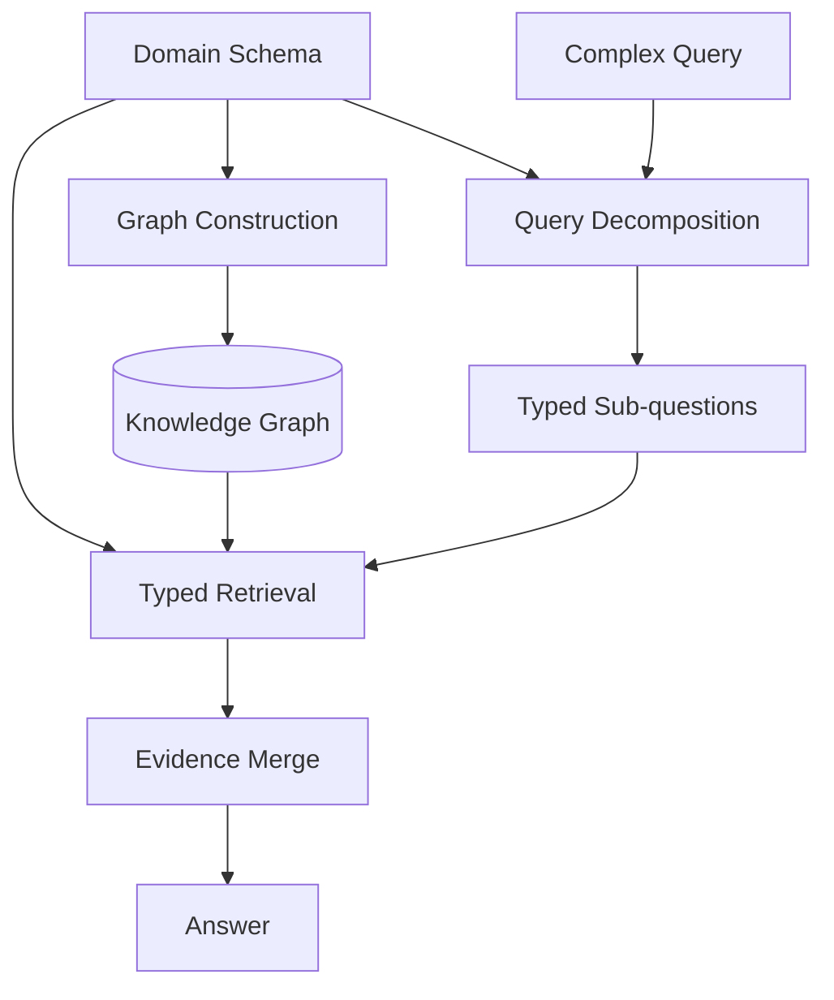

<!-- source: nibzard/awesome-agentic-patterns (Apache 2.0, https://github.com/nibzard/awesome-agentic-patterns) — retain attribution per license -->

# Schema-Guided Graph Retrieval

> Use one shared domain schema across graph construction, query decomposition, and typed retrieval to reduce noise and improve multi-hop reasoning precision.

## The Problem with Naive GraphRAG

Standard GraphRAG pipelines split into three stages: graph construction, query decomposition, and retrieval. Each stage typically operates under its own assumptions about the domain — entity granularity, relation vocabulary, node types. The misalignment produces two failure modes:

- **Retrieval noise**: entity, relation, keyword, and summary nodes compete equally during semantic search, returning irrelevant candidates
- **Decomposition drift**: sub-questions are generated without knowledge of what types exist in the graph, producing queries that don't match stored structure

The result is overly broad retrieval and disconnected reasoning chains on multi-hop questions.

## Schema as Control Surface

Schema-guided graph retrieval treats one domain schema as the control surface threading through all three stages. The Youtu-GraphRAG framework ([Dong et al., 2025; arXiv:2508.19855](https://arxiv.org/abs/2508.19855)) demonstrates this approach across six benchmarks, reporting 16.62% higher accuracy and up to 90.71% lower token cost versus state-of-the-art baselines.



### Stage 1: Schema-Guided Construction

The seed schema defines allowed entity types, relation types, and attribute types. An extraction agent is bounded by this schema when processing documents — nodes tagged with `schema_type` metadata at creation. High-confidence new types discovered during extraction can be proposed for schema expansion, reducing the risk of premature closure without allowing unbounded ontology sprawl.

A hierarchical layer sits above the base graph: community detection fuses structural topology with subgraph semantics to produce community summaries. This enables routing at multiple abstraction levels — individual nodes for precise lookups, community summaries for broader context.

### Stage 2: Schema-Aware Query Decomposition

The decomposer outputs two things for each sub-question: the sub-question text and the schema types involved. This is the critical coupling: sub-questions without type annotations provide minimal retrieval benefit — the decomposer must produce typed sub-questions or the downstream filtering gains disappear ([nibzard/awesome-agentic-patterns](https://github.com/nibzard/awesome-agentic-patterns/blob/main/patterns/schema-guided-graph-retrieval.md)).

### Stage 3: Typed Retrieval

Each sub-question retrieval is filtered by its declared schema types before semantic scoring. Type-filtered candidates are ranked, then merged across parallel sub-question searches. Typed filtering is the primary source of precision gain; semantic scoring operates on a pre-narrowed candidate set.

## When to Use

Schema-guided graph retrieval suits:

- **Multi-hop QA over private corpora** — internal documentation, domain-specific knowledge bases, support knowledge graphs
- **Stable ontologies** — domains where entity and relation types are known and don't shift rapidly
- **High-noise retrieval environments** — large graphs where flat semantic search returns too many irrelevant nodes

Skip it when:

- The domain is exploratory or the ontology is premature — schema design cost exceeds retrieval noise cost
- A well-maintained hierarchical API surface already exists — [structured domain retrieval](structured-domain-retrieval.md) with a knowledge graph is simpler
- Flat vector search over chunks already meets accuracy requirements

## Trade-offs

| Factor | Impact |
|--------|--------|
| Schema governance | Upfront design and ongoing maintenance; bad schemas suppress relevant evidence |
| Schema evolution | High-confidence type additions reduce ontology sprawl risk but require strict thresholds; whether this prevents sprawl in long-running deployments is not established |
| Parallel retrieval | Concurrent sub-question searches improve throughput but increase latency variance and orchestration complexity |
| Interpretability | Explicit typed sub-questions produce traceable reasoning chains |
| Domain transfer | Reusing one schema across ingestion and retrieval is cleaner than per-stage ontology redesign |
| Benchmark scope | The 90.71% token savings and 16.62% accuracy gains are from Youtu-GraphRAG's self-reported evaluation across six benchmarks; generalizability to other domains is unverified |

## Example

A legal knowledge base covering contract law, case precedents, and regulatory filings — one of the domain types used in the Youtu-GraphRAG benchmarks ([Dong et al., 2025](https://arxiv.org/abs/2508.19855)). Flat semantic search on "which cases support the indemnification clause in jurisdiction X" retrieves entity nodes, keyword nodes, and summary nodes indiscriminately.

**Schema definition** (excerpt):

```json
{
  "entity_types": ["Case", "Statute", "Clause", "Jurisdiction"],
  "relation_types": ["CITES", "APPLIES_IN", "GOVERNS", "SUPERSEDES"],
  "attribute_types": ["jurisdiction_code", "effective_date", "clause_type"]
}
```

**Typed sub-question output** from decomposer:

```
Sub-question: "Which cases cite indemnification clauses?"
  → schema_types: [Case, Clause, CITES]

Sub-question: "Which cases apply in jurisdiction X?"
  → schema_types: [Case, Jurisdiction, APPLIES_IN]
```

Retrieval for each sub-question filters to nodes tagged with the declared types before scoring. The evidence merge combines results across both sub-questions. A community summary for the "Contract Law — Indemnification" cluster provides broader context when node-level results are sparse.

## Key Takeaways

- A single domain schema aligned across construction, decomposition, and retrieval eliminates the stage-to-stage mismatch that causes GraphRAG noise.
- Typed sub-questions are the critical coupling: decomposition without type annotations provides minimal retrieval benefit.
- Typed filtering narrows candidates before semantic scoring — precision comes from the filter, not from a larger semantic model.
- Schema governance is a real cost; domains with unstable ontologies are poor candidates.

## Related

- [Structured Domain Retrieval](structured-domain-retrieval.md) — knowledge graph retrieval for API hierarchies; complementary for code generation tasks
- [Retrieval-Augmented Agent Workflows](retrieval-augmented-agent-workflows.md) — baseline on-demand retrieval this pattern extends
- [Repository Map Pattern](repository-map-pattern.md) — graph-importance ranking for code context
- [Observation Masking](observation-masking.md) — filtering intermediate retrieval results before reasoning
- [Context Budget Allocation](context-budget-allocation.md) — typed filtering reduces tokens consumed by irrelevant candidates
