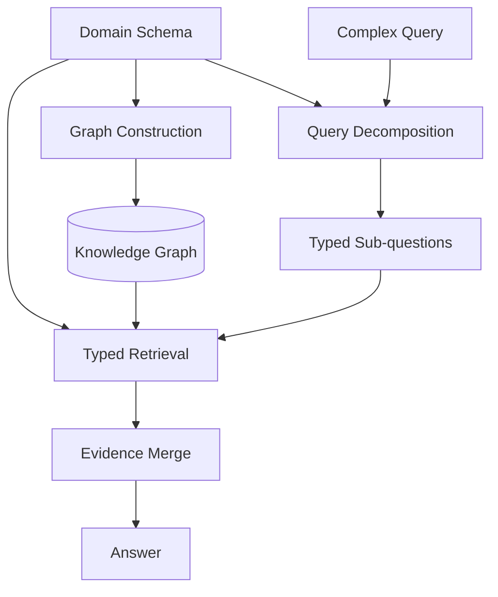

<!-- source: nibzard/awesome-agentic-patterns (Apache 2.0, https://github.com/nibzard/awesome-agentic-patterns) — retain attribution per license -->

# Schema-Guided Graph Retrieval

> Use one shared domain schema across graph construction, query decomposition, and typed retrieval to reduce noise and improve multi-hop reasoning precision.

## The problem with naive GraphRAG

Standard GraphRAG pipelines split into three stages: graph construction, query decomposition, and retrieval. Each stage usually makes its own assumptions about the domain — entity granularity, relation vocabulary, node types. The mismatch produces two failure modes:

- Retrieval noise: entity, relation, keyword, and summary nodes compete equally during semantic search, so the search returns irrelevant candidates
- Decomposition drift: the pipeline generates sub-questions without knowing what types exist in the graph, so the queries do not match the stored structure

The result is overly broad retrieval and disconnected reasoning chains on multi-hop questions.

## Schema as a control surface

Schema-guided graph retrieval threads one domain schema through all three stages. The Youtu-GraphRAG framework ([Dong et al., 2025; arXiv:2508.19855](https://arxiv.org/abs/2508.19855)) tests this approach across six benchmarks. It reports 16.62% higher accuracy and up to 90.71% lower token cost than the best prior baselines.


```mermaid
graph TD
    S[Domain Schema] --> C[Graph Construction]
    S --> D[Query Decomposition]
    S --> R[Typed Retrieval]

    C --> G[(Knowledge Graph)]
    G --> R

    Q[Complex Query] --> D
    D --> SQ[Typed Sub-questions]
    SQ --> R

    R --> E[Evidence Merge]
    E --> A[Answer]
```

### Stage 1: Schema-guided construction

The seed schema defines allowed entity types, relation types, and attribute types. This schema bounds the extraction agent as it processes documents, and the agent tags each node with `schema_type` metadata at creation. The agent can propose high-confidence new types found during extraction for schema expansion. This reduces the risk of premature closure without letting the ontology sprawl unbounded.

A hierarchical layer sits above the base graph. Community detection fuses [structural topology](repository-map-pattern.md) with subgraph semantics to produce community summaries. So the system can route at multiple abstraction levels: individual nodes for precise lookups, community summaries for broader context.

### Stage 2: Schema-aware query decomposition

The decomposer outputs two things for each sub-question: the sub-question text and the schema types involved. This is the critical coupling. Sub-questions without type annotations give little retrieval benefit, so the decomposer must produce typed sub-questions or the downstream filtering gains disappear ([nibzard/awesome-agentic-patterns](https://github.com/nibzard/awesome-agentic-patterns/blob/main/patterns/schema-guided-graph-retrieval.md)).

### Stage 3: Typed retrieval

Each sub-question filters to its declared `schema_types` before semantic scoring. The system ranks the type-filtered candidates, then merges them across parallel sub-question searches. Typed filtering is the main source of precision gain; semantic scoring runs on an already-narrowed candidate set.

The decomposer's ability to map an informal query onto the right schema types bounds the precision gain. [Multi-Agent GraphRAG (Maslej et al., 2025; arXiv:2511.08274)](https://arxiv.org/abs/2511.08274) finds schema-aware querying strongly model-dependent: its strongest model reached 77.23% average accuracy while weaker models trailed far behind. The same study reports that compositional queries (disjunctions, symmetric relations) and multi-intent questions stay hard regardless of typing. Mis-typed sub-questions filter to the wrong candidate set, so the filter's precision is no better than the model doing the typing.

## When to use

Schema-guided graph retrieval suits:

- multi-hop QA over private corpora: internal documentation, domain-specific knowledge bases, support knowledge graphs
- stable ontologies: domains where entity and relation types are known and do not shift rapidly
- high-noise retrieval environments: large graphs where flat semantic search returns too many irrelevant nodes

Skip it when:

- the domain is exploratory or the ontology is premature, so schema design cost exceeds retrieval noise cost
- a well-maintained hierarchical API surface already exists, where [structured domain retrieval](structured-domain-retrieval.md) with a knowledge graph is simpler
- flat vector search over chunks already meets your accuracy requirements

## Trade-offs

| Factor | Impact |
|--------|--------|
| Schema governance | Upfront design and ongoing maintenance; bad schemas suppress relevant evidence |
| Schema evolution | High-confidence type additions reduce ontology sprawl risk but require strict thresholds; whether this prevents sprawl in long-running deployments is not established |
| Parallel retrieval | Concurrent sub-question searches improve throughput but increase latency variance and orchestration complexity |
| Interpretability | Explicit typed sub-questions produce traceable reasoning chains |
| Domain transfer | Reusing one schema across ingestion and retrieval is cleaner than per-stage ontology redesign |
| Benchmark scope | The 90.71% token savings and 16.62% accuracy gains are from Youtu-GraphRAG's self-reported evaluation across six benchmarks; generalizability to other domains is unverified |

## Example

A legal knowledge base covering contract law, case precedents, and regulatory filings — one of the domain types used in the Youtu-GraphRAG benchmarks ([Dong et al., 2025](https://arxiv.org/abs/2508.19855)). Flat semantic search on "which cases support the indemnification clause in jurisdiction X" retrieves entity nodes, keyword nodes, and summary nodes indiscriminately.

Schema definition (excerpt):

```json
{
  "entity_types": ["Case", "Statute", "Clause", "Jurisdiction"],
  "relation_types": ["CITES", "APPLIES_IN", "GOVERNS", "SUPERSEDES"],
  "attribute_types": ["jurisdiction_code", "effective_date", "clause_type"]
}
```

Typed sub-question output from the decomposer:

```
Sub-question: "Which cases cite indemnification clauses?"
  → schema_types: [Case, Clause, CITES]

Sub-question: "Which cases apply in jurisdiction X?"
  → schema_types: [Case, Jurisdiction, APPLIES_IN]
```

Retrieval for each sub-question filters to nodes tagged with the declared `schema_types` before scoring. The evidence merge combines results across both sub-questions. A community summary for the "Contract Law — Indemnification" cluster provides broader context when node-level results are sparse.

## Key Takeaways

- Youtu-GraphRAG's 16.62% accuracy and 90.71% token-cost figures come from one self-reported evaluation across six benchmarks; confirm the gains hold on your own corpus before committing engineering budget to schema design.
- Require the decomposer to emit `schema_types` for every sub-question. An untyped sub-question bypasses the typed-retrieval filter and searches the whole graph like flat semantic search.
- The precision gain comes from the schema filter narrowing candidates before scoring runs, not the semantic scorer itself. When precision drops, check the sub-question's schema-type mapping before assuming the semantic model needs upgrading.
- Budget schema maintenance as an ongoing cost rather than a one-time design step. Skip this pattern if the domain's entity and relation types shift faster than the schema can be updated.

## Related

- [Structured Domain Retrieval](structured-domain-retrieval.md) — knowledge graph retrieval for API hierarchies; complementary for code generation tasks
- [Retrieval-Augmented Agent Workflows](retrieval-augmented-agent-workflows.md) — baseline on-demand retrieval this pattern extends
- [Repository Map Pattern](repository-map-pattern.md) — graph-importance ranking for code context
- [Observation Masking](observation-masking.md) — filtering intermediate retrieval results before reasoning
- [Context Budget Allocation](context-budget-allocation.md) — typed filtering reduces tokens consumed by irrelevant candidates
- [When a Skill Graph Cannot Beat the Ranker](skill-graph-topology-bound.md) — the limiting case: a typed graph whose candidates come from the retriever's own embedding adds no reach
- [Cross-Reference Dereference Hop in Retrieval Loops](cross-reference-dereference-hop.md) — the query-time alternative for the subset of edges the source document names explicitly, rather than encoding every edge in the graph up front
