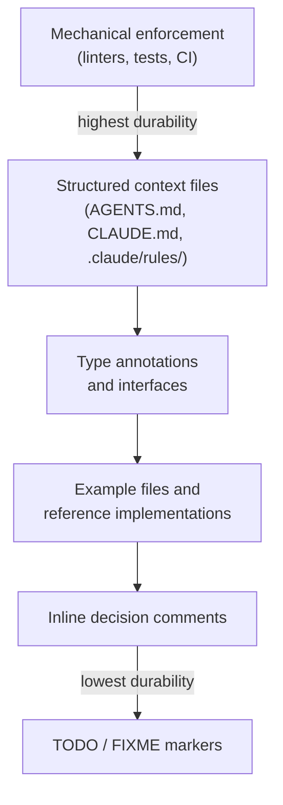

# Seeding Agent Context: Breadcrumbs in Code

> Strategically place files, comments, and markers that agents discover during exploration and use to shape their behaviour.

!!! note "Also known as"
    Providing Context to Agents, Context Priming, Breadcrumbs in Code. Seeding embeds contextual hints directly in the codebase for agents to discover during exploration. For the general technique of loading relevant context before a task, see [Context Priming](context-priming.md).

## Why Seeding Works

Agents explore codebases by reading files — what they find shapes what they do. Seeded context is persistent: it influences every session that touches that codebase region, shifting [context management](context-engineering.md) from a per-session concern to codebase hygiene.

## The Durability Spectrum

Breadcrumbs vary in how reliably they influence agent behaviour.



Mechanical enforcement outperforms written guidelines: the agent encounters the constraint at the point of violation and the error message becomes context for the next attempt ([Lavaee](https://alexlavaee.me/blog/openai-agent-first-codebase-learnings)).

## Techniques

### Directory-Scoped Context Files

The [AGENTS.md open standard](https://agents.md) defines a dedicated file for agent context, adopted by 60k+ projects and 25+ platforms. Agents read the nearest AGENTS.md in the directory tree; subdirectory files override project-level instructions.

Claude Code uses [CLAUDE.md files](https://code.claude.com/docs/en/memory) with the same scoping. The `.claude/rules/` directory adds path-scoped rules for matching files (e.g., `src/api/**/*.ts`).

### Progressive Disclosure Over Monoliths

A lean entry-point file (~100 lines) pointing to structured subdirectories outperforms a monolithic instruction file — the repository functions as agent memory, and anything not in context does not exist ([Lavaee, "OpenAI Agent-First Codebase Learnings"](https://alexlavaee.me/blog/openai-agent-first-codebase-learnings); see also [progressive disclosure for agent definitions](../agent-design/progressive-disclosure-agents.md)).

### Inline Decision Comments

Comments explaining *why* a decision was made prevent agents from reverting it. Without such a comment, a refactoring agent has no signal the choice is intentional:

```typescript
// We use optimistic updates here rather than waiting for the server response.
// Reverting to pessimistic updates caused noticeable UI lag in user testing.
```

### TODO and FIXME Markers

Placing a `TODO` or `FIXME` at the exact location ensures the agent encounters it when editing nearby code — though whether agents treat these as actionable items varies by tool.

### Type Annotations

Complete type signatures eliminate agent guesswork about return types, parameter shapes, and nullability.

### Example Files and Pattern Replication

Agents pattern-match against existing code — a well-written reference implementation communicates conventions more precisely than prose. However, agents replicate good and bad patterns alike; poor examples compound drift, a dynamic known as [pattern replication risk](../anti-patterns/pattern-replication-risk.md) ([Lavaee](https://alexlavaee.me/blog/openai-agent-first-codebase-learnings)).

### Progress Files as Breadcrumbs

Long-running agents maintain progress files (e.g., `todo.md`) that subsequent sessions read to get oriented, eliminating repeated discovery ([Anthropic](https://www.anthropic.com/engineering/effective-harnesses-for-long-running-agents)). Manus uses a continuously updated `todo.md` as a [goal recitation](goal-recitation.md) mechanism ([Manus](https://manus.im/blog/Context-Engineering-for-AI-Agents-Lessons-from-Building-Manus)).

## What to Seed vs. What to Prompt

| Seed in the codebase | Prompt interactively |
|---------------------|---------------------|
| Stable conventions and constraints | Task-specific requirements |
| Architectural decisions and rationale | What you are building now |
| Known issues and TODOs | Session priorities and scope |
| Type annotations and interfaces | One-off instructions |
| Progress files for multi-session work | Session corrections |

Seed durable information; prompt session-specific intent. See [Discoverable vs Non-Discoverable Context](discoverable-vs-nondiscoverable-context.md) for the boundary.

## When This Backfires

- **Stale breadcrumbs**: An AGENTS.md that no longer reflects the codebase misleads the agent — it acts on false premises with high confidence. Stale seeding is worse than no seeding.
- **Pattern replication**: Agents replicate existing code indiscriminately. A single poor reference implementation propagates the anti-pattern across every new file; mechanical enforcement is the only reliable safeguard.
- **Conflicting scopes**: Nested context files with contradictory instructions cause agents to apply the wrong scope — unpredictable and difficult to debug.

Seeding suits stable, long-lived codebases. For short-lived projects, the maintenance overhead may exceed the benefit.

## Key Takeaways

- Mechanical enforcement is the most durable seeding form — agents cannot ignore a failing check.
- Directory-scoped context files place conventions where the work happens.
- Agents replicate existing patterns indiscriminately — good and bad examples both propagate.
- Progress files and git history eliminate repeated discovery across sessions.
- A lean entry-point file outperforms a monolithic instruction file.

## Example

A Python monorepo with a data-pipeline package uses multiple techniques together:

**Project-level `AGENTS.md`** (repo root) lists the packages and where conventions live:

```markdown
# Project: data-platform

## Structure
- `pipelines/` — ETL jobs. See `pipelines/AGENTS.md` for conventions.
- `api/` — FastAPI service. See `api/AGENTS.md` for conventions.
- `shared/` — shared utilities imported by both packages.

## Global rules
- All new modules require type annotations.
- Do not modify `shared/schema.py` without updating `docs/schema-changelog.md`.
```

**Package-level `pipelines/AGENTS.md`** scopes the package conventions:

```markdown
# Pipelines package

## Conventions
- Use `BaseTransform` as the base class for all transform steps.
- Each pipeline has a corresponding test in `tests/pipelines/`.
- Airflow DAG definitions live in `dags/`; do not put business logic there.

## Known constraints
- `ingest_raw.py` uses synchronous S3 calls intentionally — async caused
  throttling issues with the bucket policy. Do not convert to async.
```

**Inline decision comment** in `pipelines/ingest_raw.py`:

```python
# Synchronous S3 client is intentional. Async caused throttling errors
# under the bucket policy in prod (see AGENTS.md — Known constraints).
# TODO: revisit if bucket policy is updated to allow concurrent requests.
s3 = boto3.client("s3")
```

**Typed function signature** leaves no ambiguity for the agent:

```python
def fetch_records(
    bucket: str,
    prefix: str,
    since: datetime,
) -> list[dict[str, Any]]:
    ...
```

An agent editing `ingest_raw.py` reads the package AGENTS.md, encounters the decision comment, sees the TODO, and understands the typed interface — all without session-level prompting.

## Sources

- [AGENTS.md open standard](https://agents.md) — cross-tool agent instruction format, 60k+ projects, 25+ platforms
- [Claude Code: How Claude remembers your project](https://code.claude.com/docs/en/memory) — CLAUDE.md hierarchy, .claude/rules/, auto memory
- [Anthropic: Context engineering for AI agents](https://www.anthropic.com/engineering/effective-context-engineering-for-ai-agents) — hybrid context loading, file system metadata as signals
- [Anthropic: Harness patterns for long-running agents](https://www.anthropic.com/engineering/effective-harnesses-for-long-running-agents) — progress files, git history as breadcrumbs
- [Alex Lavaee: OpenAI agent-first codebase learnings](https://alexlavaee.me/blog/openai-agent-first-codebase-learnings) — pattern replication, repository as memory, progressive disclosure
- [Manus: Context engineering for AI agents](https://manus.im/blog/Context-Engineering-for-AI-Agents-Lessons-from-Building-Manus) — file system as memory, recitation mechanism

## Related

- [Context Priming](context-priming.md)
- [Discoverable vs Non-Discoverable Context](discoverable-vs-nondiscoverable-context.md)
- [Goal Recitation](goal-recitation.md)
- [Retrieval-Augmented Agent Workflows](retrieval-augmented-agent-workflows.md)
- [Prompt Layering](prompt-layering.md)
- [Repository Map Pattern](repository-map-pattern.md)
