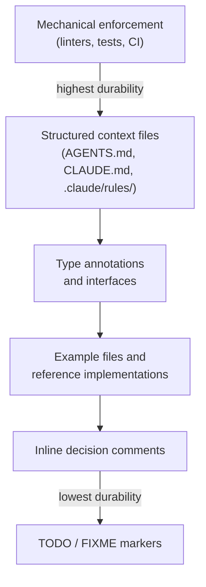

# Seeding Agent Context: Breadcrumbs in Code

> Strategically place files, comments, and markers that agents discover during exploration and use to shape their behaviour.

!!! note "Also known as"
    Providing Context to Agents, Context Priming, Breadcrumbs in Code. Seeding embeds contextual hints directly in the codebase for agents to discover during exploration. For the general technique of loading relevant context before a task, see [Context Priming](context-priming.md).

## Why Seeding Works

Agents explore codebases by reading files. What they find determines what they do. Unlike interactive prompts that exist only for one session, seeded context is persistent — it influences every agent session that touches that part of the codebase.

This shifts [context management](context-engineering.md) from a per-session concern to a codebase hygiene concern. The information is where the work happens.

## The Durability Spectrum

Breadcrumbs vary in how reliably they influence agent behaviour. Higher-durability signals are harder to ignore or misinterpret.



Mechanical enforcement — custom linters with remediation guidance in error messages — outperforms written guidelines because the agent encounters the constraint at the point of violation. The error message itself becomes context for the next attempt ([Lavaee, "OpenAI Agent-First Codebase Learnings"](https://alexlavaee.me/blog/openai-agent-first-codebase-learnings)).

## Techniques

### Directory-Scoped Context Files

The [AGENTS.md open standard](https://agents.md) defines a dedicated file for agent context, adopted by 60k+ open-source projects and supported by 25+ platforms including GitHub Copilot, Cursor, and Codex. Agents read the nearest AGENTS.md in the directory tree, so subdirectory files override or extend project-level instructions.

Claude Code uses [CLAUDE.md files](https://code.claude.com/docs/en/memory) with a similar scoping model: files walk up the directory tree from the working directory and subdirectory CLAUDE.md files load on demand when Claude reads files in those directories. The `.claude/rules/` directory adds path-scoped rules that activate only when Claude works with matching files (e.g., `src/api/**/*.ts`).

For repos that use both standards, CLAUDE.md can import AGENTS.md to avoid duplication.

### Progressive Disclosure Over Monoliths

A lean entry-point file (~100 lines) pointing to structured subdirectories outperforms a comprehensive single instruction file that crowds out task-specific context. The repository itself functions as the agent memory — anything not accessible in-context effectively does not exist ([Lavaee, "OpenAI Agent-First Codebase Learnings"](https://alexlavaee.me/blog/openai-agent-first-codebase-learnings)).

### Inline Decision Comments

Comments explaining *why* a decision was made prevent agents from reverting it:

```typescript
// We use optimistic updates here rather than waiting for the server response.
// Reverting to pessimistic updates caused noticeable UI lag in user testing.
```

Without the comment, an agent refactoring the function has no signal that this is an intentional design choice.

### TODO and FIXME Markers

Agents treat `TODO` and `FIXME` comments as actionable items [unverified — behaviour varies by tool and instruction set]. Placing a TODO at the exact location of a known issue ensures the agent encounters it when editing nearby code.

### Type Annotations

Complete type signatures eliminate an entire class of agent guesswork. The agent does not need to infer return types, parameter shapes, or nullability — the types specify them.

### Example Files and Pattern Replication

Agents pattern-match against existing code. A well-written reference implementation communicates conventions more precisely than prose instruction. However, agents replicate both good and bad patterns — poor examples compound architectural drift without mechanical enforcement ([Lavaee, "OpenAI Agent-First Codebase Learnings"](https://alexlavaee.me/blog/openai-agent-first-codebase-learnings)).

### Progress Files as Breadcrumbs

Long-running agents maintain progress files (e.g., `claude-progress.txt`, `todo.md`) that subsequent sessions read to get oriented. Git history combined with progress files forms a discovery mechanism that eliminates repeated orientation work across sessions ([Anthropic, "Effective Harnesses for Long-Running Agents"](https://www.anthropic.com/engineering/effective-harnesses-for-long-running-agents)). Manus uses a continuously updated `todo.md` as a [goal recitation](goal-recitation.md) mechanism that keeps objectives in the recent attention span ([Manus, "Context Engineering for AI Agents"](https://manus.im/blog/Context-Engineering-for-AI-Agents-Lessons-from-Building-Manus)).

## What to Seed vs. What to Prompt

| Seed in the codebase | Prompt interactively |
|---------------------|---------------------|
| Stable conventions and constraints | Task-specific requirements |
| Architectural decisions and rationale | Current context about what you are building |
| Known issues and TODOs | Priorities and scope for this session |
| Type annotations and interfaces | One-off instructions |
| Progress files for multi-session work | Session-specific corrections |

Breadcrumbs work for durable information. Session-specific intent belongs in the prompt. For what belongs in instruction files vs. what agents should discover on their own, see [Discoverable vs Non-Discoverable Context](discoverable-vs-nondiscoverable-context.md).

## Key Takeaways

- Mechanical enforcement (linters, tests, CI) is the most durable form of context seeding — agents cannot ignore a failing check.
- Directory-scoped context files (AGENTS.md, CLAUDE.md) place conventions where the work happens rather than centralizing everything at project level.
- Agents replicate existing patterns indiscriminately — good examples and bad examples both propagate.
- Progress files and git history serve as breadcrumbs for multi-session agent workflows, eliminating repeated discovery.
- A lean entry-point file with links to structured subdirectories outperforms a monolithic instruction file.

## Unverified Claims

- Agents treat `TODO` and `FIXME` comments as actionable items [unverified] — behaviour varies by tool and instruction set
- Strategic file naming (descriptive names helping agents understand purpose without reading content) improves agent navigation [unverified] — reasonable inference from how agents use file metadata but no specific study

## Example

A Python monorepo with a data-pipeline package uses multiple techniques together:

**Project-level `AGENTS.md`** (repo root) lists the packages and where conventions live:

```markdown
# Project: data-platform

## Structure
- `pipelines/` — ETL jobs. See `pipelines/AGENTS.md` for conventions.
- `api/` — FastAPI service. See `api/AGENTS.md` for conventions.
- `shared/` — shared utilities imported by both packages.

## Global rules
- All new modules require type annotations.
- Do not modify `shared/schema.py` without updating `docs/schema-changelog.md`.
```

**Package-level `pipelines/AGENTS.md`** scopes the package conventions:

```markdown
# Pipelines package

## Conventions
- Use `BaseTransform` as the base class for all transform steps.
- Each pipeline has a corresponding test in `tests/pipelines/`.
- Airflow DAG definitions live in `dags/`; do not put business logic there.

## Known constraints
- `ingest_raw.py` uses synchronous S3 calls intentionally — async caused
  throttling issues with the bucket policy. Do not convert to async.
```

**Inline decision comment** in `pipelines/ingest_raw.py`:

```python
# Synchronous S3 client is intentional. Async caused throttling errors
# under the bucket policy in prod (see AGENTS.md — Known constraints).
# TODO: revisit if bucket policy is updated to allow concurrent requests.
s3 = boto3.client("s3")
```

**Typed function signature** leaves no ambiguity for the agent:

```python
def fetch_records(
    bucket: str,
    prefix: str,
    since: datetime,
) -> list[dict[str, Any]]:
    ...
```

An agent editing `ingest_raw.py` reads the package AGENTS.md, encounters the decision comment, sees the TODO, and understands the typed interface — all without any session-level prompting.

## Sources

- [AGENTS.md open standard](https://agents.md) — cross-tool agent instruction format, 60k+ projects, 25+ platforms
- [Claude Code: How Claude remembers your project](https://code.claude.com/docs/en/memory) — CLAUDE.md hierarchy, .claude/rules/, auto memory
- [Anthropic: Context engineering for AI agents](https://www.anthropic.com/engineering/effective-context-engineering-for-ai-agents) — hybrid context loading, file system metadata as signals
- [Anthropic: Harness patterns for long-running agents](https://www.anthropic.com/engineering/effective-harnesses-for-long-running-agents) — progress files, git history as breadcrumbs
- [Alex Lavaee: OpenAI agent-first codebase learnings](https://alexlavaee.me/blog/openai-agent-first-codebase-learnings) — pattern replication, repository as memory, progressive disclosure
- [Manus: Context engineering for AI agents](https://manus.im/blog/Context-Engineering-for-AI-Agents-Lessons-from-Building-Manus) — file system as memory, recitation mechanism

## Related

- [Context Priming](context-priming.md)
- [Discoverable vs Non-Discoverable Context](discoverable-vs-nondiscoverable-context.md)
- [Goal Recitation](goal-recitation.md)
- [Retrieval-Augmented Agent Workflows](retrieval-augmented-agent-workflows.md)
- [Prompt Layering](prompt-layering.md)
- [Repository Map Pattern](repository-map-pattern.md)
