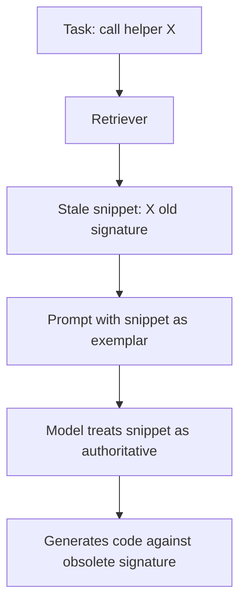

# Stale Repository Retrieval Induces Incorrect Code

> Stale repository snippets are not harmless background noise in retrieval-augmented code completion — they function as authoritative in-context examples and bias models toward writing code against obsolete API signatures.

## The Finding

A controlled diagnostic study on 17 production helper-signature changes from five Python repositories compared four retrieval conditions — current-only, stale-only, no-retrieval, and mixed — under prompts that hid commit recency from the model. Stale-only retrieval increased references to obsolete signatures by 88.2 percentage points on Qwen2.5-Coder-7B-Instruct (15 of 17 samples affected) and 76.5 percentage points on GPT-4.1-mini (13 of 17), with 75% overlap on which samples failed across the two models ([Weng et al., 2026](https://arxiv.org/abs/2605.14478)).

The no-retrieval baseline produced zero stale references but only one passing completion overall. Retrieval still helps — the problem is unfiltered temporal staleness, not retrieval itself.

## Why Stale Snippets Mislead



A retrieved snippet showing a helper being called with its previous signature is a high-confidence textual exemplar. The model conditions on it as in-context-learning input and reproduces the call shape. The failure mode is not hallucination and not training-data lag — the model is doing exactly what RAG asks of it, with bad inputs.

## The Mixed-Context Result

Mixed current+stale retrieval largely resolved the stale-induced failures the paper observed. Adding fresh evidence alongside stale snippets is enough — the model preferentially follows the current exemplar when both are present.

This shapes the practical response. Hard recency filters that drop older snippets risk losing structural and convention signal that is still valid. Co-retrieving current evidence — for example, fetching the current declaration of any helper referenced in a retrieved usage — addresses the failure without discarding context.

## Diagnosing the Problem in Your Pipeline

The study isolates a specific failure pattern. Three checks indicate exposure:

- **Index freshness lag**: how far behind `HEAD` is the retrieval index? Indexes rebuilt nightly against a fast-moving codebase routinely retrieve snippets predating the current signatures.
- **Signature drift rate**: helpers whose signatures change frequently are the susceptible population. Stable APIs are not affected.
- **Co-retrieval of declarations**: when a usage snippet is retrieved, is the current declaration of the called helper also pulled in? The mixed-context finding depends on this.

This is related to but distinct from [Context Poisoning](../anti-patterns/context-poisoning.md), where a hallucinated premise propagates. Stale retrieval differs in source — the bad content comes from a real, prior repository state, not from model invention — and in remedy: co-retrieving current evidence works for stale snippets but does not help when the agent has already committed to a hallucinated premise.

## Scope and Limits

- The study covers 17 samples and tests two models. The effect direction is consistent and the mechanism is well-specified, but absolute percentages should not be extrapolated beyond signature-change tasks in Python.
- Mixed-context recovery depends on the current evidence actually being retrieved. A retriever that consistently surfaces only stale snippets — for example, because the current version has fewer cross-references — will not benefit.
- The finding does not generalise to retrieval tasks that do not depend on exact signatures (docstring generation, comment completion, naming suggestions) — the study did not test these.
- The staleness problem is acknowledged across the repository-level code generation literature: a [survey of retrieval-augmented code generation](https://arxiv.org/abs/2510.04905) identifies staleness of indexed representations as a recurring limitation, and [kapa.ai's analysis of RAG failure modes](https://www.kapa.ai/blog/rag-gone-wrong-the-7-most-common-mistakes-and-how-to-avoid-them) confirms that semantic relevance scoring does not detect temporal staleness.

## Example

A team using Aider-style repository indexing rebuilds its retrieval index nightly. A high-traffic helper `process_payment(order_id, amount, currency)` is refactored to `process_payment(order, options)` at 09:00. Until the next index rebuild, every retrieval for payment-related tasks surfaces snippets showing the three-argument form.

**Stale-only retrieval** — what the index serves until rebuild:

```python
# Retrieved snippet from billing/refund.py
result = process_payment(order_id=order.id, amount=order.total, currency="USD")
```

The model generates new call sites against this signature. None compile against the refactored helper.

**Mixed retrieval** — same usage snippet plus current declaration:

```python
# Retrieved snippet from billing/refund.py
result = process_payment(order_id=order.id, amount=order.total, currency="USD")

# Retrieved current declaration from payments/core.py
def process_payment(order: Order, options: PaymentOptions) -> Result: ...
```

With the current declaration present, the model resolves the signature conflict in favour of the declaration. Pulling the current declaration of every helper referenced in retrieved usage snippets is a cheap structural change that does not require recency filtering.

## Key Takeaways

- Stale repository snippets actively bias code completion toward obsolete signatures, not just add noise — measured at 76.5–88.2 percentage-point increases in stale references on a 17-sample diagnostic ([Weng et al., 2026](https://arxiv.org/abs/2605.14478)).
- The mechanism is in-context learning on misleading exemplars; the model is not hallucinating, it is following the prompt.
- Co-retrieving current evidence — particularly the current declaration of any referenced helper — largely resolves the failure without dropping older snippets.
- Pure recency filtering risks losing valid convention and structural signal; mixed-context retrieval is the more targeted remedy.
- Findings are from 17 Python signature-change cases on two models — directional, not a calibrated rate.

## Related

- [Repository-Level Retrieval for Code Generation](repository-level-retrieval-code-generation.md) — the broader retrieval pattern this failure mode sits inside
- [Chunking Strategy for RAG-Based Code Completion](chunking-strategy-rag-code-completion.md) — orthogonal RAG-for-code design choice; chunking does not address staleness
- [RAG Component Prioritization for Software Engineering](rag-component-prioritization-software-engineering.md) — which RAG components matter most for code tasks
- [Context Hub](context-hub.md) — versioned API documentation retrieval; the documentation analogue of co-retrieving current declarations
- [Environment Specification as Context](environment-specification-as-context.md) — runtime version pinning, complementary to signature freshness
- [Context Poisoning](../anti-patterns/context-poisoning.md) — related but distinct failure mode where a hallucinated premise propagates
