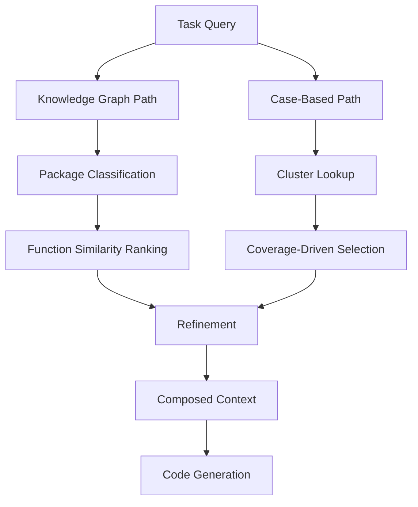

# Structured Domain Retrieval: Knowledge Graphs and Case-Based Reasoning

> Flat vector search loses structural relationships between API entities. A knowledge graph of package-function hierarchies combined with coverage-driven case selection retrieves domain context that similarity search misses.

## The Problem with Flat Retrieval

Standard RAG retrieves context by embedding similarity — vectorize the query, return the closest chunks. This fails for domain-specific code generation because API knowledge is **hierarchical**: a function belongs to a module, belongs to a package, with specific parameter types and return conventions. Embedding distance does not encode these relationships. Graph-structured retrieval was shown to better capture relational context in knowledge-intensive tasks ([Edge et al., "From Local to Global", 2024](https://arxiv.org/abs/2404.16130)).

DomAgent demonstrated this: a 7B model with flat retrieval scored ~40% pass@1 on truck software tasks; with structured KG retrieval plus case-based reasoning it scored 96.6% ([DomAgent, 2025](https://arxiv.org/abs/2603.21430)).

## Two Retrieval Paths

Structured domain retrieval operates through two complementary paths: understanding what exists (top-down) and seeing how it is used (bottom-up).



### Top-Down: Knowledge Graph Retrieval

Build a knowledge graph from your domain's API surface — packages, modules, classes, functions as entities with containment and dependency edges. At retrieval time:

1. **Package classification** — an LLM determines which packages are relevant to the current task
2. **Function ranking** — cosine similarity between task and function embeddings within selected packages
3. **Top-T selection** — the highest-ranked functions and their documentation are returned

The agent receives package location, parameter types, and sibling relationships — not just an isolated signature.

### Bottom-Up: Case-Based Reasoning

Working code examples show how API functions are actually used. The key insight is **coverage-driven selection**: cluster and select a minimal representative set.

1. **Cluster functions** by semantic similarity within each package (K-means)
2. **Select cases iteratively** — add a case if it covers a new package or cluster
3. **Stop at coverage thresholds** — typically 90% of packages and 90% of clusters

DomAgent found that 30% of coverage-selected cases matched the performance of 80% randomly selected cases on the benchmarks tested (DS-1000 and a truck CAN signal domain); generalizability to other domains has not been established ([DomAgent, 2025](https://arxiv.org/abs/2603.21430)).

## Refinement Gate

The LLM reviews retrieved items against the task, removing entries that are superficially similar but functionally irrelevant — the structured equivalent of [observation masking](observation-masking.md).

## When to Use This

Structured domain retrieval pays off when:

- **Well-defined API surface** — SDKs, internal libraries, or frameworks with package-function hierarchies
- **Large API surface** — hundreds of functions across dozens of packages
- **Repetitive tasks** — the same API patterns recur, making case curation worthwhile
- **High accuracy requirements** — regulated or safety-critical domains where 40% pass@1 is unacceptable

Skip it when the API fits in a system prompt, tasks are exploratory, or the team cannot maintain the knowledge graph. For APIs with fewer than ~100 functions, the construction and maintenance overhead typically exceeds the accuracy benefit.

## Construction

### Knowledge Graph

1. Parse API docs or source to extract packages, classes, functions, params, return types
2. Build containment (package → module → function) and dependency edges
3. Embed each function using name + description + parameter signature
4. Store in a graph DB, JSON index, or MCP server

### Case Base

1. Collect working examples from tests, docs, or production
2. Embed, cluster by similarity, select via coverage thresholds (90% package, 90% cluster)
3. Store with metadata linking each case to KG entities it exercises

### Integration with Agent Workflows

Expose both paths as tools, following the [retrieval-augmented agent workflow](retrieval-augmented-agent-workflows.md) pattern:

```
# Agent tool descriptions (startup context)
- search_domain_kg: Query the domain knowledge graph for relevant functions
- search_case_base: Retrieve representative code examples for a task
```

The agent starts lean — only tool descriptions preloaded. On a domain task it calls `search_domain_kg` for API structure, `search_case_base` for usage patterns, then generates code grounded in both.

## Example

A vehicle diagnostics agent generates code against a CAN signal SDK with 400+ functions across 30 packages.

**Knowledge graph entry** (stored in a JSON index or graph DB):

```json
{
  "package": "can_signals.body",
  "module": "lighting",
  "function": "set_headlight_mode",
  "params": [{"name": "mode", "type": "HeadlightMode"}, {"name": "bus_id", "type": "int"}],
  "returns": "SignalResult",
  "depends_on": ["can_signals.core.send_frame"]
}
```

**Case base entry** (coverage-selected working example):

```python
# Case: Toggle hazard lights via CAN bus
from can_signals.body.lighting import set_indicator_mode, IndicatorMode
from can_signals.core import send_frame

result = set_indicator_mode(IndicatorMode.HAZARD, bus_id=0)
send_frame(result.frame, timeout_ms=100)
```

**Agent tool call sequence**:

1. Task arrives: "Write a function to activate high-beam headlights on bus 1"
2. Agent calls `search_domain_kg("headlight high beam")` — returns `set_headlight_mode` with its package path, params, and dependency on `send_frame`
3. Agent calls `search_case_base("headlight")` — returns the hazard light case showing the `set_*` → `send_frame` pattern
4. Refinement gate keeps both (direct relevance); would discard an unrelated `body.doors` result
5. Agent generates code grounded in the KG signature and the case pattern

## Key Takeaways

- Knowledge graphs preserve package-function structure that vector similarity loses.
- Coverage-driven case selection produces a minimal set that outperforms larger random collections.
- A refinement gate removes superficially similar but irrelevant context before generation.
- Expose KG and case base as on-demand tools rather than preloading into the context window.

## When This Backfires

Structured domain retrieval adds significant upfront cost and ongoing maintenance. Three failure conditions to assess before committing:

- **API churn outpaces graph updates** — when the API surface changes faster than the KG and case base can be refreshed, the agent retrieves stale signatures and outdated examples. Fast-moving internal SDKs or pre-release frameworks are high-risk.
- **KG construction ROI is negative below ~100 functions** — parsing, embedding, and indexing a small API surface costs more in engineering time than switching to curated few-shot examples in the system prompt. Measure actual retrieval failures before building graph infrastructure.
- **Case base diversity is insufficient** — coverage-driven selection depends on having enough working examples to form meaningful clusters. Projects with thin test suites or sparse documentation produce a case base that mimics the gaps of flat retrieval.

## Related

- [Retrieval-Augmented Agent Workflows](retrieval-augmented-agent-workflows.md) — simpler baseline this page extends
- [Schema-Guided Graph Retrieval](schema-guided-graph-retrieval.md) — typed graph retrieval using a shared domain schema across construction, decomposition, and retrieval
- [Repository Map Pattern](repository-map-pattern.md) — AST + graph importance for code context
- [Semantic Context Loading](semantic-context-loading.md) — LSP-based structured code navigation
- [Context Hub](context-hub.md) — on-demand API docs without hierarchical structure
- [Domain-Specific System Prompts](../instructions/domain-specific-system-prompts.md) — domain adaptation via prompting
- [Domain-Specific Agent Challenges](../human/domain-specific-agent-challenges.md) — human factors of domain-specific agents
- [Agent Memory Patterns](../agent-design/agent-memory-patterns.md) — persistent knowledge vs per-task retrieval
- [Repository-Level Retrieval for Code Generation](repository-level-retrieval-code-generation.md) — cross-file dependency and AST retrieval for code generation
- [Observation Masking](observation-masking.md) — refinement gate for intermediate tool results
