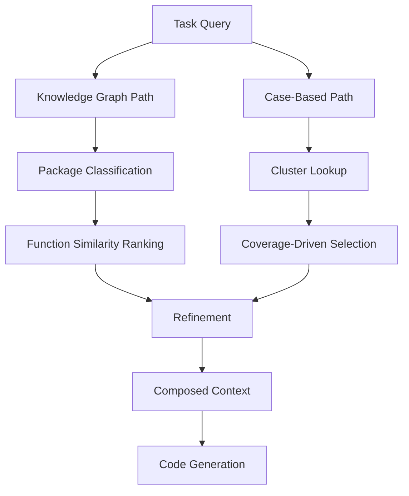

# Structured Domain Retrieval: Knowledge Graphs and Case-Based Reasoning

> Flat vector search loses the structural relationships between API entities. Combining a knowledge graph of package-function hierarchies with coverage-driven case selection retrieves domain context that generic similarity search misses.

## The Problem with Flat Retrieval

Standard RAG retrieves context by embedding similarity — the query is vectorized, the closest chunks are returned. This works when the relevant context is a contiguous text passage. It fails for domain-specific code generation because API knowledge is **hierarchical**: a function belongs to a module, which belongs to a package, which has specific parameter types and return conventions. Vector similarity does not encode these relationships.

DomAgent demonstrated this gap quantitatively: on domain-specific truck software tasks, a 7B model with flat retrieval scored roughly 40% pass@1. The same model with structured knowledge graph retrieval plus case-based reasoning scored 96.6% — a 57-point improvement from retrieval structure alone ([DomAgent, 2025](https://arxiv.org/abs/2603.21430)).

## Two Retrieval Paths

Structured domain retrieval operates through two complementary paths, mirroring how developers acquire specialized expertise: understanding what exists (top-down) and seeing how it is used (bottom-up).



### Top-Down: Knowledge Graph Retrieval

Build a knowledge graph from your domain's API surface. Entities are packages, modules, classes, and functions. Edges encode containment and dependency relationships.

At retrieval time:

1. **Package classification** — an LLM binary decision determines which packages are relevant to the current task
2. **Function ranking** — cosine similarity between the task embedding and function embeddings within selected packages
3. **Top-T selection** — the highest-ranked functions and their documentation are returned

This preserves structural context: the agent receives not just a function signature but its package location, parameter types, and relationship to sibling functions.

### Bottom-Up: Case-Based Reasoning

A curated set of working code examples shows how API functions are actually used — patterns that documentation alone does not convey.

The key insight is **coverage-driven selection**: rather than embedding all examples, use clustering to select a minimal representative set.

1. **Cluster functions** by semantic similarity within each package (K-means)
2. **Select cases iteratively** — add a case if it covers a new package or a new cluster
3. **Stop when coverage thresholds are met** — typically when 90% of packages and 90% of clusters are represented

DomAgent found that 30% of cases selected this way matched the performance of 80% selected randomly [unverified — generalizability beyond the tested benchmarks is not established]. The practical implication: a small, well-chosen case base outperforms a large random one.

## Refinement Gate

Retrieved knowledge and cases are not injected directly. A refinement step uses the LLM to review retrieved items against the task, removing entries that are superficially similar but functionally irrelevant. This prevents the context window from filling with noise that dilutes the signal from genuinely relevant examples.

This is the structured equivalent of the [observation masking](observation-masking.md) pattern — stripping intermediate results that no longer serve the current task step.

## When to Use This

Structured domain retrieval pays off when:

- **Your domain has a well-defined API surface** — SDKs, internal libraries, domain-specific frameworks with package-function hierarchies
- **The API surface is large enough that flat search returns noise** — hundreds of functions across dozens of packages
- **Tasks are repetitive within the domain** — the same API patterns recur across tasks, making case curation worthwhile
- **Accuracy requirements are high** — industrial, regulated, or safety-critical domains where 40% pass@1 is unacceptable

It is overkill when:

- The domain API is small enough to fit in a system prompt
- Tasks are exploratory rather than constrained to a known API surface
- The team lacks capacity to build and maintain the knowledge graph

## Practical Construction

### Knowledge Graph

For codebases with structured documentation:

1. Parse API docs or source code to extract packages, classes, functions, parameters, and return types
2. Build edges for containment (package → module → function) and dependency (function A calls function B)
3. Generate embeddings for each function using name + description + parameter signature
4. Store in a format the agent can query — a graph database, a structured JSON index, or an MCP server that exposes traversal operations

### Case Base

1. Collect working code examples from tests, documentation, or production usage
2. Embed each example and cluster by semantic similarity
3. Select representative cases using coverage thresholds (aim for 90% package coverage, 90% cluster coverage)
4. Store as retrievable documents with metadata linking each case to the KG entities it exercises

### Integration with Agent Workflows

Expose both retrieval paths as tools the agent invokes on demand, following the [retrieval-augmented agent workflow](retrieval-augmented-agent-workflows.md) pattern:

```
# Agent tool descriptions (startup context)
- search_domain_kg: Query the domain knowledge graph for relevant functions
- search_case_base: Retrieve representative code examples for a task
```

The agent starts lean — only tool descriptions are preloaded. When a domain-specific task arrives, it calls `search_domain_kg` for API structure, then `search_case_base` for usage patterns, then generates code grounded in both.

## Key Takeaways

- Vector similarity retrieval loses hierarchical API relationships — knowledge graphs preserve package-function structure that matters for domain code generation.
- Coverage-driven case selection produces a minimal example set that outperforms larger random collections.
- A refinement gate between retrieval and generation removes superficially similar but irrelevant context.
- The technique is most valuable for teams with well-defined, large API surfaces where accuracy requirements justify the upfront construction cost.
- Expose KG and case base as on-demand tools rather than preloading domain knowledge into the context window.

## Unverified Claims

- The finding that 30% coverage-selected cases match 80% randomly selected cases may not generalize beyond the specific benchmarks tested (DS-1000, truck CAN signal domain)
- Whether KG construction overhead is justified for domains with fewer than ~100 API functions is not established
- Whether open-source tooling can reduce KG construction cost to practical levels for typical development teams is an open question

## Related

- [Retrieval-Augmented Agent Workflows: On-Demand Context](retrieval-augmented-agent-workflows.md) — the simpler baseline; structured domain retrieval extends this with hierarchical knowledge
- [Repository Map Pattern: AST + PageRank for Dynamic Code Context](repository-map-pattern.md) — a related approach that uses AST parsing and graph importance for code context selection
- [Semantic Context Loading: Language Server Plugins for Agents](semantic-context-loading.md) — leverages LSP for structured code navigation, complementary to KG-based retrieval
- [Context Hub: On-Demand Versioned API Docs for Coding Agents](context-hub.md) — on-demand API documentation retrieval without the hierarchical structure
- [Domain-Specific System Prompts with Concrete Examples](../instructions/domain-specific-system-prompts.md) — domain adaptation through prompting rather than retrieval
- [Domain-Specific Agent Challenges](../human/domain-specific-agent-challenges.md) — the human factors side of domain-specific agent work
- [Agent Memory Patterns: Learning Across Conversations](../agent-design/agent-memory-patterns.md) — persistent knowledge accumulation as an alternative to per-task retrieval
- [Observation Masking](observation-masking.md) — the refinement gate pattern applied to intermediate tool results
