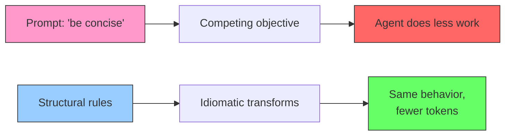

# Token-Efficient Code Generation: Structural Beats Prompting

> Idiomatic syntax patterns reduce generated code tokens by 18-38% while preserving correctness. Prompt-level "be concise" instructions are inferior and can backfire.

## The Problem

Every token an AI coding agent generates costs compute, latency, and context budget. When generated code re-enters the context window (for review, debugging, or multi-step workflows), verbosity compounds. A function that could be 50 tokens but generates as 80 consumes 60% more context on every subsequent reference.

## Two Approaches to Conciseness

### Prompt Engineering (Fragile)

Adding "write concise code" or "minimize tokens" to system prompts creates a competing objective. The agent resolves the conflict by doing less work, not writing better code. Cursor discovered this with GPT-5-Codex: the model refused to continue tasks because it was "not supposed to waste tokens." See [Token Preservation Backfire](../anti-patterns/token-preservation-backfire.md).

### Structural Optimization (Reliable)

[ShortCoder (Liu et al., 2026)](https://arxiv.org/abs/2601.09703) demonstrates that AST-preserving syntax transformations achieve 18.1-37.8% token reduction on HumanEval benchmarks without degrading correctness or readability. The approach works at the syntax level, not the instruction level.



## Ten Idiomatic Python Patterns That Cut Tokens

ShortCoder identifies ten syntax-level transforms, all preserving AST equivalence. Each replaces a verbose pattern with its idiomatic equivalent:

| # | Transform | Verbose | Idiomatic |
|---|-----------|---------|-----------|
| 1 | Multiple assignment | `a = 1`; `b = 2` | `a, b = 1, 2` |
| 2 | Return cleanup | `return(x)` | `return x` |
| 3 | Compound operators | `x = x + y` | `x += y` |
| 4 | Ternary expression | `if/else` block for single value | `x = a if cond else b` |
| 5 | Elif chains | Nested `if/else` | `elif` |
| 6 | Comprehensions | Loop + append | `[f(x) for x in items]` |
| 7 | Consolidated delete | Multiple `del` lines | `del a, b, c` |
| 8 | Dict.get() | `if key in dict` check | `dict.get(key, default)` |
| 9 | String formatting | `"a" + str(b) + "c"` | `f"a{b}c"` |
| 10 | Context managers | `open()`/`close()` | `with open() as f:` |

These are standard Pythonic idioms. The insight is not that they exist, but that they produce measurable token savings when applied systematically to LLM output.

## Practical Implications

### For Agent Instruction Authors

Do not add "be concise" to coding agent prompts. Instead, include idiomatic code examples in your instructions. Agents pattern-match from examples more reliably than they follow abstract efficiency directives.

```python
# In AGENTS.md or system prompt — show, don't tell
# Prefer:
results = [process(item) for item in data if item.valid]

# Not:
results = []
for item in data:
    if item.valid:
        results.append(process(item))
```

### For Tool and Harness Designers

When generated code re-enters context (self-review loops, multi-step implementation), idiomatic code compounds savings across every turn. A 20% reduction per generation means 20% more headroom for reasoning on every subsequent reference [unverified].

Apply structural approaches at the right layer:

- **Model selection**: Models trained on high-quality Python (Claude, GPT-4o) already favor many idiomatic patterns [unverified]
- **Post-processing**: Lint rules or AST transforms can catch non-idiomatic output before it enters context
- **Example-driven instructions**: Concrete code samples in prompts guide output style without creating competing objectives

### For Cost-Aware Workflows

Combine with [Cost-Aware Agent Design](../agent-design/cost-aware-agent-design.md) for layered savings: route simple tasks to cheaper models, and ensure all models produce idiomatic output. Token reduction on the generation side complements token reduction on the [tool output side](../tool-engineering/token-efficient-tool-design.md).

## Limitations

- **Python-only evidence**: ShortCoder's rules target Python. Adapting to TypeScript, Go, or Rust requires language-specific rule engineering.
- **Small benchmark**: Results are on HumanEval (164 problems). Production codebases with complex error handling and multi-file dependencies may show different gains.
- **Diminishing returns with frontier models**: Current frontier models already produce relatively idiomatic code [unverified]. The biggest gains come from smaller or older models.

## Key Takeaways

- Prompt-level conciseness instructions create competing objectives and degrade agent performance
- Syntax-level structural optimization achieves 18-38% token reduction without correctness loss
- Idiomatic code examples in agent instructions beat abstract "be efficient" directives
- Token savings compound when generated code re-enters context across multi-turn workflows

## Related

- [Token Preservation Backfire](../anti-patterns/token-preservation-backfire.md) — Why prompt-level "be efficient" instructions degrade agent output
- [Token-Efficient Tool Design](../tool-engineering/token-efficient-tool-design.md) — Minimizing tokens on the tool output side rather than the generation side
- [Cost-Aware Agent Design](../agent-design/cost-aware-agent-design.md) — Routing by complexity and model tier for layered cost savings
- [Prompt Compression](prompt-compression.md) — Writing instructions in fewer words to reduce token cost

## Unverified Claims

- Compounding savings claim (20% reduction per turn yielding proportional headroom) — logical but not empirically measured in any cited source
- Frontier models favoring idiomatic patterns — based on general observation, no benchmark comparison across model tiers for idiom adherence
- Diminishing returns with frontier models — inferred from ShortCoder testing only smaller models (CodeLlama-7B, DeepSeek-Coder), not directly measured on frontier models
