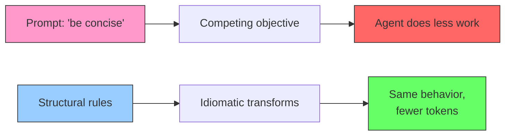

# Token-Efficient Code Generation: Structural Beats Prompting

> Idiomatic syntax patterns reduce generated code tokens by 18-38% while preserving correctness. Prompt-level "be concise" instructions can backfire.

## The Problem

Every generated token costs compute, latency, and context budget. When generated code re-enters the context window, verbosity compounds.

## Two Approaches to Conciseness

### Prompt Engineering (Fragile)

Adding "write concise code" creates a competing objective — the agent does less work, not better work. Cursor found GPT-5-Codex refused tasks because it was "not supposed to waste tokens" ([Token Preservation Backfire](../anti-patterns/token-preservation-backfire.md)).

### Structural Optimization (Reliable)

[ShortCoder (Liu et al., 2026)](https://arxiv.org/abs/2601.09703) shows that AST-preserving syntax transformations achieve 18.1-37.8% token reduction on HumanEval without degrading correctness.



## Ten Idiomatic Python Patterns That Cut Tokens

ShortCoder's ten AST-equivalent transforms:

| # | Transform | Verbose | Idiomatic |
|---|-----------|---------|-----------|
| 1 | Multiple assignment | `a = 1`; `b = 2` | `a, b = 1, 2` |
| 2 | Return cleanup | `return(x)` | `return x` |
| 3 | Compound operators | `x = x + y` | `x += y` |
| 4 | Ternary expression | `if/else` block for single value | `x = a if cond else b` |
| 5 | Elif chains | Nested `if/else` | `elif` |
| 6 | Comprehensions | Loop + append | `[f(x) for x in items]` |
| 7 | Consolidated delete | Multiple `del` lines | `del a, b, c` |
| 8 | Dict.get() | `if key in dict` check | `dict.get(key, default)` |
| 9 | String formatting | `"a" + str(b) + "c"` | `f"a{b}c"` |
| 10 | Context managers | `open()`/`close()` | `with open() as f:` |

Applied systematically to LLM output, these standard idioms produce measurable token savings.

## Practical Implications

### For Agent Instruction Authors

Skip "be concise" in agent prompts. Include idiomatic code examples — agents pattern-match from examples more reliably than they follow abstract directives.

```python
# In AGENTS.md or system prompt — show, don't tell
# Prefer:
results = [process(item) for item in data if item.valid]

# Not:
results = []
for item in data:
    if item.valid:
        results.append(process(item))
```

### For Tool and Harness Designers

Idiomatic code compounds savings across turns as generated code re-enters context [unverified].

Apply structural approaches at the right layer:

- **Model selection**: Models trained on high-quality Python already favor idiomatic patterns [unverified]
- **Post-processing**: Lint rules or AST transforms catch non-idiomatic output before context entry
- **Example-driven instructions**: Code samples in prompts guide style without competing objectives

### For Cost-Aware Workflows

Combine with [Cost-Aware Agent Design](../agent-design/cost-aware-agent-design.md): route simple tasks to cheaper models and ensure all produce idiomatic output. Generation-side reduction complements [tool-output-side](../tool-engineering/token-efficient-tool-design.md) reduction.

## Limitations

- **Python-only evidence**: ShortCoder targets Python; other languages need language-specific rules.
- **Small benchmark**: Results are on HumanEval (164 problems). Production codebases may differ.
- **Diminishing returns with frontier models**: Frontier models already produce relatively idiomatic code [unverified]; biggest gains come from smaller or older models.

## Key Takeaways

- Prompt-level conciseness instructions create competing objectives
- Structural optimization achieves 18-38% token reduction without correctness loss
- Idiomatic code examples beat abstract "be efficient" directives
- Savings compound when generated code re-enters context across turns

## Related

- [Token Preservation Backfire](../anti-patterns/token-preservation-backfire.md) — Prompt-level "be efficient" degrades output
- [Token-Efficient Tool Design](../tool-engineering/token-efficient-tool-design.md) — Minimizing tokens on the tool output side
- [Cost-Aware Agent Design](../agent-design/cost-aware-agent-design.md) — Routing by complexity and model tier
- [Prompt Compression](prompt-compression.md) — Fewer words in instructions to cut token cost
- [Context Compression Strategies](context-compression-strategies.md) — Broader techniques for reducing context size
- [Context Budget Allocation](context-budget-allocation.md) — Distributing token budget across sources
- [Prompt Cache Economics](prompt-cache-economics.md) — Cost savings from caching prompt prefixes
- [Prompt Caching as Architectural Discipline](prompt-caching-architectural-discipline.md) — Cache-friendly prompt structure
- [Context Window Dumb Zone](context-window-dumb-zone.md) — Where tokens get lost in large windows
- [Instruction-Guided Code Completion](instruction-guided-code-completion.md) — Controlling what models generate beyond correctness

## Unverified Claims

- Compounding savings across turns — logical but not empirically measured
- Frontier models favoring idiomatic patterns — no benchmark comparison across model tiers
- Diminishing returns with frontier models — inferred from ShortCoder testing smaller models only
