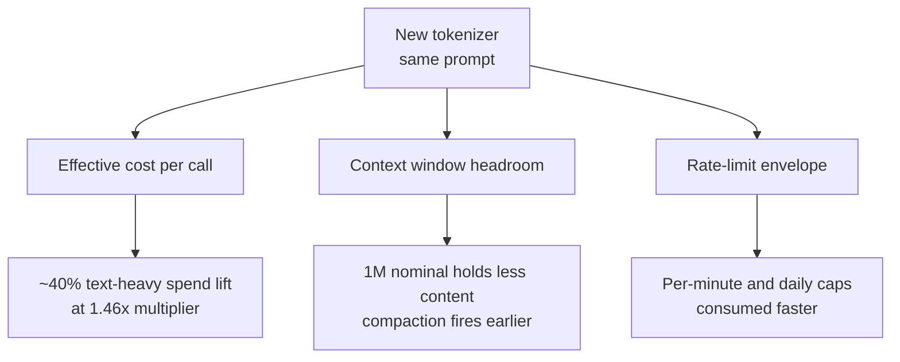

# Tokenizer Swap Tax: Budgeting for Model Migrations That Change Token Counts

> When a vendor ships a new tokenizer alongside a new model, the same input maps to a different token count — per-token pricing stays flat, but effective cost, context window, and rate limits all shift before you change a line of code.

A tokenizer change is a silent migration variable. Flat per-token pricing and an unchanged nominal context window make the upgrade look cost-neutral on the pricing page. Same text, different count — the delta flows directly into spend forecasts, compaction triggers, and rate-limit planning.

## The Opus 4.6 → 4.7 Benchmark

Anthropic documents the Claude Opus 4.7 tokenizer as producing ["roughly 1.0–1.35x as many tokens when processing text compared to previous models (up to ~35% more, varying by content)"](https://platform.claude.com/docs/en/about-claude/models/whats-new-claude-4-7). Pricing matches 4.6 at $5 / $25 per MTok input/output, and the 1M-token context window is unchanged.

Simon Willison measured the real-world multiplier against the [`/v1/messages/count_tokens` endpoint](https://platform.claude.com/docs/en/build-with-claude/token-counting) and found the spread is workload-shape dependent ([Claude Token Counter comparisons](https://simonwillison.net/2026/Apr/20/claude-token-counts/)):

| Input | Opus 4.6 tokens | Opus 4.7 tokens | Multiplier |
|-------|----------------:|----------------:|-----------:|
| Opus 4.7 system prompt (raw text) | 5,039 | 7,335 | 1.46x |
| 30-page text-heavy PDF (15 MB) | 56,482 | 60,934 | 1.08x |
| 682x318 image | 310 | 314 | ~1.00x |
| 3456x2234 high-res PNG | 1,578 | 4,744 | 3.01x |

The high-resolution image figure reflects Opus 4.7's new [2,576 px / 3.75 MP image ceiling](https://platform.claude.com/docs/en/about-claude/models/migration-guide) — up from ~1,600 tokens max per image to ~4,784. At matched lower resolutions, images tokenize nearly identically. The tokenizer multiplier and the vision multiplier are separate forces.

## Three Axes of Impact



**Cost.** Flat per-token pricing multiplied by a higher token count is a price increase the pricing page does not show.

**Context window.** The same source text fills more of the window. Anthropic's migration guide recommends ["updating your `max_tokens` parameters to give additional headroom, including compaction triggers"](https://platform.claude.com/docs/en/about-claude/models/migration-guide).

**Rate limits.** Per-minute and per-day token caps are measured in the new tokenizer's units. A job that previously fit under a ceiling may now exceed it without any prompt change.

## Pre-Migration Checklist

Anthropic's migration guide calls out the three concrete actions to run before cutting production traffic:

1. **Re-run representative prompts through both tokenizers** — use [`/v1/messages/count_tokens`](https://platform.claude.com/docs/en/build-with-claude/token-counting) against the new model ID and compare to baseline. Measure by content type: text, images at target resolutions, PDF ingestion, tool results.
2. **Audit any code path that estimates tokens client-side** or assumes a fixed token-to-character ratio. Anthropic: ["Any code path that estimates tokens client-side or assumes a fixed token-to-character ratio should be re-tested against Claude Opus 4.7."](https://platform.claude.com/docs/en/about-claude/models/migration-guide)
3. **Update `max_tokens`, compaction thresholds, and prompt-cache fit checks** to reflect the measured multiplier — not the vendor's documented range, which is a spread.

For Claude specifically, [`task_budget`](https://platform.claude.com/docs/en/build-with-claude/task-budgets) (beta) and the [`effort`](https://platform.claude.com/docs/en/build-with-claude/effort) parameter are active controls that can absorb some of the multiplier at the cost of intelligence trade-offs. These are tunable; the tokenizer change is not.

## When the Multiplier Overcounts

The headline multiplier is not the migration cost. Several offsets can reduce — or erase — the predicted spend lift:

- **Workload mix matters more than the worst case.** Willison's text-heavy PDF came in at 1.08x, not 1.35x. A pipeline where input is dominated by PDFs or images at matched resolutions sees a multiplier near 1.0.
- **Quality gains reduce retries.** A more capable model that completes tasks in fewer attempts can reduce total tokens per completed task even when per-call token counts rise. Raw tokenizer arithmetic misses this offset.
- **Effort and task-budget tuning.** Anthropic positions `effort` as ["more important for this model than for any prior Opus"](https://platform.claude.com/docs/en/about-claude/models/migration-guide). Teams already exercising these controls may absorb the tokenizer delta without visible cost change.

Forecast from measured multipliers on your actual workload, not the vendor's documented maximum.

## Example

**Before migration** — cost forecast reuses historical token counts:

```python
# Spend estimate on Opus 4.6 history
monthly_input_tokens = 120_000_000  # measured from 4.6 telemetry
monthly_input_cost = monthly_input_tokens * 5 / 1_000_000  # $600
```

**After migration** — forecast multiplies by a measured per-content-type multiplier:

```python
# Re-count representative prompts through count_tokens on 4.7
# Workload = 70% system + chat text, 25% PDF ingestion, 5% images
measured_multiplier = 0.70 * 1.46 + 0.25 * 1.08 + 0.05 * 1.00  # 1.34x
projected_input_tokens = 120_000_000 * measured_multiplier  # 160.8M
projected_input_cost = projected_input_tokens * 5 / 1_000_000  # $804

# Also re-check compaction thresholds: 1M context holds ~746K "4.6-equivalent" tokens
effective_context = 1_000_000 / measured_multiplier  # ~746K
```

The pricing page shows $5/MTok either way. The spend forecast shifts by 34%.

## Key Takeaways

- A tokenizer swap changes effective cost, context window headroom, and rate-limit consumption even when per-token pricing and nominal context size are unchanged.
- Vendor-published multiplier ranges are spreads; measure your workload mix against the new tokenizer before forecasting.
- Text, PDF, and image inputs can tokenize at very different multipliers — blend by content type, do not use the worst-case number.
- Update `max_tokens`, compaction triggers, and client-side token estimators before cutting production traffic.
- Quality gains and active controls (effort, task budgets) can offset the raw multiplier; tokenizer arithmetic alone overestimates migration cost.

## Related

- [Context Budget Allocation](context-budget-allocation.md)
- [Prompt Cache Economics](prompt-cache-economics.md)
- [Context Window Anxiety](context-window-anxiety.md)
- [Manual Compaction as Dumb Zone Mitigation](manual-compaction-dumb-zone-mitigation.md)
- [Token-Efficient Code Generation](token-efficient-code-generation.md)
- [Cost-Aware Agent Design](../agent-design/cost-aware-agent-design.md)
- [Token Preservation Backfire](../anti-patterns/token-preservation-backfire.md)
