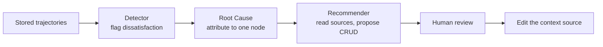

# Trajectory Attribution for Context Repair (TRACE)

> Mine stored agent trajectories for dissatisfaction cues to attribute a context failure to the individual skill, knowledge-base entry, or tool description behind it.

Trajectory attribution turns a trajectory log into a diagnostic corpus for the context layer. An automated loop reads a failed session, names the single context source that caused the failure, and proposes a concrete edit to that file. TRACE reports 72.7% root-cause node attribution and 82% end-to-end fix effectiveness on 60 dissatisfaction traces spanning up to 16 execution nodes ([arxiv 2608.09153v1](https://arxiv.org/abs/2608.09153v1)).

Those figures come from a synthetic benchmark the authors built themselves, so the technique is conditional.

## When this applies

Confirm all four before adopting:

- Context lives in separately addressable sources: skill files, knowledge-base entries, tool definitions, system prompts. Attribution needs distinct targets, and one monolithic prompt reduces the method to ordinary prompt optimization ([arxiv 2608.09153v1](https://arxiv.org/abs/2608.09153v1)).
- Traces record reasoning, not only inputs and outputs. Full execution traces improved attribution accuracy by up to 76% over a partial-observation counterpart on a benchmark built for that comparison ([TraceElephant, arxiv 2604.22708v1](https://arxiv.org/abs/2604.22708v1)).
- Failures surface as conversational cues. The detector fires on rephrasing, correction language, negative sentiment, and escalation ([arxiv 2608.09153v1](https://arxiv.org/abs/2608.09153v1)), so a coding agent whose only signal is a reverted diff gives it nothing to read.
- A human approves every write. TRACE generates recommendations for review and applies only approved ones ([arxiv 2608.09153v1](https://arxiv.org/abs/2608.09153v1)).

## The three stages

The Detector scans sessions for implicit dissatisfaction and emits a verdict with a confidence score. Root Cause then models the session as a graph whose nodes are decision points shaped by a prompt, knowledge-base entry, skill, or tool, and walks it backward to the earliest node that contradicts what the user expected. Finally the Recommender explores the implicated sources itself and returns a create, update, or delete recommendation with evidence. Attribution runs as one call over a reverse-ordered bundle of the whole trajectory, which the paper reports as 16 times cheaper than per-node iteration ([arxiv 2608.09153v1](https://arxiv.org/abs/2608.09153v1)).

## Why it works

The agent's reasoning trace already names the source behind each decision, so attribution becomes a reading problem rather than an inference problem. TRACE extracts references such as "According to the KB…" and "Following the SOP for…" and follows them to the entry or skill file the agent cited, which locates a cause even when the visible symptom appears far downstream. Presenting the whole trajectory at once in reverse order then biases the model toward the earliest node that introduced the discrepancy over the later ones that merely propagated it ([arxiv 2608.09153v1](https://arxiv.org/abs/2608.09153v1)).

Exploration then supplies the one fact the conversation cannot contain. As the paper puts it, "From the conversation alone, distinguishing 'outdated information' from 'missing information' is often ambiguous—both manifest as the user providing a correction." So the Recommender rereads the store before proposing anything, and that step carries most of the accuracy: skipping it drops operation accuracy on knowledge-base content faults from 83% to 33%. It also rescues bad attribution, producing the correct recommendation 67% of the time when the Root Cause agent named the wrong node ([arxiv 2608.09153v1](https://arxiv.org/abs/2608.09153v1)).

The input is abundant for a structural reason. In the WildFeedback corpus, 11.96% of conversations were labeled dissatisfied against 5.04% satisfied, so mining implicit signals needs no annotation campaign ([DRIFT, arxiv 2510.02341v2](https://arxiv.org/abs/2510.02341v2)).

## When this backfires

- Applying recommendations automatically. The Recommender picks the right operation 96% of the time but the right target path only 82% of the time, so roughly one recommendation in five edits the wrong file, and an unreviewed write becomes the context the next session reasons over ([arxiv 2608.09153v1](https://arxiv.org/abs/2608.09153v1)).
- Tool-definition faults. Attribution falls to 66.7% on tool nodes, because a bad query can originate in either the tool schema or the skill that calls it ([arxiv 2608.09153v1](https://arxiv.org/abs/2608.09153v1)).
- Long or complex sessions. Implicit feedback helps on short questions and stops helping on longer, more complex ones ([arxiv 2507.23158v2](https://arxiv.org/abs/2507.23158v2)). TRACE's hardest tier tops out at 16 nodes, and 60% of its traces sit in the easiest tier of 2 to 8 nodes ([arxiv 2608.09153v1](https://arxiv.org/abs/2608.09153v1)).
- Rules accumulating one incident at a time. The textual-gradient family this method extends carries a documented overfitting risk: optimized prompts grow longer, collect narrow sample-specific rules, and generalize poorly past the training distribution ([TextReg, arxiv 2605.21318](https://arxiv.org/abs/2605.21318)). Audit the accumulated edits periodically.
- Low interaction volume. The bottleneck the loop removes is manual log review becoming unscalable as interaction volume grows ([arxiv 2608.09153v1](https://arxiv.org/abs/2608.09153v1)); below the volume where one person can still read the failures by hand, it costs more than the review it replaces.

Independent work puts the ceiling lower than the headline suggests. On a 12,326-trajectory benchmark the best model reached 73.9% step-level attribution accuracy on text with only 22.2% error-mode F1, and the authors conclude that accurate failure attribution remains a challenge ([Who&When Pro, arxiv 2607.09996v1](https://arxiv.org/abs/2607.09996v1)). Locating the step is easier than naming why it failed, and the recommendation depends on the naming.

## Example

The paper walks a three-node trajectory: a user asks about the refund policy, the agent retrieves a knowledge-base entry, and the agent answers with an outdated 14-day policy when the correct one is 30 days. The backward pass scores each node ([arxiv 2608.09153v1](https://arxiv.org/abs/2608.09153v1)):

| Node | Attribution | Reason given |
|------|-------------|--------------|
| User query | 0 | "the user's question was clear" |
| KB retrieval | 0.9 | The entry contained "14-day refund policy" — "this is where incorrect information entered the trajectory" |
| Response | 0.2 | "the agent correctly used the information it was given" |

The knowledge-base entry takes the highest attribution and its textual gradient specifies the update. Note where the symptom sits: the user saw the wrong answer at the response node, which scores lowest of the three.

## Key Takeaways

- Split your context layer into addressable sources and log the agent's reasoning before you build any of this. Both are prerequisites, and neither is retrofittable onto a trace store you already have.
- Budget the engineering effort on exploration, not attribution. Reading the store is what separates create from update, and it rescues two-thirds of the cases where the attribution itself was wrong.
- Wire the human approval gate in from day one. Retrofitting review after an auto-apply loop has been writing for a month means auditing every edit it made.
- Treat the reported accuracy as a ceiling to measure against, not a number to inherit. It was set on 60 synthetic dissatisfaction traces of at most 16 nodes.

## Related

- [Context Quality as a Leading Indicator of Agent Reliability](context-quality-audit.md) — scores the same context sources before a run rather than after a failure
- [Trajectory Pre-Filter for Failure Diagnosis (TrajAudit)](../observability/trajectory-prefilter-failure-diagnosis.md) — diagnoses a failed coding task instead of the context source behind it
- [Traces Need Feedback to Power Learning](../observability/traces-need-feedback-to-power-learning.md) — the verdict-attachment layer that makes a trajectory store minable in the first place
- [Evolving Playbooks](evolving-playbooks.md) — the delta-entry format for accumulating the fixes this loop proposes
- [Tool Description Quality](../tool-engineering/tool-description-quality.md) — the source type this method attributes least reliably
