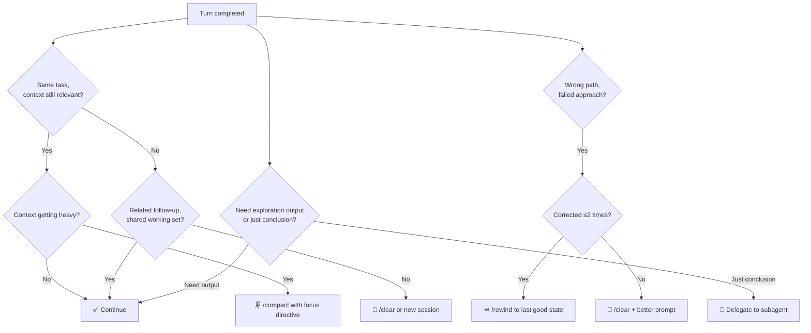

# Turn-Level Context Decisions

> Every completed turn is a branching point with five options: continue in the same session, rewind to retry from an earlier point, clear and start fresh, compact the session summary, or delegate to a subagent.

## Why This Decision Matters

With 1M-token windows, sessions can run longer — but longer is not better. [Context rot](context-window-dumb-zone.md) degrades output as context grows: attention spreads thin, and signal competes with noise from superseded reasoning, resolved errors, and stale tool output. [Anthropic describes this as a performance gradient](https://www.anthropic.com/engineering/effective-context-engineering-for-ai-agents) across all models — a steady decline, not a cliff.

The five-option decision at each turn boundary is the core skill of context management. [Claude Code's best practices](https://code.claude.com/docs/en/best-practices) frame it directly: "Most best practices are based on one constraint: Claude's context window fills up fast, and performance degrades as it fills."

## The Five Options

### Continue

Keep the current session. Use when the next task shares the same working set — files, decisions, and context from previous turns remain relevant.

Continue is the default when context is still productive. Do not compact or clear preemptively on short sessions; well under 100K tokens on a 1M-context model carries negligible rot risk.

### Rewind

Drop everything after a specific turn and reprompt from that checkpoint. In Claude Code, double-tap `Esc` or run `/rewind`.

Rewind is stronger than correction. A failed approach leaves the full failed reasoning chain in context — tool calls, error messages, dead-end explorations. Stacking corrections on top anchors the model toward the same failure mode. Rewinding removes the failed branch entirely.

[Claude Code best practices](https://code.claude.com/docs/en/best-practices) codify the rule: "If you've corrected Claude more than twice on the same issue in one session, the context is cluttered with failed approaches. Run `/clear` and start fresh with a more specific prompt."

### Clear

Reset context entirely with `/clear`. Use when switching to an unrelated task where prior context would be noise rather than signal.

The [kitchen sink session anti-pattern](../anti-patterns/session-partitioning.md) shows the cost: mixing unrelated tasks fills the window with residue — file contents, command output, off-topic reasoning — that competes for attention.

`/clear` resets within the same session; `claude --resume` or a fresh `claude` starts a new one. Use `/clear` between loosely related tasks where shared environment still applies; start a new session when tasks share nothing.

### Compact

Summarize the session and replace history with the summary. Run `/compact` with optional focus directives to control what survives.

Compaction reduces noise while preserving decision rationale, but it is lossy. [Anthropic acknowledges](https://www.anthropic.com/engineering/effective-context-engineering-for-ai-agents) that "overly aggressive compaction can result in the loss of subtle but critical context whose importance only becomes apparent later." Each cycle introduces summarization error; multiple cycles compound drift.

Timing matters. [Auto-compaction fires at ~95%](https://code.claude.com/docs/en/best-practices) — long after [reasoning quality has degraded](context-window-dumb-zone.md). For reasoning-heavy sessions, compact manually at task-type transitions or after bulk reads you no longer need. Use `CLAUDE_AUTOCOMPACT_PCT_OVERRIDE` to [lower the trigger threshold](manual-compaction-dumb-zone-mitigation.md).

Direct the compaction to preserve what matters:

```
/compact Focus on the API changes and test failures. Discard CI log output.
```

### Delegate to a Subagent

Spawn a [subagent](../tools/claude/sub-agents.md) for work that generates intermediate output you will not need again. The subagent runs in its own window; only the final result returns.

The mental test: "Will I need this output again, or just the conclusion?" If "just the conclusion," delegate. Codebase exploration, security review, and test analysis generate large volumes of reads that pollute the parent context. A subagent absorbs that cost and returns a summary.

```
Use a subagent to investigate how the auth system handles token refresh.
```

## Decision Flowchart



## When the Framework Backfires

The framework assumes task boundaries are knowable in advance. Three conditions weaken it:

- **Exploratory work with unpredictable direction**: Premature clearing or compacting discards context that turns out to be critical. When you cannot predict what will become relevant, err toward continue.
- **Highly interconnected multi-file changes**: Subagent delegation loses cross-file awareness the main session preserves. If the delegated task requires accumulated decisions across files, keep it in the parent session.
- **Compaction at the worst time**: The model produces the poorest summaries precisely when context rot is worst — at high fill. [Manual compaction](manual-compaction-dumb-zone-mitigation.md) at task transitions beats auto-compaction at 95%.

## Key Takeaways

- Rewind beats correction: drop failed attempts from context rather than stacking error-correction messages on top of polluted reasoning.
- Compact early, not late: auto-compaction at 95% fires after reasoning has degraded. Compact manually at task-type transitions.
- Delegate for exploration: use subagents when intermediate output is disposable and only the conclusion matters.
- Clear between unrelated tasks: the kitchen sink session anti-pattern shows that mixed-task context degrades every subsequent task.
- Continue is the right default: for short sessions and related follow-up work, aggressive context management adds overhead without benefit.

## Related

- [Context Window Dumb Zone](context-window-dumb-zone.md) — degradation thresholds by task type
- [Manual Compaction as Dumb Zone Mitigation](manual-compaction-dumb-zone-mitigation.md) — when and how to compact before auto-compaction fires
- [Context Compression Strategies](context-compression-strategies.md) — tiered compression mechanics for long-running agents
- [The Kitchen Sink Session](../anti-patterns/session-partitioning.md) — the anti-pattern that `/clear` addresses
- [Claude Code Sub-Agents](../tools/claude/sub-agents.md) — mechanics of subagent delegation
- [Session Recap](../agent-design/session-recap.md) — structured handoff artifacts at session boundaries
- [Goal Recitation](goal-recitation.md) — continuous drift prevention within a session
- [Context Budget Allocation](context-budget-allocation.md) — the finite budget that drives turn-level decisions
