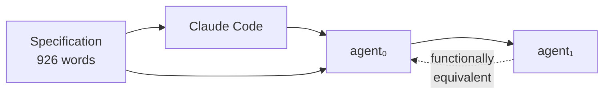

# Bootstrapping Coding Agents

> A coding agent can re-implement itself from a natural language specification, reproducing the classical compiler bootstrap. The specification — not the implementation — is the stable artifact of record.

## The Bootstrap Sequence

Compiler self-hosting follows a known pattern: a compiler written in language X compiles itself. Monperrus (2026) demonstrates the same property for coding agents ([source](https://arxiv.org/abs/2603.17399)):

1. **Write a specification** — 926 words of natural language describing the agent's interface, behavioral constraints, and tool-loop mechanics
2. **Generate agent₀** — Claude Code implements the specification as working Python
3. **Generate agent₁** — agent₀ re-implements the same specification from scratch

Both implementations satisfy the spec identically. The agent is meta-circular: it can produce itself.

## Why This Matters

The bootstrap property inverts the traditional relationship between specification and implementation:

| Traditional | Bootstrap model |
|-------------|-----------------|
| Code is the source of truth | Spec is the source of truth |
| Code review catches bugs | Spec review catches design errors |
| Implementations are maintained | Implementations are regenerated |
| Version control tracks code changes | Version control tracks spec changes |

**The practical implication:** improving an agent means improving its specification. The implementation becomes a build artifact — reconstructible on demand, not maintained by hand.

## Specification Properties

The paper identifies four properties that make a specification bootstrappable:

- **Auditable** — under 1,500 words, readable in 15 minutes. A reviewer can hold the full spec in working memory.
- **Behaviorally complete** — every tool call, error condition, and edge case is documented. Gaps produce divergent implementations.
- **Convergence-testable** — two independent implementations from the same spec should produce identical external behavior. If they diverge, the spec is ambiguous.
- **Abstraction-focused** — describes *what* the agent does, not *how*. Implementation details in the spec constrain regeneration without adding correctness.

## Connection to Existing Practices

This concept extends patterns already used in agent-driven development:

**[Spec-driven development](../workflows/spec-driven-development.md)** treats the specification as the persistent source of truth across coding sessions. The bootstrap finding provides theoretical grounding: if the spec is precise enough, the entire implementation is regenerable — not just the next change.

**[Frozen spec files](../instructions/frozen-spec-file.md)** preserve intent across context compaction. Bootstrap-grade specs go further: they are not just preserved, they are *sufficient* — the implementation can be reconstructed from the spec alone.

**[Specification as prompt](../instructions/specification-as-prompt.md)** uses formal artifacts (types, schemas, tests) as agent instructions. The bootstrap paper works with natural language specs instead, suggesting that well-structured prose can achieve comparable precision for agent-level behavior.

## Limitations

This is a single-paper finding with important caveats:

- **Scale is unresolved.** The demonstration uses a 926-word spec. Whether specs of 10,000+ words maintain tractability is an open question. The companion Attractor project uses 34,900-word specifications, but verification complexity increases substantially. [unverified]
- **Model-dependent.** The bootstrap succeeds only with frontier models. Earlier or smaller models produce syntactically invalid or behaviorally incorrect implementations. This makes the property a moving target, not a universal guarantee.
- **Security risk.** Per Ken Thompson's "Reflections on Trusting Trust," a compromised model could inject subtle errors that propagate through every bootstrap generation. Countermeasures include version-pinning models, running generation in controlled CI environments, and treating outputs as reproducible build products.
- **Industrial validation is thin.** The paper cites a team that built a million-line codebase with zero manually written code, but this claim is not independently verifiable from the paper alone. [unverified]
- **Spec is necessary but not sufficient.** Real systems require test suites, deployment configs, and operational knowledge alongside the spec. The spec is *a* primary artifact, not *the only* artifact.

## Key Takeaways

- A coding agent can re-implement itself from a 926-word natural language specification, demonstrating meta-circular bootstrapping
- The specification — not the implementation — becomes the stable artifact of record
- Effective bootstrappable specs are auditable, behaviorally complete, convergence-testable, and abstraction-focused
- Code review shifts to specification review; implementations become regenerable build artifacts
- The finding is model-dependent and scale-limited — treat it as an emerging direction, not an established pattern

## Unverified Claims

- The companion Attractor project's 34,900-word specification has been successfully bootstrapped
- A team built a million-line codebase using Codex with zero manually written code

## Related

- [Spec-Driven Development](../workflows/spec-driven-development.md) — the workflow this concept extends
- [Frozen Spec File](../instructions/frozen-spec-file.md) — preserving spec intent across sessions
- [Specification as Prompt](../instructions/specification-as-prompt.md) — using formal artifacts as agent instructions
- [Entropy Reduction Agents](../workflows/entropy-reduction-agents.md) — reducing implementation variance through constraints
