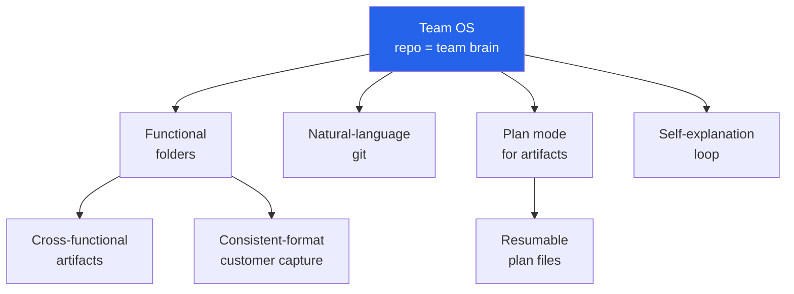

# Team OS

> Team OS is a single git repository — curated by and for a coding agent — that acts as the shared cognitive substrate for a cross-functional team. Version control plus structured context files plus a natural-language git interface turns the repo into a queryable, auditable brain every role can read and write.

Most coding-agent patterns assume an engineer is driving. Team OS inverts the default: PMs, analysts, designers, and operators check structured knowledge into the repo and consume each other's expertise through the agent. The mechanism is specific — nested `CLAUDE.md` files deliver progressively-disclosed context, functional folders bound ownership, and the GitHub CLI or GitHub MCP collapses the git learning curve to natural language. The agent is the shared interface; the repo is the source of truth.

The pattern is documented in Aakash Gupta's interview with Hannah Stulberg, a Product Manager at DoorDash and author of the *In the Weeds* Substack. Stulberg describes operating at a scale where "engineers are building product, designers are building product, PMs are shipping code" — roughly twenty people across functions collaborating through a single coding-agent-managed repo ([transcript](https://www.aakashg.com/hannah-stulberg-podcast/)). A [reference implementation](https://github.com/in-the-weeds-hannah-stulberg/team-os-example-repo) is published under CC BY-NC 4.0.

## The Thesis

The repo is the team's brain. The coding agent is the shared interface over it. Two problems collapse into one artifact:

- **Context delivery to the agent.** Nested `CLAUDE.md` and a functional folder taxonomy implement [progressive disclosure](../../agent-design/progressive-disclosure-agents.md) — the agent pulls only the tokens relevant to the current query instead of traversing the whole repo.
- **Self-service retrieval for humans.** The same markdown the agent reads is the canonical source the team reads, removing the PM-as-router bottleneck Stulberg names directly: *"every question goes through you. Every answer lives in your head or in a doc no one can find. That does not scale."* ([source](https://www.news.aakashg.com/p/claude-code-team-os))

The causal lever is [natural-language git](natural-language-git.md). Once a non-engineer can author and merge through the agent, the marginal contributor cost stops being "learn git" and becomes "know what to write" — which matches the [strategy-over-code-generation](../../human/strategy-over-code-generation.md) shift already observed in agent-driven teams.

## Pattern Map

Each node above is a page in this framework. The context-routing mechanism — nested `CLAUDE.md` files loaded by path prefix — is a prerequisite of the Functional folders page and is taught through the [hierarchical CLAUDE.md](../../instructions/hierarchical-claude-md.md) atomic pattern rather than a separate framework module.

| # | Module | What it covers |
|---|--------|----------------|
| 1 | [Functional folder taxonomy](functional-folder-taxonomy.md) | The `product/`, `analytics/`, `engineering/`, `team/` layout and ownership boundaries |
| 2 | [Cross-functional artifacts](cross-functional-artifacts.md) | Role-by-artifact matrix — PRDs, SQL + schemas, RFCs, call notes |
| 3 | [Consistent-format customer capture](consistent-format-customer-capture.md) | The artifact-shape lever that unlocks cross-call synthesis |
| 4 | [Plan mode for knowledge artifacts](plan-mode-knowledge-artifacts.md) | Plan-before-generate for PRDs and strategy docs |
| 5 | [Natural-language git](natural-language-git.md) | GitHub CLI / GitHub MCP as the non-engineer adoption unlock |
| 6 | [Plan files as resumable artifacts](plan-files-resumable-artifacts.md) | Committed plan files — qualified pattern: survive context compaction and enable ~80% reuse on recurring workflows, require supersession discipline to avoid retrieval hazards |
| 7 | [Self-explanation loop](self-explanation-loop.md) | "Why is this structured this way?" as an active learning prompt |

**Atomic patterns Team OS composes (cross-links):** [hierarchical CLAUDE.md](../../instructions/hierarchical-claude-md.md), [CLAUDE.md convention](../../instructions/claude-md-convention.md), [AGENTS.md as table of contents](../../instructions/agents-md-as-table-of-contents.md), [progressive disclosure for agents](../../agent-design/progressive-disclosure-agents.md), [strategy over code generation](../../human/strategy-over-code-generation.md), [plan mode](../../workflows/plan-mode.md).

## Adoption Gradient

| Stage | Shape | Prerequisites | Who adopts |
|-------|-------|---------------|-----------|
| **Solo** | Flat repo, single root `CLAUDE.md`, no sub-agents | Coding agent installed; IDE over terminal; ~1 hour | 1 contributor |
| **Pod** (2–5) | Root + 2–3 functional folders, nested `CLAUDE.md`, shared MCPs | Agreed folder taxonomy; 1 git-fluent champion; PR review norm | Small cross-functional pod |
| **Cross-functional team** (6–15) | Full taxonomy, `.claude/{agents,commands,skills}/`, natural-language git for non-engineers, plan mode as norm | Hard launch gate: features not launched until metrics, queries, and schemas are checked in; analyst-audited data playbooks; 30-day runway | PM-led with analyst, design, eng partners |
| **Scaled** (15+) | Multiple sub-agents per function, skill library, committed plan files, cross-repo MCP federation | Skills explicitly invoked (not auto); context-rot review cadence; owner per functional folder | Multi-function org unit |

Prerequisite ordering is strict. Skip the pod stage and folder drift accumulates; skip natural-language git and non-engineers silently churn.

## When to Adopt — and When Not To

**Adopt when:** the primary consumer of team knowledge is a coding agent; repeated cross-functional handoffs require a shared artifact; at least one git-fluent contributor treats the repo as sacred; the team has a 30-day-plus planning runway.

**Do not adopt when:**

- **Mature collaboration stack already works.** Teams with disciplined Notion/Confluence/Jira hygiene and dedicated analytics docs lose on mobile UX, permissioning, real-time co-authoring, and search ([Document360 analysis](https://document360.com/blog/wiki-as-knowledge-base-software/)).
- **Regulated or audited knowledge** (legal, HR, finance). Access controls, attestations, and retention policies are bolt-ons in GitHub; PII or privileged material in a repo is an audit finding waiting to happen.
- **No version-control literacy and no interest in building it.** Git's learning curve is real; the natural-language escape hatch still leaks at merge conflicts, CI failures, and `gh auth` errors ([docs-as-code critique](https://thisisimportant.net/posts/docs-as-code-broken-promise/)).
- **Knowledge is genuinely ephemeral.** Sales tactics, campaign assets, or weekly pivots that churn faster than PR review cadence do not reward versioning.
- **Heavy synchronous co-authoring.** OKR drafting and roadmap workshops favor multiplayer editors over async PR review.

## Example — The Stulberg Workflow

Stulberg's team uses a single repo with `.claude/{agents,commands,skills}/` plus functional folders for `product/`, `analytics/`, `engineering/`, and `team/`. Customer calls land in `product/customers/` as consistent-format markdown that later synthesis can compare across weeks. PRDs enter through plan mode — Shift+Tab twice triggers parallel context load, clarifying questions, and a written plan file the author reviews before any prose is generated. Plan files are committed to the repo and yield roughly 80% reuse on the next invocation of the same workflow.

A hard launch gate binds the framework: "features aren't launched until metrics, queries, and schemas are checked in." A strategy partner who had never opened GitHub two months earlier now opens pull requests daily, interacting entirely through the agent rather than the git CLI ([source](https://www.news.aakashg.com/p/claude-code-team-os)).

The workflow above is a single-practitioner case study (N=1). The underlying mechanisms — nested context files, plan mode, natural-language git — generalize; the specific DoorDash configuration is illustrative, not yet measured across diverse teams.

<a href="https://www.youtube.com/watch?v=0UArKLQ6bXA" target="_blank" rel="noopener">Watch: How to build a Team OS in Claude Code — Aakash Gupta with Hannah Stulberg (YouTube)</a>

## Key Takeaways

- Team OS is a composition, not a new primitive — it synthesizes hierarchical instruction files, plan mode, and natural-language git into one operating model.
- The mechanism is agent-as-shared-interface over a structured, version-controlled knowledge surface. That is what makes the same artifact serve humans and agents simultaneously.
- The scaling evidence is first-hand and rich but N=1. Present it as a case study, not a universal.
- Non-engineer adoption depends on natural-language git. Without it the pattern collapses back to "engineers maintain the repo."
- When the primary knowledge consumer is a human browsing on mobile, a modern knowledge base beats this framework on almost every axis.

## Related

- [Hierarchical CLAUDE.md](../../instructions/hierarchical-claude-md.md) — the primary context-delivery mechanism
- [CLAUDE.md convention](../../instructions/claude-md-convention.md) — root instruction file shape
- [AGENTS.md as table of contents](../../instructions/agents-md-as-table-of-contents.md) — tool-agnostic equivalent for mixed-tool teams
- [AGENTS.md standard](../../standards/agents-md.md) — the underlying open standard for project-level agent instructions
- [Progressive disclosure for agents](../../agent-design/progressive-disclosure-agents.md) — why functional folder depth saves tokens
- [Strategy over code generation](../../human/strategy-over-code-generation.md) — why PM-as-router stops scaling
- [Plan mode](../../workflows/plan-mode.md) — the gate Team OS uses for high-stakes artifacts
- [Brownfield to Agent-First](../brownfield-to-agent-first/index.md) — the companion framework for *codebase* readiness

## Source

- Aakash Gupta × Hannah Stulberg, *How to build a Team OS in Claude Code* — [article](https://www.news.aakashg.com/p/claude-code-team-os), [transcript](https://www.aakashg.com/hannah-stulberg-podcast/), [YouTube](https://www.youtube.com/watch?v=0UArKLQ6bXA)
- [Team OS example repository](https://github.com/in-the-weeds-hannah-stulberg/team-os-example-repo) — reference implementation (CC BY-NC 4.0)
