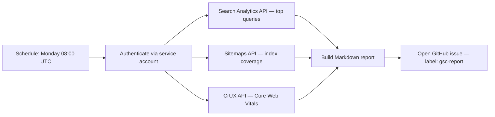

# Google Search Console Monitoring Workflow

> Automate Google Search Console monitoring with GSC and Bing WMT: a scheduled API-driven report plus an on-demand pull replace manual dashboard checks.

Learn it hands-on: [The Deterministic Baseline](https://learn.agentpatterns.ai/geo/deterministic-baseline/) — guided lesson with quizzes.

## Why automate Search Console

GSC is the authoritative source for how Google sees the site. It exposes index coverage gaps, real CrUX performance (not lab data), crawl anomalies, schema errors, and query performance. Without a reporting loop, you cannot see regressions until traffic drops.

Bing WMT provides the same data for Bing and Microsoft Copilot Search. It has a public API ([Bing Webmaster Tools API](https://learn.microsoft.com/en-us/bingwebmaster/)) but no bulk CSV export equivalent to GSC's Search Analytics API — trend monitoring still relies on the dashboard.

## One-time setup

### Google Search Console

1. Verify ownership at [search.google.com/search-console](https://search.google.com/search-console):
   - DNS TXT record (preferred — survives server changes)
   - HTML meta tag (requires deploying to the site)
2. Submit sitemap: `https://agentpatterns.ai/sitemap.xml`
3. Add the site as an `sc-domain:` property to cover all subdomains and protocols
4. Add the service account email: Settings → Users and permissions → Add user → Restricted

### Bing Webmaster Tools

1. Verify ownership at [bing.com/webmasters](https://www.bing.com/webmasters) — DNS TXT or HTML meta tag
2. Submit sitemap: `https://agentpatterns.ai/sitemap.xml`
3. Enable IndexNow: Bing WMT → IndexNow → Auto-submit

### GCP service account for API access

```bash
# Create service account
gcloud iam service-accounts create gsc-reporter \
  --display-name="GSC Reporter"

# Create JSON key
gcloud iam service-accounts keys create gsc-key.json \
  --iam-account=gsc-reporter@<project-id>.iam.gserviceaccount.com

# Enable APIs
gcloud services enable searchconsole.googleapis.com chromeuxreport.googleapis.com
```

Add the service account email to GSC via Settings → Users and permissions → Add user.

Store credentials as GitHub Actions secrets:

| Secret | Value |
|--------|-------|
| `GSC_SERVICE_ACCOUNT_JSON` | Full content of `gsc-key.json` |
| `GSC_SITE_URL` | `sc-domain:agentpatterns.ai` |
| `CRUX_API_KEY` | GCP API key restricted to Chrome UX Report API |

## Automated weekly report

Set up a scheduled GitHub Actions workflow that runs every Monday at 08:00 UTC, calls the GSC and CrUX APIs, and opens a GitHub issue with the results.



The implementation is two files you add to your repo: a workflow at `.github/workflows/gsc-weekly-report.yml` that runs on the schedule, and a report script (for example `scripts/gsc_report.py`) that calls the APIs and formats the Markdown.

Report sections:

| Section | API | Notes |
|---------|-----|-------|
| Index coverage | GSC Sitemaps API | Submitted vs indexed counts per sitemap |
| Core Web Vitals | CrUX API | Real user data, trailing 28 days, mobile |
| Top queries | Search Analytics API | Top 10 by impressions, last 7 days |
| Crawl anomalies | GSC dashboard | No bulk API — links to GSC Indexing → Pages |
| Schema errors | GSC dashboard | No bulk API — links to GSC Enhancements |

## On-demand pull

To fetch the latest data without waiting for the weekly schedule, wrap the same report script in an on-demand command or skill. That wrapper provides:

- Authentication pattern using service account credentials
- API call templates for queries, sitemaps, and CrUX
- Output format matching the weekly report structure
- Tips on rate limits, data lag, and CrUX dataset coverage

Trigger via GitHub CLI:

```bash
gh workflow run gsc-weekly-report.yml --repo OWNER/REPO
```

Or run locally:

```bash
# Requires GSC_SERVICE_ACCOUNT_JSON, GSC_SITE_URL, CRUX_API_KEY in env
uv pip install google-auth requests
python scripts/gsc_report.py
cat /tmp/gsc_report.md
```

## Data constraints

| Constraint | Detail |
|------------|--------|
| Search Analytics lag | ~3 days — report end date is `today - 3` |
| CrUX window | Trailing 28 days — not the past 7 days |
| URL Inspection rate limit | 2,000 requests/day — spot-check only |
| Bing WMT | No bulk CSV export — API exists but bulk analytics require dashboard |
| CrUX origin eligibility | Insufficient real-user traffic returns 404 from CrUX API |

## Key Takeaways

- A weekly GitHub Actions workflow pulls Search Console and Bing WMT data via API, replacing manual dashboard checks with a structured report.
- Coverage spans index status, Core Web Vitals (via the CrUX API), and top queries — the signals worth tracking week over week.
- Data is near-real-time, not live: Search Analytics lags ~3 days and CrUX reports a trailing 28-day window, so reports reflect recent rather than current state.
- An on-demand command wrapping the same script covers ad-hoc checks between scheduled runs.
- The overhead pays off only with sufficient traffic; low-traffic or single-property sites gain little over a manual 5-minute check.

## Related

- [Continuous Triage](../workflows/continuous-triage.md) — label-based routing for automated issue handling
- [Agent Observability in Practice](../observability/agent-observability-otel.md) — structured monitoring patterns applicable beyond GSC
- [Measuring GEO Performance for AI Search Visibility](measuring-geo-performance.md) — the broader GEO measurement framework the GSC index-coverage and query signals feed into

## Sources

- [Google Search Console API reference](https://developers.google.com/webmaster-tools/v1/api_reference_index)
- [Chrome UX Report API](https://developer.chrome.com/docs/crux/api/)
- [Core Web Vitals thresholds — web.dev](https://web.dev/articles/vitals)
- [Bing Webmaster Tools](https://www.bing.com/webmasters/about)
- [IndexNow protocol](https://www.indexnow.org/)

## When this backfires

Automating GSC adds real infrastructure overhead — a GCP service account, stored credentials, and a weekly Actions workflow. The return on that investment degrades under these conditions:

- Insufficient traffic: CrUX requires a minimum volume of real user data, so the API returns 404 for low-traffic origins. The Core Web Vitals section then stays empty for most of its life.
- Search Analytics lag: the 3-day data lag means the weekly report reflects conditions from 10 or more days ago by the time you act on it. That is too stale for incident response, where manual GSC checks are faster.
- Single-property sites: GSC's Search Analytics API caps at 10 rows by default. Sites with fewer than 50 indexed pages gain little over a manual 5-minute weekly check.
