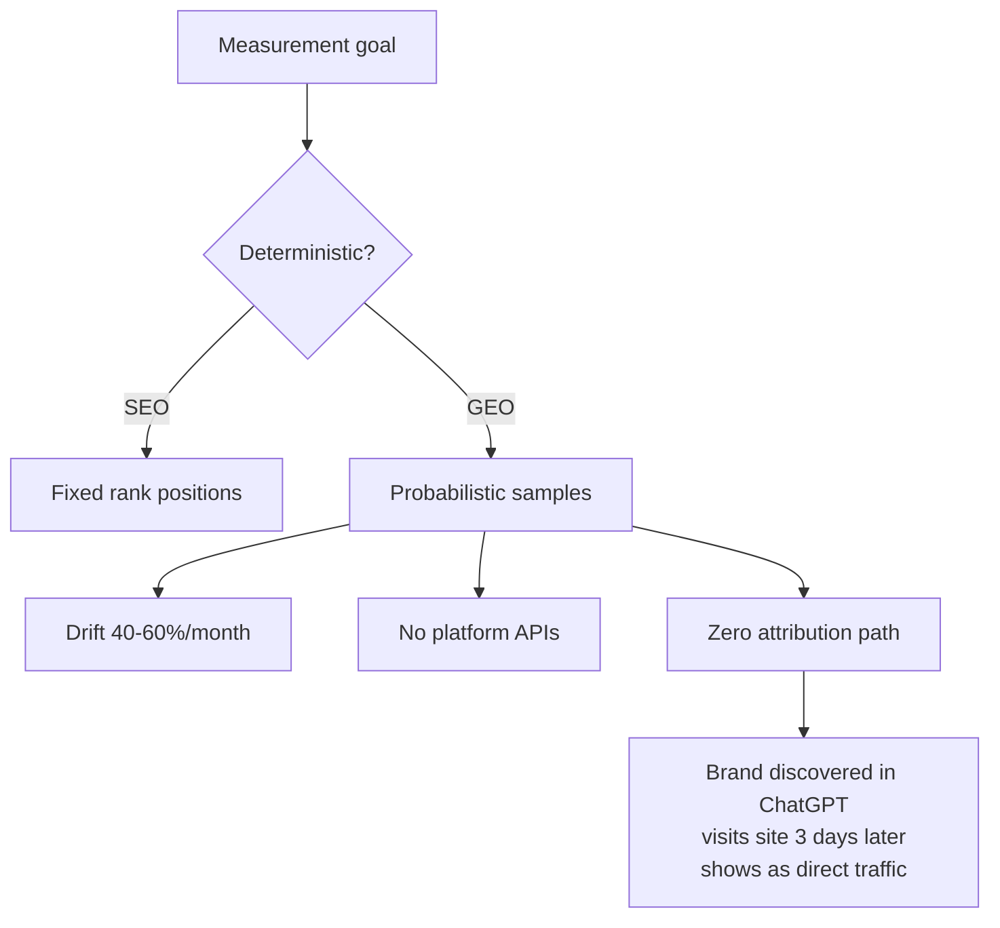

# Measuring GEO Performance

> Measurement of GEO performance is fundamentally harder than measuring SEO. There are no fixed positions, no platform APIs, and no guaranteed consistency across sessions.

## The Core Problem

SEO rank tracking works because results are deterministic. GEO measurement does not — LLMs generate probabilistic outputs on-the-fly:

- Only ~20% of brands maintained citation presence across 5 consecutive runs [unverified]
- Monthly citation drift ranges 40–60% across major platforms [unverified]
- AI platforms expose no impression counts, referral data, or ranking signals
- All measurement relies on repeated sampling, not platform APIs

## Metric Vocabulary

| Metric | Definition |
|--------|------------|
| **AI Visibility Score** | Normalised composite: mention frequency × position × platform coverage |
| **Share of Model (SoM)** | % of AI responses where your brand appears for relevant category queries |
| **Citation Share of Voice** | Your brand's citation count as a % of total category citations |
| **Generative Position** | Average rank when AI outputs a list; first-mentioned brands receive preferential framing [unverified] |
| **Citation Frequency** | How often AI includes clickable links or footnotes to your domain |
| **Sentiment Score** | Qualitative tone (positive / neutral / negative) when your brand is described |
| **Hallucination Rate** | How often AI states factually incorrect information about your brand |
| **Platform Coverage Rate** | % of tracked platforms where your brand appears for target prompts |

LLMs cite 2–7 domains per response [unverified] — far fewer than Google's 10 blue links, making citation share more competitive than organic share.

## Tool Landscape

| Tool | Starting Price | Platforms Tracked | Differentiator |
|------|---------------|-------------------|----------------|
| [Otterly.ai](https://otterly.ai/) | $29/mo | ChatGPT, AI Overviews, AI Mode, Perplexity, Gemini, Copilot | Widest platform coverage; 40+ countries |
| [Semrush AI Toolkit](https://www.semrush.com/semrush-ai-toolkit/) | $99/mo/domain | Major LLMs | Integrates with existing Semrush ecosystem |
| [Profound](https://www.tryprofound.com/) | $499/mo | Major LLMs + e-commerce | Enterprise; hallucination detection; compliance |
| [Scrunch](https://scrunch.com/) | $250/mo | ChatGPT, Claude, Perplexity, Gemini | Content gap and outdated information detection |

All tools sample by running prompts — none have access to platform-internal data.

## What No Tool Solves



**Attribution gap**: A brand discovered via ChatGPT that visits days later shows as direct traffic — the discovery touch is invisible.

**Zero-click gap**: For every 1,500 pages crawled by GPTBot, approximately one visitor clicks through [unverified].

**Unannounced model updates**: Providers update models without notice, making sudden visibility changes unattributable to content versus model behaviour.

**GEO/SEO tension**: Restructuring content for AI extraction can improve citation rates while reducing organic rankings.

## Monitoring Cadence

| Frequency | Activity |
|-----------|----------|
| **Daily** | Run 20–30 target prompts across platforms (automated via tool or agent script) |
| **Weekly** | Review brand mention frequency, citation share, position, and sentiment; flag anomalies |
| **Monthly** | Aggregate visibility trends; analyse citation source breakdown; benchmark against competitors |
| **Quarterly** | Deep-dive sentiment analysis; update competitive benchmarks; reassess prompt set for relevance |

Brand web mentions correlate 0.664 with AI Overview visibility [unverified].

## Example

A minimal Python monitoring loop using the Anthropic SDK:

```python
# geo_monitor.py
import json, datetime, anthropic
from pathlib import Path

PROMPTS = [
    "best tools for API documentation",
    "how to write docs for developer tools",
]
LOG_FILE = Path("geo_log.jsonl")
client = anthropic.Anthropic()

def sample_platform(prompt: str) -> str:
    msg = client.messages.create(
        model="claude-opus-4-5",
        max_tokens=512,
        messages=[{"role": "user", "content": prompt}],
    )
    return msg.content[0].text

def run_cycle(brand: str):
    for prompt in PROMPTS:
        text = sample_platform(prompt)
        result = {
            "prompt": prompt,
            "ts": datetime.datetime.utcnow().isoformat(),
            "mentioned": brand.lower() in text.lower(),
            "position": text.lower().find(brand.lower()),
        }
        with LOG_FILE.open("a") as f:
            f.write(json.dumps(result) + "\n")

if __name__ == "__main__":
    run_cycle(brand="Acme Docs")
```

Run on a daily cron (`0 9 * * *`). Diff `mentioned` counts week-over-week to detect visibility drops.

## Related

- [Google Search Console Monitoring](../workflows/gsc-search-console-monitoring.md) — deterministic organic search baseline
- [What Is GEO](what-is-geo.md) — foundational GEO overview
- [SEO vs GEO](seo-vs-geo.md) — how GEO measurement differs from SEO ranking
- [How AI Engines Cite](how-ai-engines-cite.md) — citation mechanics behind what gets measured
- [Topical Authority](topical-authority.md) — signal strength that GEO metrics capture
- [Assertion Density](assertion-density.md) — writing technique affecting citation frequency
- [GEO for Technical Docs](geo-for-technical-docs.md) — GEO in technical documentation contexts
- [Schema and Structured Data](schema-and-structured-data.md) — structured markup for AI citation visibility
- [AI Crawler Policy](ai-crawler-policy.md) — controlling AI crawler access for citation
- [llms.txt](llms-txt.md) — machine-readable hints for AI indexing
- [Answer-First Writing](answer-first-writing.md) — content structure for AI retrieval
- [Atomic Pages and Chunking](atomic-pages-and-chunking.md) — one-concept-per-page for RAG accuracy

## Sources

- [Measuring AI Visibility and GEO Performance: Hard Truths](https://searchengineland.com/measuring-ai-visibility-geo-performance-hard-truths-467197) — Search Engine Land
- [GEO Rank Tracker: How to Monitor Your Brand's AI Search Visibility](https://searchengineland.com/geo-rank-tracker-how-to-monitor-your-brands-ai-search-visibility-465683) — Search Engine Land
- [Profound GEO Guide 2025](https://www.tryprofound.com/guides/generative-engine-optimization-geo-guide-2025) — Profound
- [GEO Metrics: Visibility, Trust, and Brand Presence](https://foundationinc.co/lab/geo-metrics) — Foundation Inc
- [Best GEO Tools 2025](https://www.semrush.com/blog/best-generative-engine-optimization-tools/) — Semrush
