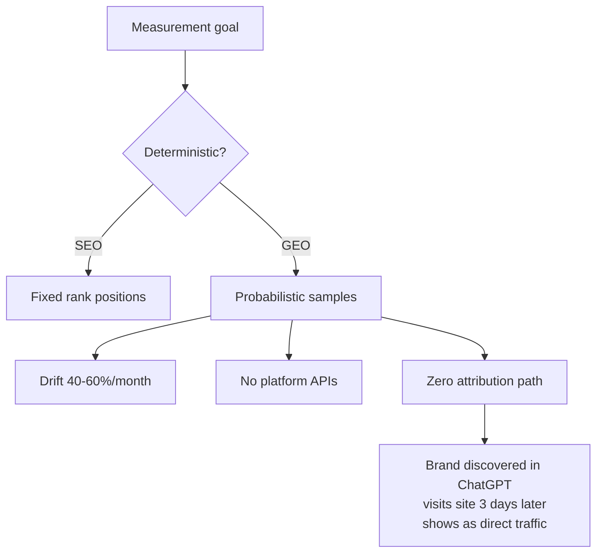

# Measuring GEO Performance

> Measurement of GEO performance is fundamentally harder than measuring SEO. There are no fixed positions, no platform APIs, and no guaranteed consistency across sessions.

Learn this hands-on with the [Capstone: Measure and Decide lesson](https://learn.agentpatterns.ai/geo/capstone-measure-and-decide/), a guided lesson with quizzes.

## The core problem

SEO rank tracking works because results are deterministic. GEO measurement is different: LLMs generate probabilistic outputs on the fly.

- Brand citation presence is inconsistent across consecutive runs on the same prompt — citations vary by session
- Monthly citation drift is substantial across major platforms; the same brand may appear in week one and disappear by week four
- AI platforms expose no impression counts, referral data, or ranking signals
- All measurement relies on repeated sampling, not platform APIs

## Metric vocabulary

| Metric | Definition |
|--------|------------|
| AI Visibility Score | Normalised composite: mention frequency × position × platform coverage |
| Share of Model (SoM) | % of AI responses where your brand appears for relevant category queries |
| Citation Share of Voice | Your brand's citation count as a % of total category citations |
| Generative Position | Average rank when AI outputs a list; first-mentioned brands receive more prominent framing in the response |
| Citation Frequency | How often AI includes clickable links or footnotes to your domain |
| Sentiment Score | Qualitative tone (positive / neutral / negative) when your brand is described |
| Hallucination Rate | How often AI states factually incorrect information about your brand |
| Platform Coverage Rate | % of tracked platforms where your brand appears for target prompts |

LLMs typically cite a small number of domains per response — far fewer than Google's 10 blue links — making citation share intensely competitive.

## Available tools

| Tool | Starting Price | Platforms Tracked | Differentiator |
|------|---------------|-------------------|----------------|
| [Otterly.ai](https://otterly.ai/) | $29/mo | ChatGPT, AI Overviews, AI Mode, Perplexity, Gemini, Copilot | Widest platform coverage; 40+ countries |
| [Semrush AI Toolkit](https://www.semrush.com/semrush-ai-toolkit/) | $99/mo/domain | Major LLMs | Integrates with existing Semrush ecosystem |
| [Profound](https://www.tryprofound.com/) | from $99/mo | ChatGPT (entry) → 10+ LLMs (enterprise) | Enterprise; hallucination detection; compliance |
| [Scrunch](https://scrunch.com/) | from $100/mo | ChatGPT (entry) → Claude, Perplexity, Gemini | Content gap and outdated information detection |

Starting prices are entry tiers verified June 2026. The cheapest plan is usually single-platform, with multi-LLM coverage on higher tiers. Confirm current pricing with each vendor. All tools sample by running prompts. None access platform-internal data.

[isitagentready.com](https://isitagentready.com) is a free, one-off alternative to those paid trackers: instead of sampling AI responses for citation frequency, it scans a site's own machine-readable surface for the signals that make agent retrieval possible in the first place. A [scan of agentpatterns.ai](https://isitagentready.com/?url=agentpatterns.ai) checked, among other things, markdown alternates — an HTTP `Link` header pointing to a `text/markdown` version of each page — and `/.well-known/` discovery documents such as an agent-skills index and an MCP server card; both check families passed. That result says the site's content is structured for agents to fetch and index cleanly, which is a precondition for citation, not a substitute for the citation-tracking metrics above.

## What no tool solves


```mermaid
graph TD
    A[Measurement goal] --> B{Deterministic?}
    B -- SEO --> C[Fixed rank positions]
    B -- GEO --> D[Probabilistic samples]
    D --> E[Drift 40-60%/month]
    D --> F[No platform APIs]
    D --> G[Zero attribution path]
    G --> H[Brand discovered in ChatGPT<br>visits site 3 days later<br>shows as direct traffic]
```

The attribution gap: ChatGPT-discovered visits that land days later show as direct traffic, so the discovery touch is invisible.

The zero-click gap: [GPTBot](ai-crawler-policy.md) crawls heavily, but crawl-to-click conversion is very low, so AI answers inform readers without sending referral traffic.

Unannounced model updates: providers update models silently, which makes visibility shifts hard to attribute to content or to model behavior.

The GEO and SEO tension: restructuring for AI extraction can raise citation rates while reducing organic rankings.

## Monitoring cadence

| Frequency | Activity |
|-----------|----------|
| Daily | Run 20–30 target prompts across platforms (automated via tool or script) |
| Weekly | Review mention frequency, citation share, position, and sentiment; flag anomalies |
| Monthly | Aggregate visibility trends; analyse citation source breakdown; benchmark competitors |
| Quarterly | Sentiment analysis in depth; update competitive benchmarks; reassess prompt set |

Brand web mention volume correlates with AI Overview visibility — stronger organic presence tends to mean more frequent AI citation.

## When this backfires

GEO monitoring can mislead or waste investment under specific conditions:

- High-drift queries: broad prompts ("best tools for X") vary so widely from session to session that sampled data reflects noise, not visibility. Narrow, brand-specific prompts are more stable.
- Small sample budgets: fewer than 20 to 30 prompts daily cannot separate genuine change from session variance. Under-sampling causes false positives and missed drops.
- Single-platform fixation: a brand optimized for ChatGPT may see no lift on Perplexity or Gemini. Models differ in training data, retrieval, and citation behavior, so per-platform results are not portable.
- Attribution substitution: treating [citation counts](how-ai-engines-cite.md) as a revenue proxy confuses visibility with intent. A mention in a category response may bring no commercial consideration.
- Model update blindness: providers update models without changelogs. A sustained drop may reflect a weight change, not content failure, and rewriting in response can cause SEO regressions for no GEO benefit.

## Example

A minimal Python monitoring loop using the Anthropic SDK:

```python
# geo_monitor.py
import json, datetime, anthropic
from pathlib import Path

PROMPTS = [
    "best tools for API documentation",
    "how to write docs for developer tools",
]
LOG_FILE = Path("geo_log.jsonl")
client = anthropic.Anthropic()

def sample_platform(prompt: str) -> str:
    msg = client.messages.create(
        model="claude-opus-4-5",
        max_tokens=512,
        messages=[{"role": "user", "content": prompt}],
    )
    return msg.content[0].text

def run_cycle(brand: str):
    for prompt in PROMPTS:
        text = sample_platform(prompt)
        result = {
            "prompt": prompt,
            "ts": datetime.datetime.utcnow().isoformat(),
            "mentioned": brand.lower() in text.lower(),
            "position": text.lower().find(brand.lower()),
        }
        with LOG_FILE.open("a") as f:
            f.write(json.dumps(result) + "\n")

if __name__ == "__main__":
    run_cycle(brand="Acme Docs")
```

Run on a daily cron (`0 9 * * *`). Diff `mentioned` counts week-over-week to detect visibility drops.

## FAQ

**Can you build your own GEO monitoring setup instead of paying for a tracking tool?**

Yes — a minimal script using the Anthropic SDK can sample target prompts, check whether a brand name appears in the response, and log the result. Running it on a daily cron and diffing mention counts week-over-week surfaces the same visibility drops that paid tools detect, though it lacks their multi-platform coverage and dashboards.

**Why can restructuring content for AI extraction hurt SEO rankings?**

GEO and SEO pull in different directions. Content reshaped to be easily extracted and cited by AI systems can raise citation rates on platforms like ChatGPT or Perplexity while simultaneously reducing organic search rankings, since the structural changes that help machine extraction don't always align with what search engines reward. Teams should weigh both before restructuring.

**Does having strong organic search visibility improve AI citation frequency?**

There's a correlation: brand web mention volume tends to track with AI Overview visibility, meaning a stronger organic presence generally coincides with more frequent AI citation. That's not a guarantee, though — GEO measurement stays probabilistic and platform-specific, so a strong SEO footprint doesn't automatically translate into citations on every AI platform.

**Why do broad prompts like "best tools for X" produce unreliable GEO data?**

Broad, generic prompts vary so widely in AI-generated responses from session to session that sampled results reflect random noise rather than genuine visibility changes. Narrow, brand-specific prompts produce far more stable results. Combined with too few daily samples, high-drift queries can generate false positives and hide real visibility drops.

## Key Takeaways

- GEO measurement is probabilistic, not deterministic — there are no fixed ranks, no platform APIs, and citations vary session-to-session, so all data comes from repeated sampling.
- Track GEO-native metrics (Share of Model, Citation Share of Voice, Generative Position) rather than borrowing SEO rank concepts that do not map.
- No tool closes the attribution gap: AI-discovered visits show as direct traffic, and unannounced model updates make visibility shifts hard to attribute to content.
- Sample at least 20–30 prompts daily across multiple platforms; smaller budgets cannot separate genuine change from session variance.
- Verify tool pricing and platform coverage directly with vendors — entry tiers are often single-platform and prices change frequently.

## Related

- [Google Search Console Monitoring](gsc-search-console-monitoring.md) — deterministic organic search baseline
- [What Is GEO](what-is-geo.md) — foundational GEO overview
- [SEO vs GEO](seo-vs-geo.md) — how GEO measurement differs from SEO ranking
- [How AI Engines Cite](how-ai-engines-cite.md) — citation mechanics behind what gets measured
- [Topical Authority](topical-authority.md) — signal strength that GEO metrics capture
- [Assertion Density](assertion-density.md) — writing technique affecting citation frequency
- [GEO for Technical Docs](geo-for-technical-docs.md) — GEO in technical documentation contexts
- [Schema and Structured Data](schema-and-structured-data.md) — structured markup for AI citation visibility

## Sources

- [Measuring AI Visibility and GEO Performance: Hard Truths](https://searchengineland.com/measuring-ai-visibility-geo-performance-hard-truths-467197) — Search Engine Land
- [GEO Rank Tracker: How to Monitor Your Brand's AI Search Visibility](https://searchengineland.com/geo-rank-tracker-how-to-monitor-your-brands-ai-search-visibility-465683) — Search Engine Land
- [Profound GEO Guide 2025](https://www.tryprofound.com/guides/generative-engine-optimization-geo-guide-2025) — Profound
- [GEO Metrics: Visibility, Trust, and Brand Presence](https://foundationinc.co/lab/geo-metrics) — Foundation Inc
- [Best GEO Tools 2025](https://www.semrush.com/blog/best-generative-engine-optimization-tools/) — Semrush
