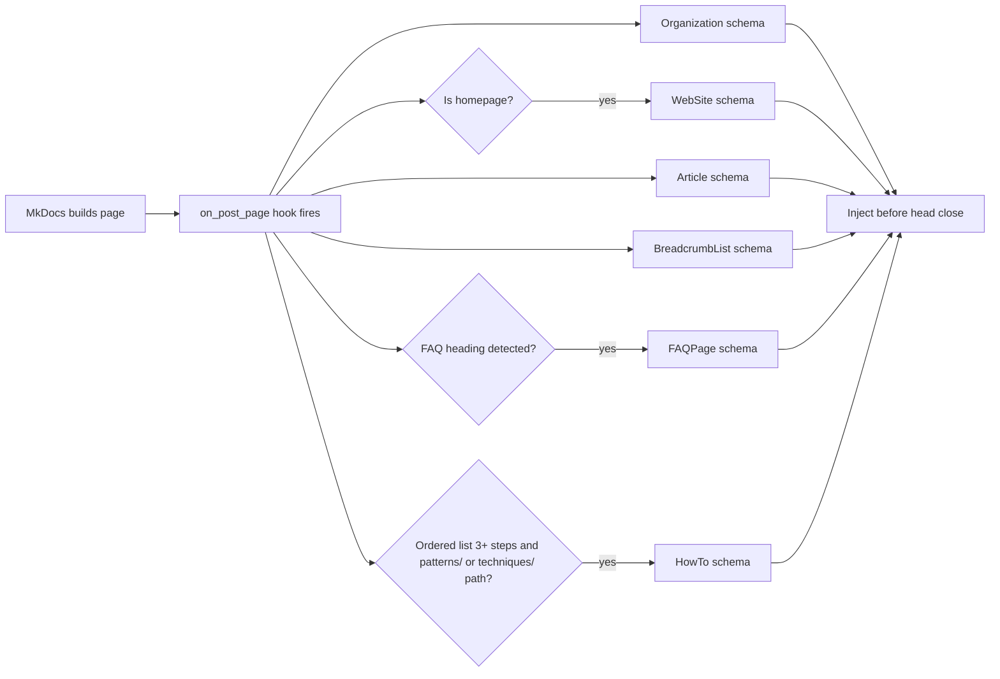

# Schema Markup for AI Citation

> FAQPage schema yields a measurable citation lift in AI responses — structured data pre-packages content in the same Q&A and step formats AI uses to generate answers, reducing extraction effort during indexing. Independent studies cite FAQPage citation improvements ranging from 2.7x to 3.2x ([Frase.io](https://www.frase.io/blog/faq-schema-ai-search-geo-aeo); [DEV Community](https://dev.to/wilow445/schemaorg-is-your-secret-weapon-for-ai-citations-heres-the-data-1if3)).

Schema's primary value has shifted from SEO to AI citation — ChatGPT, Perplexity, Gemini, and Claude process it at indexing time. This site auto-injects FAQPage, HowTo, and Article schemas via `hooks/structured_data.py`.

## What Changed: Google vs. AI Search

| Channel | FAQPage / HowTo Rich Results | Schema Citation Value |
|---------|------------------------------|-----------------------|
| Google Search (classic) | Restricted to government/health sites since Aug 2023 | Low for most dev docs |
| Google AI Overviews | Processed at index time | High — 3.2x appearance lift (Frase.io) |
| ChatGPT | Not rendered live; indexed content used | High — favours Q&A format |
| Perplexity | Indexed schema aids entity disambiguation | High — citation footnotes |
| Gemini | Renders JavaScript; processes schema | High |

**Key nuance**: chatbots don't read JSON-LD on live fetch — benefit accrues at indexing and training.

## The Three Schema Types

### FAQPage

Structures Q&A blocks for direct AI extraction. Keep answers 40–80 words — standalone, citable length.

```json
{
  "@context": "https://schema.org",
  "@type": "FAQPage",
  "mainEntity": [{
    "@type": "Question",
    "name": "What is an agent harness?",
    "acceptedAnswer": {
      "@type": "Answer",
      "text": "An agent harness is scaffolding that surrounds an AI agent loop — managing context, tool calls, error recovery, and output formatting. It separates infrastructure concerns from reasoning logic."
    }
  }]
}
```

The hook detects `## FAQ` or `## Frequently Asked Questions` followed by `**Question**` / answer pairs and emits this schema automatically.

### HowTo

Converts numbered step lists into extractable blocks — each step is a quotable unit.

```json
{
  "@context": "https://schema.org",
  "@type": "HowTo",
  "name": "How to configure prompt caching",
  "step": [
    { "@type": "HowToStep", "position": 1, "text": "Enable the caching header in your API request." },
    { "@type": "HowToStep", "position": 2, "text": "Place stable content at the top of the context window." }
  ]
}
```

Auto-detection triggers on ordered lists (`<ol>`) with 3+ items, restricted to `patterns/` and `techniques/` paths. Extend `_HOWTO_PATHS` in `hooks/structured_data.py` to widen coverage.

### DefinedTerm

Machine-readable definitions for named concepts — useful where terms like "agent" are ambiguous across tools.

```json
{
  "@context": "https://schema.org",
  "@type": "DefinedTermSet",
  "@id": "https://agentpatterns.ai/concepts#",
  "name": "Agent Patterns Glossary",
  "hasDefinedTerm": [
    {
      "@type": "DefinedTerm",
      "@id": "https://agentpatterns.ai/concepts#agent-harness",
      "termCode": "AP-001",
      "name": "Agent Harness",
      "description": "Scaffolding that surrounds an agent loop, managing context, tool calls, error recovery, and output formatting.",
      "inDefinedTermSet": "https://agentpatterns.ai/concepts#"
    }
  ]
}
```

Each term's `@id` fragment is directly linkable as an authoritative definition.

## How This Site Generates Schema

The hook runs at `on_post_page` and injects JSON-LD into every page's `<head>`:



No per-page config — add an FAQ section and schema appears.

## Writing for Schema Auto-Detection

### FAQ Section

The hook matches `## FAQ` (or `## Frequently Asked Questions`) plus `**Question**` / paragraph pairs:

```markdown
## FAQ

**What is an agent harness?**

An agent harness is the scaffolding that surrounds an AI agent loop — managing
context, tool calls, error recovery, and output formatting. It separates
infrastructure concerns from the agent's reasoning logic.

**When should I use HowTo schema?**

Use HowTo schema for step-by-step instructional content where each step is a
discrete, independently meaningful action. Avoid it for conceptual explanations
that happen to have numbered sections.
```

### HowTo Steps

Write each step as a self-contained sentence — it is extracted as a standalone `HowToStep.text`. Auto-injection applies only to `patterns/` and `techniques/`.

## When This Backfires

Schema lifts citation rates in aggregate, but fails under specific conditions:

- **Stale schema after edits** — if body text drifts from the auto-generated schema (e.g., FAQ answers edited outside the `**Question**` / answer format), engines see contradictory signals and may deprioritize the page.
- **Thin or low-authority domains** — lift is relative to baseline authority. Schema accelerates existing signal; it doesn't manufacture credibility.
- **Wrong type for content shape** — HowTo on conceptual explanations, or FAQPage on unrelated Q&A, causes schema–content mismatch that validators flag and engines may penalise.
- **Indexing pipeline changes** — benefit accrues at indexing time; if a provider downweights structured data, pages relying on the lift lose it with no on-page change.

## Testing Schema

| Tool | Purpose | URL |
|------|---------|-----|
| Google Rich Results Test | Validates Google-supported rich results (Article, BreadcrumbList) | https://search.google.com/test/rich-results |
| Schema Markup Validator | Validates all schema.org types without Google restrictions | https://validator.schema.org/ |
| [Google Search Console](../workflows/gsc-search-console-monitoring.md) | Monitors rich result impressions and errors post-deployment | https://search.google.com/search-console |

Run locally:

```bash
mkdocs build --strict
# Paste a built page's <head> into the Schema Markup Validator
```

## Sources

- [FAQPage Structured Data — Google Search Central](https://developers.google.com/search/docs/appearance/structured-data/faqpage) — spec and eligibility
- [DefinedTerm — Schema.org](https://schema.org/DefinedTerm) — official spec
- [DefinedTermSet for Industry Terminology — DEV](https://dev.to/mark_mcneece_365i/using-schemaorgs-definedtermset-for-industry-terminology-a-case-study-1mm2) — fragment `@id` and TermSet linking
- [Schema.org Is Your Secret Weapon for AI Citations — DEV](https://dev.to/wilow445/schemaorg-is-your-secret-weapon-for-ai-citations-heres-the-data-1if3) — FAQPage +45%, HowTo +38%
- [FAQ Schema for AI Search, GEO and AEO — Frase.io](https://www.frase.io/blog/faq-schema-ai-search-geo-aeo) — 3.2x AI Overview lift
- [Schema Markup and AI in 2025 — Searchviu](https://www.searchviu.com/en/schema-markup-and-ai-in-2025-what-chatgpt-claude-perplexity-gemini-really-see/) — JSON-LD ignored on live fetch; benefits at indexing
- [Structured Data in MkDocs](https://v-schipka.github.io/posts/schema-in-mkdocs/) — MkDocs Material approach
- [Structured Data for SEO and GEO — Digidop](https://www.digidop.com/blog/structured-data-secret-weapon-seo) — GPT-4 accuracy 16% → 54%

## Related

- [GEO for Technical Docs](geo-for-technical-docs.md) — schema type selection checklist and per-format GEO priorities
- [How AI Engines Cite](how-ai-engines-cite.md) — citation mechanisms schema markup targets
- [Answer-First Writing](answer-first-writing.md) — content structure that complements schema auto-detection
- [SEO vs GEO](seo-vs-geo.md) — how structured data signals differ between traditional SEO and AI citation optimization
- [llms.txt](llms-txt.md) — complementary machine-readable format for AI discoverability
- [AI Crawler Policy](ai-crawler-policy.md) — controlling which crawlers index your structured data
- [Measuring GEO Performance](measuring-geo-performance.md) — tracking schema citation lift
- [What Is GEO](what-is-geo.md) — foundational concepts behind generative engine optimization
- [Assertion Density](assertion-density.md) — specific claims and statistics that complement schema-marked content
- [Atomic Pages and Chunking](atomic-pages-and-chunking.md) — page structure that improves schema auto-detection accuracy
- [Topical Authority](topical-authority.md) — how schema markup contributes to entity coverage and domain authority

