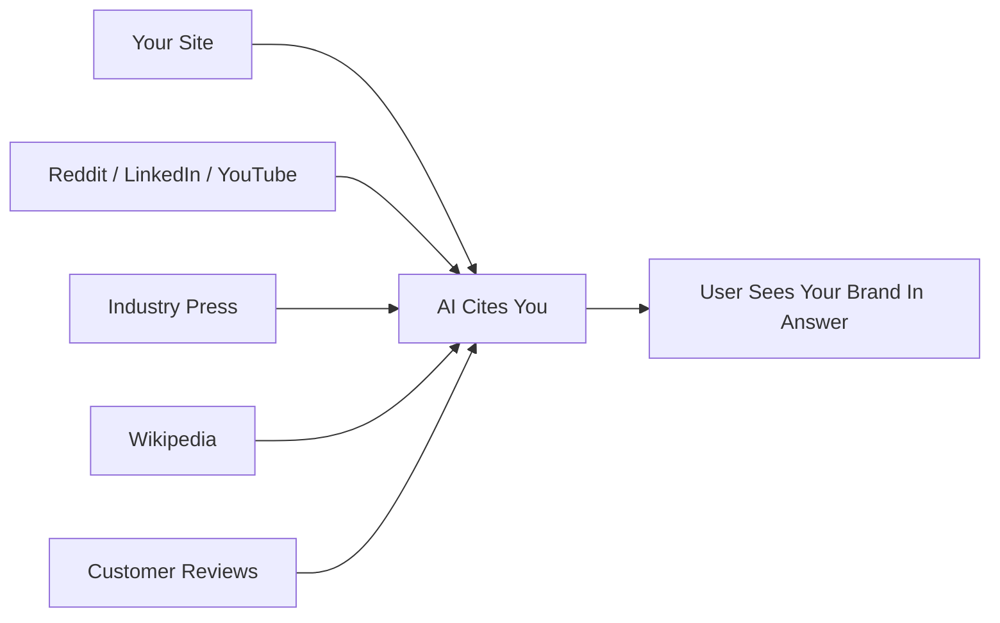

# SEO vs GEO — Signals, Metrics, Optimization Targets

> Traditional SEO optimises for rank position in a list of links; GEO optimises for citation share inside synthesised answers. The signals that drive each outcome differ substantially — some SEO practices transfer, others conflict, and several GEO-specific ones have no SEO equivalent.

## Signal Comparison

| Signal | Traditional SEO | GEO | Direction |
|--------|-----------------|-----|-----------|
| Backlinks | Primary ranking factor | Weak predictor of AI citation | Deprioritise for GEO |
| Brand search volume | Secondary | Strong predictor of AI citation; correlated with entity prominence | Invest heavily |
| Off-site brand mentions | Nice-to-have | Stronger predictor than backlinks; earned media dominates AI citations | Build deliberately |
| Keyword density | Neutral to positive | Actively harmful -- decreases visibility | Abandon |
| Content freshness | Important | High: AI engines weight recency in source selection | Carry over |
| Structured data / schema | Helpful | Required for entity clarity | Expand |
| Authoritative writing | Important | Important | Carry over |
| Statistics and quotations | Marginal SEO benefit | 22-37% visibility improvement ([Princeton GEO study](https://arxiv.org/html/2311.09735v3)) | New priority |
| Rank position | Primary goal | Low correlation with AI citation | Not a GEO proxy |

## What Conflicts

**Keyword density is a direct conflict.** The [Princeton GEO study](https://arxiv.org/html/2311.09735v3) found keyword stuffing decreases AI citation rates — the opposite of its historical SEO effect. A keyword-dense paragraph burns tokens; a data table is cheaper to parse and more likely cited.

**Rank position is not a GEO proxy.** The [Princeton GEO study](https://arxiv.org/html/2311.09735v3) found citation-oriented techniques produced a 115% visibility increase for lower-ranked sites while top-ranked sites saw a 30% decrease.

## What Is New

**The majority of AI citations come from third-party earned media**, not brand-owned content: forums, review platforms, industry press, Wikipedia, YouTube, LinkedIn. A [Semrush analysis of 150,000 AI citations](https://www.semrush.com/blog/most-cited-domains-ai/) found Reddit accounted for 40.1% of LLM references, Wikipedia 26.3%, and YouTube 23.5% — corroborated by a [Search Engine Land summary of the study](https://searchengineland.com/ai-search-engines-cite-reddit-youtube-and-linkedin-most-study-473138). Owned content at most supplements; it does not dominate.

**Content structure determines extractability.** AI systems pull isolated passages, not pages. Self-contained paragraphs, data tables, and FAQ sections are high-value; long-form narrative guides are low-value for extraction.

## Metric Comparison

| Dimension | SEO Metric | GEO Equivalent |
|-----------|-----------|----------------|
| Visibility | Rank position | AI visibility score / share of voice |
| Traffic | Organic click-through rate | Citation frequency across tracked prompts |
| Competitive standing | Share of SERP clicks | AI share of voice vs. competitors |
| Reach | Impressions | Prompts where brand appears |
| Sentiment | Not tracked | Brand sentiment in AI responses |
| Source health | Domain authority | Citation volatility — AI citation pools shift frequently |

## Where to Invest

| Action | Rationale |
|--------|-----------|
| Build off-site brand presence (forums, reviews, press) | Off-site earned media is a stronger predictor of AI citation than backlinks |
| Add statistics and direct quotations to existing pages | 22-37% citation improvement per the [Princeton GEO study](https://arxiv.org/html/2311.09735v3) |
| Restructure key pages for extractable passages | AI cites standalone paragraphs, not full pages |
| Stop keyword-stuffing; optimise for token efficiency | Keyword density actively harms GEO |
| Instrument AI citation tracking | Rank-based metrics do not capture AI citation signal — AI engines cite low-ranked and non-ranked pages |

## Why These Signals Work

AI engines build entity representations from training-data co-occurrence, not the link graph. Brand mentions in forums, reviews, and editorial coverage teach a model what a brand stands for — independently of any site links. Backlinks route crawlers; they do not contribute to entity association.

Keyword density is a token cost. Repeating the same keyword consumes token budget without adding semantic signal. A data table encodes equivalent facts more compactly and is a better extraction candidate.

## When This Backfires

- **Measurement opacity**: AI citation share has no standardised tracking equivalent to Google Search Console — campaigns may run months before lift is detectable.
- **Small-brand cold-start**: Citation pools favour established earned media — Wikipedia, major press, G2-tier review platforms. New brands must build that inventory before GEO techniques gain traction.
- **Model-specific variability**: Citation signals don't transfer uniformly across AI engines. A source prominent in ChatGPT responses may not appear in Gemini or Perplexity. Track per model.
- **Attribution bleed**: Brand-mention campaigns may also lift organic rankings, making it hard to isolate the GEO contribution without prompt-based measurement.

## Related

- [What Is GEO](what-is-geo.md)
- [How AI Engines Cite](how-ai-engines-cite.md)
- [Measuring GEO Performance](measuring-geo-performance.md)
- [Answer-First Writing](answer-first-writing.md)
- [Assertion Density](assertion-density.md)
- [Topical Authority](topical-authority.md)
- [Schema and Structured Data for GEO](schema-and-structured-data.md)
- [AI Crawler Policy](ai-crawler-policy.md)
- [Atomic Pages and Chunking](atomic-pages-and-chunking.md)
- [GEO for Technical Docs](geo-for-technical-docs.md)
- [llms.txt](llms-txt.md)
