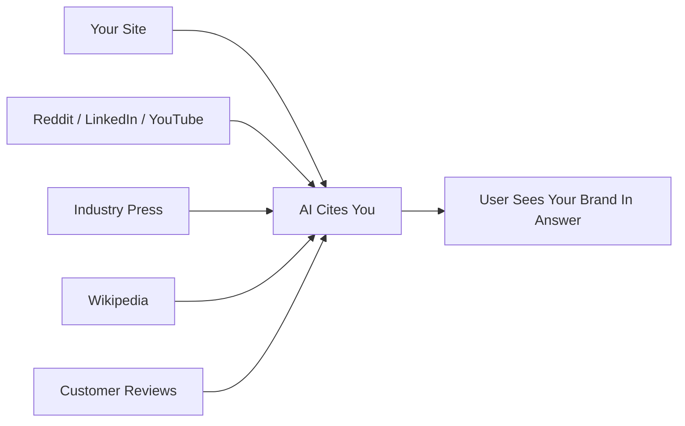

# SEO vs GEO — Signals, Metrics, Optimization Targets

> GEO (Generative Engine Optimization) and traditional SEO share a foundation but diverge sharply on the signals that drive visibility. Understanding which practices transfer, which conflict, and which are new determines where effort delivers the most return.

## The Core Shift

Traditional SEO puts your link in a ranked list; the user decides whether to click. GEO puts your content inside the AI's answer — the user never sees your URL but associates the knowledge with your brand. The optimization target shifts from *rank position* to *citation share*.

## Signal Comparison

| Signal | Traditional SEO | GEO | Direction |
|--------|-----------------|-----|-----------|
| Backlinks | Primary ranking factor | Weak predictor (0.10 correlation) | Deprioritise for GEO |
| Brand search volume | Secondary | Strongest predictor (0.334 correlation) | Invest heavily |
| Off-site brand mentions | Nice-to-have | 3.2x more predictive than links [unverified] | Build deliberately |
| Keyword density | Neutral to positive | Actively harmful -- decreases visibility | Abandon |
| Content freshness | Important | High: 65% of AI bot traffic targets past 12 months | Carry over |
| Structured data / schema | Helpful | Required for entity clarity | Expand |
| Authoritative writing | Important | Important | Carry over |
| Statistics and quotations | Marginal SEO benefit | 21-37% visibility improvement [unverified] | New priority |
| Rank position | Primary goal | 4.5% correlation with AI citation | Not a GEO proxy |

## What Transfers from SEO

- **Content freshness** -- regular updates serve both disciplines
- **Authoritative, accurate writing** -- remains the baseline
- **Structured data** -- [schema markup](schema-and-structured-data.md) (Article, Organization, FAQ) helps AI parse entities
- **Technical accessibility** -- [blocking GPTBot or ClaudeBot in robots.txt](ai-crawler-policy.md) is the GEO equivalent of blocking Googlebot

## What Conflicts

**Keyword density is a direct conflict.** The [Princeton GEO study](https://arxiv.org/html/2311.09735v3) found keyword stuffing decreases AI citation rates — the opposite of its historical SEO effect. A keyword-dense paragraph burns tokens; a data table is cheaper to parse and more likely cited.

**Rank position is not a GEO proxy.** High-ranking pages are not reliably cited by AI engines (4.5% correlation); rank-5 websites gained 115% visibility from citation-oriented techniques while top-ranked sites lost share [unverified].

## What Is New

**91% of AI citations come from third-party sources [unverified].** Owned content captures at most 9% of citations. The rest requires off-site presence:

- Unlinked brand mentions on forums, review platforms, community sites
- YouTube and LinkedIn content (top off-site citation sources)
- Wikipedia entries and industry press

**Content structure determines extractability.** AI systems pull isolated passages, not pages. Self-contained paragraphs with direct answers outperform long-form guides. FAQ sections, data tables, and standalone sub-headings are high-value.

## Metric Comparison

| Dimension | SEO Metric | GEO Equivalent |
|-----------|-----------|----------------|
| Visibility | Rank position | AI visibility score / share of voice |
| Traffic | Organic click-through rate | Citation frequency across tracked prompts |
| Competitive standing | Share of SERP clicks | AI share of voice vs. competitors |
| Reach | Impressions | Prompts where brand appears |
| Sentiment | Not tracked | Brand sentiment in AI responses |
| Source health | Domain authority | Citation volatility (40-60% of sources change monthly) |

## Where to Invest

| Action | Rationale |
|--------|-----------|
| Build off-site brand presence (forums, reviews, press) | Off-site mentions are 3.2x more predictive than links [unverified] |
| Add statistics and direct quotations to existing pages | 21-37% citation improvement with minimal rewrite [unverified] |
| Restructure key pages for extractable passages | AI cites standalone paragraphs, not full pages |
| Stop keyword-stuffing; optimise for token efficiency | Keyword density actively harms GEO |
| Instrument AI citation tracking | Rank-based metrics miss 95.5% of AI citation signal |

## Unverified Claims

- Correlation values, the 65% freshness figure, the 3.2x mentions ratio, and the 21-37% visibility lift are from the [2025 AI Citation LLM Visibility Report](https://thedigitalbloom.com/learn/2025-ai-citation-llm-visibility-report/), not the original academic paper
- 91% third-party citation share — from a 2026 industry report; methodology undisclosed [unverified]
- Citation volatility (40-60% monthly) — source unidentified [unverified]

## Related

- [What Is GEO](what-is-geo.md)
- [How AI Engines Cite](how-ai-engines-cite.md)
- [Measuring GEO Performance](measuring-geo-performance.md)
- [Answer-First Writing](answer-first-writing.md)
- [Assertion Density](assertion-density.md)
- [Topical Authority](topical-authority.md)
- [Schema and Structured Data for GEO](schema-and-structured-data.md)
- [AI Crawler Policy](ai-crawler-policy.md)
- [Atomic Pages and Chunking](atomic-pages-and-chunking.md)
- [GEO for Technical Docs](geo-for-technical-docs.md)
- [llms.txt](llms-txt.md)
